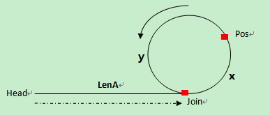

# 目录

[排序 3](#排序)

[字符串 5](#字符串)

[算法/数据结构 5](#算法数据结构)

[队列和栈 8](#队列和栈)

[链表 11](#链表)

[二分搜索 15](#二分搜索)

[二叉树 17](#二叉树)

[动态规划 22](#动态规划)

[位运算 25](#位运算)

[排列组合 27](#排列组合)

[大数据 31](#大数据)


# 排序


## 概况


| 名称 | 时间复杂度 | 空间复杂度 | 稳定排序 | 备注 |
| ---- |:-------------:| :--------: | :------: | ---- |
| 冒泡 | O(n\^2) | O(1) | 1    |      |
| 选择 | O(n\^2) | O(1) | 0    | 选最小值放在数组第一位 |
| 插入 | O(n\^2) | O(1) | 1    |      |
| 归并 | O(n\*log n) | O(n) | 1    |      |
| 快速 | O(n\*log n) | O(n) | 0    | 划分过程(partition) |
| 堆   | O(n\*log n) | O(1) | 0    |      |
| 希尔 | O(n\*log n) | O(1) | 0    | 插入排序改良版，步长≥1且逐渐变小 |
| 桶   | O(n) | O(m) | 1    | 计数：每个值一个bucket ，基数：根据值的百/十/个位上的数排序 |

不稳定排序口诀：快选堆希


习题
----

-   排序一个几乎有序的数组（每个元素移动≤k）且k ≪ n。

*普通解法：*时间O(n\*k) 空间O(1)

使用插入排序，因为插入排序与原数组顺序有关。

*最优解法：*时间O(n\*log k) 空间O(k)

改进版的堆排序：每k个元素组成小根堆（类似sliding window）。


-   判断数组是否包含重复值。

*普通解法：*时间O(n) 空间O(n)

哈希表。

*最优解法：*时间O(n) 空间O(1)

使用改良版的堆排序对数组进行排序。递归实现的堆排序空间复杂度是O(log
n)，非递归实现的堆排序空间复杂度是O(1)。


-   荷兰国旗问题：只包含0、1、2整数的数组排序，使用交换（不可以使用计数方法），原地排序。

*最优解法：*时间O(n) 空间O(1)

采用快排思想。在数组左侧设立"0区"，右侧设立"2区"。遍历数组，遇到0，就和"0区"右边第一个数进行交换，且"0区"向右扩一个位置。遇到2，就和"2区"左边第一个数进行交换，且"2区"向左扩一个位置。注意此时被交换过来的数还没进行检测，需要进行比较分区。当前位置和"2区"起始位置重合时，循环停止。


-   在行列都排好序的情况下矩阵找数。

*最优解法：*时间O(n+m) 空间O(1)

从右上角找起。


-   需要排序的最短子数组长度。例如\[1,5,4,3,2,6,7\]需要排序的最短子数组是\[5,4,3,2\]，所以返回4。

*最优解法：*时间O(n) 空间O(1)

遍历数组，找出每个元素位置上迄今出现的最大值。若num\[i\]\<max，记录发生这种情况最右位置。再从右向左遍历数组，记录迄今出现的最小值。若num\[i\]\>min，记录发生这种情况最左位置。返回两者的差。


-   给定int\[\]，返回排序之后，相邻两数最大差值。

*最优解法：*时间O(n) 空间O(n)

桶排序。找出min和max。将\[min, max)分成n个区间，单独将最大值放在第n+1区间。一共有n+1个区间，但是只有n个数，所以必然有空桶。只用考虑桶间的相邻数的差值。


字符串
======

概况
----

广泛性：可看做字符类型的数组；很多其他类型问题可转化为字符串问题


类型
----

规则判断：整数；浮点数；回文

数字运算：int、long表达范围有限，用字符串模拟大数计算

数组操作：排序、调整

字符计数：哈希表；固定长度数组 C/C++(256)
Java(65536)；滑动窗口；寻找无重复子串；变位词

动态规划：最长公共子串/子序列；最长回文子串/子序列

搜索：字符变换(BFS+DFS)


算法/数据结构
-------------

Manacher - 最长回文子串

KMP - 字符串匹配

前缀树、后缀树、后缀数组


习题
----

-   判断二叉树t1是否包含二叉树t2。

*普通解法：*时间O(n\*m) 空间O(1) // n代表t1节点数，m代表t2节点数

*最优解法：*时间O(n+m) 空间O(n)

序列化两棵树，在str1中查找子串str2。

-   判断两个字符串是否互为变形词。

*最优解法：*时间O(n) 空间O(n)

用哈希表进行字符统计。也可用固定长度数组代替哈希表结构。

-   判断两个字符串是否互为旋转词。str1前面人一部分挪到后面形成的字符串都是旋转词。例如1234的旋转词包括:
    1234, 2341, 3412, 4123。

*最优解法：*时间O(n) 空间O(n)

先判断两者长度是否相同。如果相同，生成str1+str1的大字符串。KMP算法查找其中是否包含str2。

-   单词间做逆袭调整。例如"I love you" -\> "you love I"

*最优解法：*时间O(n) 空间O(1)

实现字符串局部字符的逆序函数。将所有字符逆序。再将每一个单词的部分逆序。

-   给定str和整数i，i代表位置。将str\[0\~i\]移到右侧。例如str="abcde",
    i=2 -\> 'deabc'。

*最优解法：*时间O(n) 空间O(1)

str\[0\~i\]逆序，str\[i+1\~n-1\]逆序，str\[0\~n-1\]逆序。

-   给定str\[\]，找到一种拼接后字典序最小的拼接顺序，返回此大字符串。

*最优解法：*时间O(n\*log n) 空间O(1)

不能按每一个字符串的字典顺序排序。反例：\["ba", "b"\] -\> \["b", "ba"\]
-\> "bba"。但是实际上"bab"的字典序更小。

正确解是根据str1+str2和str2+str1的结果排序。 //
会不会出现插入中间更小的情况？

-   给定str，将空格替换成"%20"，假设空间足够。

*最优解法：*时间O(n) 空间O(1)

遍历str得到空格数量x。替换后长度为len+2x。指针指向该位置前一个，从右向左遍历填充数组。

-   给定str判断是否是有效括号字符串。

*最优解法：*时间O(n) 空间O(n)

使用栈。可应对多种括号。

*最优解法：*时间O(n) 空间O(1)

只能应对单一括号。整数num代表左括号和右括号的差值。遇到左括号，num++。否则num\--。若出现num\<0，则返回false。最后判断num == 0。


-   返回str最长无重复字符子串的长度。例如，"abcd" -\> 4, "abcb" -\> 3。

*最优解法：*时间O(n) 空间O(n)

求i位置向左最长的无重复字符子串。

HashMap：统计每个字符之前出现的位置。

int pre：s\[i-1\]结尾的情况下，最长无重复子串的长度。

计算i-map.get(str\[i\]-1)，与1+pre进行比较，取两者的min。更新pre和hashmap。

{width="4.770833333333333in"
height="2.0972222222222223in"}

{width="5.722222222222222in"
height="2.2291666666666665in"}


队列和栈
========


概况
----

可用数组或者链表实现。数组实现较为简单。


习题
----

-   实现一个特殊的栈。除了基本功能之外，实现getMin。要求pop, push,
    getmin时间为O(1)。

*最优解法：*时间O(n) 空间O(n)

方法1：用一个栈stackData保存数据，另一个栈stackMin保存最小值。数字正常进入stackData，但是只有当它小于等于stackMin栈顶时，该数被放入stackMin。当stackData弹出时，比较这个值与stackMin栈顶元素大小。如果相同，stackMin也弹出。

方法2：用一个栈stackData保存数据，另一个栈stackMin保存最小值。数字正常进入stackData。将数字与stackMin栈顶比较，较小的数被放入stackMin。当stackData弹出时，
stackMin也弹出。

方案一空间较为优化，方案二时间更优。

-   实现一个类，用2个栈实现队列。支持add，poll，peek。

*最优解法：*时间O(n) 空间O(n)

一个stackPush栈，一个stackPop栈。stackPush向stackPop倒入数据。注意两点：stackPush倒数据一次性倒完；stackPop中有数据，stackPush不能进行倒数据操作。

-   实现一个栈的逆序。只能用递归和栈的本身操作。不能申请额外数据结构。

*最优解法：*时间O(n) 空间O(n)

```java
// remove and return the last element in the stack  
public int get(Stack<Integer> stack) {   
  	int res = stack.pop();  
  	if (stack.isEmpty())  
    	return res;  
 	else {  
   		int last = get(stack);  
	    stack.push(res);  
	    return last;  
	}  
}  
  
public void reverse(stack<Integer> stack) {  
  	if (stack.isEmpty())  
    	return;  
 	int i = get(stack);  
 	reverse(stack);  
  	stack.push(i);  
}  
```


-   栈中元素为int，将栈从顶到底由从大到小排序，只可以额外申请一个栈。

*最优解法：*时间O(n) 空间O(n)

类似罗汉塔。栈1pop，与栈2顶比较。如果栈1的小，直接压入栈2。否则先pop出栈2的元素，直到栈2栈顶比栈1被pop出的元素大为止，将该元素压入。最后将栈2元素全部倾倒进栈1。

-   有一个int数组arr和一个大小为w的窗口从数组的最左滑到最右。窗口每一次滑动一个位置。返回一个长度为n-w+1的数组res，每一个元素表示每一个窗口状态下的最大值。例子arr=\[4,3,5,4,3,3,6,7\],
    w=3，返回\[5,5,5,4,6,7\]。

*普通解法：*时间复杂度O(n\*w)

遍历

*最优解法：*时间复杂度O(n)

使用双端队列qmax={}, 存放数组中的index

遍历arr\[i\]

qmax放入规则：若qmax为空，直接将index放入。否则，取出qmax队尾存放的index
j，如果arr\[j\]\>arr\[i\]，将i放入qmax队尾；如果arr\[j\]≤arr\[i\]，则一直从qmax队尾弹出index
k，直到arr\[k\]\>arr\[i\]，此时把i放入qmax队尾。

qmax弹出规则：如果qmax队头的index = i-w，弹出此index。

*证明：*arr中每个数，最多进出qmax两次。所以时间是O(n)。

-   给定一个没有重复元素的数组arr，写出生成这个数组的maxTree函数。要求时间和空间复杂度均为O(n)。maxTree是二叉树，其中每一个子树中，值最大的节点都是root。

例子arr=\[3,4,5,1,2\]

*最优解法*：

利用栈得到每个数左右两边第一个比自己大的数。如果栈为空，直接放入。若不为空，查看栈顶元素，若栈顶元素大于自己，则可以入栈，并且得到自己的左边第一个比自己大的数是原来的栈顶。若栈顶元素小于自己，弹出栈顶，直到栈为空或栈顶元素更大，此时自己入栈，并且得到自己的左边第一个比自己大的数是自己入栈前的栈顶。同理可得右边第一个比自己大的数。


| 左边第一个比自己大的数 | 右边第一个比自己大的数 |
| ---------------------- | ---------------------- |
| 3-\>null               | 3-\>4                  |
| 4-\>null               | 4-\>5                  |
| 5-\>null               | 5-\>null               |
| 1->5                   | 1-\>2                  |
| 2-\>5                  | 2-\>null               |


对每一个数对比两边，选择两个数中较小的一个作为自己的父节点

​			5

​		/ 		\\

​	4 				2

​	/ 					\\

3 							1

证明：首先，必然是一棵树，而不是森林。所有数都会找到比自己大的数作为父节点，最后都会找到数组中最大的数当成root。其次，证明这棵树是二叉树。任何一个数在单独一侧，孩子的数量都不超过一个。假设A在一侧有两个孩子k1、k2，满足A\>k1且A\>k2。又因为数组中无重复元素，所以k1\<k2。根据我们的方法，k1不会以A作为父节点，而可能会以k2作为父节点。矛盾。遂满足二叉树条件。


链表
====

概况
----

链表存储空间不一定连续，是临时分配的，所以不能像数组一样用index提取元素。

大量链表问题可以使用额外数据结构简化调整。但是最优解一般不使用额外数据结构。

## 关键点

1\. 链表调整函数的返回值类型，一般是节点类型

2\. 先画图理清思路

3\. 边界条件：头尾节点、空节点

习题
----

-   单链表翻转操作。

*最优解法1*：

1.  链表为空或长度为1，特殊处理

2.  记录三个变量prev、cur、next。把cur的指针指向prev，把cur设置成新的head。然后把pre设置成cur，把cur设置成next。

*最优解法2*：开一个新的头newHead。每次从原来list中除去头部元素，插入新列表的头部。

-   给定一个整数num，在节点值有序的环形链表中插入一个节点值为num的节点，并且保证这个环形单链表依然有序。

*最优解法*：时间O(n) 空间O(1)

创建新节点node。

如果原链表为空，自己形成环形链表，返回此节点。

如果原链表不为空，找到p.val≤node.val且c.val≥node.val，将node插入到p和c之间。返回head。

如果转了一圈没有发现插入的位置，说明node的值大于/小于链表中所有值，则将node插入头节点的前面。如果node值大于链表中所有值，返回原来的head。否则，将node设置成head，返回head。

-   给定一个链表中节点node，但不给定head。如何在链表中删除node？要求时间O(1)

*最优解法*：时间O(1) 空间O(1)

如果是单链表，拷贝后一个节点的值，然后将后一个节点删掉。但是无法删掉最后一个节点。另外，如果节点结构复杂且拷贝操作受限时，不可行。

-   给定一个链表中头节点head和一个数num。把链表调整成节点值小于num的节点都放在左边，值等于num的节点都放在中间，值大于num的节点都放在链表右边。

*普通解法*：时间O(n) 空间O(n)

将所有节点放入数组中然后将数组进行快排划分的调整过程。然后将数组用链表连接。

*最优解法*：时间O(n) 空间O(1)

将链表分成三个（大于、等于、小于），最后将三个链表连接起来。


-   给定两个有序链表头节点head1和head2，打印两个链表的公共部分。

*最优解法*：时间O(n) 空间O(1)

如果有一个链表为空，直接返回。之后用双指针遍历两个链表，找到两个链表第一个相同元素，打印这个元素。此时双指针同时移动，并且打印相同元素。直到其中一个链表为空。


-   给定一个单链表头节点head，实现一个调整单链表的函数，使得每k个节点之间逆序。如果最后一组不够k个节点，不调整最后几个节点。例子：1-\>2-\>3-\>4-\>5-\>6-\>7-\>8-\>null，k=3。调整后3-\>2-\>1-\>6-\>5-\>4-\>7-\>8-\>null。

如果链表为空，或者长度为1，或者k\<2，直接返回。

*数据结构解法*：时间O(n) 空间O(k)

用栈来处理。集齐K个元素。记得之前调整组的最后一个节点。特殊处理头结点。

*最优解法*：时间O(n) 空间O(1)

记录每个组的第一个节点，当遍历到第k个节点时，开始做逆序调整。


-   给定一个单链表头节点head和一个值val。把所有等于val的节点删掉。

*最优解法*：时间O(n) 空间O(1)

用cur指针遍历原链表，若元素不等于val，设置该元素为返回链表的其中一个元素，next指向null。更新返回链表的尾部。注意第一个元素加入返回链表时，tail指针是不存在的。


-   给定一个单链表，判断是否为回文结构。

*数据结构解法*：时间O(n) 空间O(n)

用栈来处理。将所有节点压入栈中，之后依次弹出，与原链表进行比对。

*数据结构+算法解法*：时间O(n) 空间O(n/2)

使用栈和快慢指针。快指针一次走两步。慢指针一次走一步。慢指针遍历过的元素压入栈中。当快指针走完的时候，慢指针会来到中间的位置。如果链表长度为奇数，中间位置的元素不入栈。将慢指针向后移动一位。依次弹出栈中元素与慢指针所指向的元素进行比对。

*最优解法*：时间O(n) 空间O(1)

用cur指针遍历原链表找到中间节点。将右半部分变成逆序链表。从两头开始，依次遍历，对比节点是否一样。注意，返回之前一定要将链表的结构调整回来。


-   给定一个单链表，每个节点不仅包含有一条指向下一个节点的next指针，同时含有一条rand指针，可能指向任何一个节点。请复制这种含有rand指针节点的链表。

*最优解法*：时间O(n) 空间O(n)

对原链表每个节点，拷贝一个复制节点，插入当前节点和下一个节点之间。再遍历一次所有节点，但是每一次拿到两个节点，即链表原来就有的节点和它的复制节点（1&1'），通过原有节点的rand指针找到下一个节点，将复制节点的next指针指向下一个节点的复制节点。最后把这个大的链表拆开成两个独立的链表，返回head。


-   给定一个单链表，判断是否有环。有环则返回链表入环的第一个节点，否则返回空。

*普通解法*：时间O(n) 空间O(n)

哈希表。

*最优解法*：时间O(n) 空间O(1)

从头节点开始，用快慢指针遍历，快指针一次走两步。慢指针一次走一步。如果有环，快指针和慢指针会在环中相遇。此时快指针从头开始遍历，一次走一步，慢指针从相遇处一次走一步。快慢指针再次相遇时，那个节点就是入环的第一个节点。

*数学证明：*

{width="4.034722222222222in"
height="1.7222222222222223in"}

首先要证明的是，两指针相遇时，慢指针还没有走完整个链表。

（1）如果慢指针第一次达到Join点时，快指针也在Join点，慢指针未走完整个链表；

（2）如果慢指针第一次达到Join点时，快指针没有在Join点，我们以最极端的情况来说，假设快指针这时就在慢指针的前面一个节点，这时，快指针追上慢指针需要走最长的距离。因为快指针的速度是慢指针的两倍，所以慢指针走一圈，快指针走两圈，当慢指针第一次在环上走完一圈回到Join点时，快指针刚好走完两圈，并且已经在慢指针的前面，所以它俩在慢指针第一次回到Join点之前就已经相遇。

其次证明，快慢指针相遇后，慢指针再往前移LenA个节点就刚好到达Join点。

假设第一次相遇点为Pos，环起点为Join，头结点到环起点的长度为LenA，环起点到第一次相遇点的长度为x，第一次相遇点到环起点的长度为y，环长为C

（1）第一次相遇时，slow走的长度 S = LenA + x;（由证明的第一部分得到）

（2）第一次相遇时，fast走的长度 2S = LenA + n\*C + x;（n≥1，因为快指针先进入环，要追上后进入的慢指针，必须得回到环起点在起点之后才能追上）

可以推出LenA = n\*C - x。

慢指针一共走了S + LenA = S + n\*C - x = S + (n - 1)\*C + (C - x) = S + (n - 1)\*R + y，刚好走到入环点。


-   给定两个无环单链表，判断是否相交。如果相交，返回第一个相交节点，否则返回空。

*最优解法*：时间O(n+m) 空间O(1)

遍历两个链表，统计两个链表的长度n&m。让长的链表先走n-m步，两个链表同时往下走。判断是否有相交节点。


-   给定两个有环单链表，判断是否相交。如果相交，返回第一个相交节点，否则返回空。

*最优解法*：时间O(n+m) 空间O(1)

首先找到两个链表各自的入环节点，如果入环节点相同，则两个链表必然相交。这种情况下，需要找到两个链表是否在入环前就相交。方法同判定两个无环单链表是否相交，以入环节点作为遍历的终止位置。如果入环节点不同，就让链表1的node从自己的入环点向后走，如果在回到自己之前遇到了链表2的入环点，则两个链表相交。返回两个链表其中任意一个入环点即可。

-   给定两个单链表（不知道是否有环），判断是否相交。如果相交，返回第一个相交节点，否则返回空。

*最优解法*：时间O(n+m) 空间O(1)

首先找到两个链表各自的入环节点。如果一个有环，另一个无环，这两个链表不可能相交。剩下的情况用之前的方法分类讨论。


二分搜索
========

概况
----

有序序列中查询，时间复杂度O(log
n)。并不一定非要在有序序列中才能得到应用。

## 关键点

1\. 边界条件：不漏掉任何一个数，死循环

2\. 给定处理或查找的对象不同，判断条件不同，要求返回的内容不同

3\. 有序循环数组

习题
----

-   给定无序数组arr，已知任意相邻两个元素的值不重复。请返回任意一个局部最小的位置。局部最小定义：小于左右两侧的值。

*最优解法*：时间O(log n) 空间O(1)

arr为空或者长度为0，返回-1，局部最小不存在。arr长度为1，返回0。如果arr长度大于1，先检查数组头尾（分别只需要与一个元素相比较）。接着检查mid，如果mid只比右边的数小，说明从mid向左趋势是减小的，检查从start到mid的数组即可。如果mid只比左边的数小，同理。如果mid比两边都大，说明两边都存在局部最小，可以任选一边进行搜索。

-   给定有序数组arr和一个整数num。在arr中找到num出现的最左位置。

*最优解法*：时间O(log n) 空间O(1)

做二分搜索，并持续更新pos变量。

-   给定有序循环数组arr，返回其中最小值。有序循环数组是有序数组左边任意长度的部分放到右边去，右边的部分拿到左边来。比如数组\[1,2,3,3,4\]，是有序循环数组，\[4,1,2,3,3\]也是。

*最优解法*：时间O(log n) 空间O(1)

如果arr\[L\]\<arr\[R\]，说明整个数组有序，直接返回L。如果arr\[L\]\>arr\[M\]，说明最小值一定出现在L到M这段区间。同理，如果arr\[R\]\>arr\[M\]，搜索M到R区间。如果仍不满足条件，说明arr\[L\]
= arr\[M\] = arr\[R\]。此时只能采用遍历找到最小值。

-   给定有序数组arr， 其中不含有重复元素，请找到满足arr\[i\] ==
    i条件的最左的位置。如果没有这样的位置，返回-1。

*最优解法*：时间O(log n) 空间O(1)

生成pos变量。如果arr\[0\]\>N-1，说明不存在这样的位置，直接返回-1。同理检查arr\[N-1\]\<0。如果arr\[M\]
\> M，说明需要在0\~M-1区间上搜索。如果arr\[M\] \<
M，说明需要在M+1\~N-1区间上搜索。如果arr\[M\] =
M，令pos=M，继续在0\~M-1区间上二分搜索。

-   给定一棵完全二叉树的头head，返回树的节点个数。（总是从左向右添加子节点）

*最优解法*：时间O(log n\^2) 空间O(1) //为啥是O(log n2)?

首先找到树的最左节点，得到树的高度（最左节点一定在完全二叉树的最后一层上）。找到二叉树头节点右子树上的最左节点。如果这个节点到达最后一层，说明二叉树头节点的左子树一定是满二叉树（直接用公式算节点个数）。在右子树递归求节点个数。如果这个节点未能到达最后一层，说明二叉树头节点的右子树一定是满二叉树（比左子树的高度小1）。在左子树递归求节点个数。

-   求一个整数k的N次方。

*最优解法*：时间O(log n) 空间O(1)

把N分解成2的次方的和。比如75=64+8+2+1。


二叉树
======

概况
----

节点结构。

```java
class Node {  
    int val;  
    Node left;  
   	Node right;  
    Node (int data) {  
        this.val = data;  
    }  
}  

```


# 关键点

1\. 结合队列、栈、链表、字符串等数据结构

2\. 基本遍历方法：BFS，DFS

3\. 递归函数

概念
----

平衡二叉树(AVL树)：空树是平衡二叉树。所有子树满足各自的左子树和右子树的高度差不超过1。

搜索二叉树：每一棵子树头节点的值比左子树上的所有节点值要大，比右子树上的所有节点值要小。

满二叉树：除了最后一层的节点无子节点外，所有节点都有两个子节点。层数为L，节点为N，则N
= 2\^L - 1，L = log~2~(N+1)

完全二叉树：除了最后一层之外，每一层的节点都是满的。即使最后一层不满，缺少的节点也全部在右边。

后继节点successor：这个节点在中序遍历中的下一个节点。

前驱节点predecessor：这个节点在中序遍历中的上一个节点。

习题
----

-   用递归方式和非递归方式实现：先序（中左右）、中序和后续的遍历打印。

先序

*递归解法*：时间O(n) 空间O(1)

```java
public void preOrder(Node head) {
    if (head == null)
        return;
    System.out.println(head.value + " ");
    preOrder(head.left);
    preOrder(head.right);
}
```


*非递归解法*：时间O(n) 空间O(L) // L是二叉树的深度

申请一个栈stack。将头节点head压入栈中。每次从stack中弹出栈顶节点，记为cur，打印cur的值。如果cur右孩子不是空，将其压入栈中，如果cur左孩子不是空，将其压入栈中。重复这一步骤，直到栈为空。

中序

*非递归解法*：时间O(n) 空间O(L)

申请一个栈stack。令cur等于头节点。

把cur节点压入栈中，对以cur为头的整棵子树而言，依次把左边界压入栈中，即不断令cur=cur.left，重复这一步骤，直到cur为空。

从stack中弹出一个节点，记为node。打印，并让cur=node.right。重复上一步骤。

当stack为空且cur等于空，过程结束。

后序

*两个栈非递归解法*：时间O(n) 空间O(L)

申请一个栈s1。将头节点head压入栈中。每次从s1中弹出栈顶节点，记为cur，先把cur的左孩子压入s1，然后把右孩子压入s1。在整个过程中，每一个从s1中弹出的节点都放进第二个栈s2中。重复该步骤，直到s1为空。从s2中一次弹出节点并打印。

*一个栈非递归解法*：时间O(n) 空间O(L)

申请一个栈s1。将头节点head压入栈中。同时设置两个变量h和c。初始h为head，c为null。整个流程中，h代表最近一次弹出并打印的节点，c代表s1栈顶节点。

每次令c等于栈顶节点，但是不从栈中弹出节点。分以下三种情况：

(1) 如果c的左孩子不为空，并且h不等于c的孩子，则把c的左孩子压入栈中。

(2) 如果情况1不成立，并且c的右孩子不为空，并且h不等于c的右孩子。则把c的右孩子压入栈中。

(3) 如果情况1和2均不成立，说明c的左子树和右子树已经处理完毕了。从栈中弹出c打印，令h=c。

一直重复以上步骤，直到栈为空。

-   连同行号按层遍历。

*最优解法*：时间O(n) 空间O(1)

定义两个变量。

last: 指向本层最右node，当从queue pop出的node为last时，令last=nextLast。

nextLast: 指向下一层最右node，加入本层node的子节点时更新。

用queue来做。类似BFS。

-   二叉树的序列化（二叉树-\>字符串）和反序列化（字符串-\>二叉树）

先序序列化

*最优解法*：时间O(n) 空间O(1)

初始化str变量为空。先序遍历二叉树，如果遇到空节点，在str末尾加上" ,"。

先序反序列化

*最优解法*：时间O(n) 空间O(1)

将给定的字符串根据分隔符转换成数组。每一个元素生成一个节点。当遇到空格时，生成空节点，且不需要往下继续构成子树。

按层序列化

*最优解法*：时间O(n) 空间O(1)

用队列进行二叉树按层遍历，即BFS。


-   给定二叉树，判断是否是平衡二叉树。

*最优解法*：时间O(n) 空间O(1)

分别判断每个节点的左子树和右子树。


-   给定二叉树，判断是否是搜索二叉树。

*最优解法*：时间O(n) 空间O(1)

实现二叉树中序遍历。如果节点值一直变大，则是搜索二叉树。最好使用非递归方式进行中序遍历。


-   给定二叉树，判断是否是完全二叉树。

*最优解法*：时间O(n) 空间O(1)

按层遍历。如果节点有右孩子，没有左孩子，直接返回false。如果当前节点并不是左右孩子都有，之后节点必须全部为叶节点，否则返回false。


-   有一棵二叉树，节点包含一个指向父亲的指针。给定这棵树中某个节点node，返回其后继节点。

*普通解法：*时间O(n) 空间O(n)

通过node节点的parent指针不断向上找到头节点。做中序遍历，生成中序遍历序列。

*最优解法*：时间O(l) 空间O(1) // l为node与其successor之间的实际距离

如果node有右子树，那么后继节点就是右子树上最左边的节点。

如果没有右子树，先检查node是不是其父节点的左孩子。如果是，那么父节点就是后继节点。如果是右孩子，就向上寻找node的后继节点。假设向上移动到的节点记为s，s的父节点记为p，如果发现s是p的左孩子，那么p就是node的后继节点，否则就一直向上移动。如果一直向上寻找，已经移动到空节点，说明node没有后继节点。

-   把一个纸条竖着放在桌子上，从纸条下方向上方对折1次，展开。此时折痕是凹下去的。如果是连续对折两次，三条折痕从上到下依次是下折痕、下折痕、上折痕。给定一个参数n，代表连续对折n次，从上到下打印所有折痕方向。

> ​					下
>
> ​				/       \\

​				上 			下

> ​			/ \\ 				/ \\

​			上   下 		上      下

*最优解法：*时间O(n) 空间O(1)

实质是一棵满二叉树。左子树都是上。实现先右、再中、最后左的遍历。用递归实现。


-   有一棵二叉树原本是搜索二叉树，其中有两个节点调换了位置。找到这两个错误节点。

*最优解法：*时间O(n) 空间O(1)

对二叉树进行中序遍历，依次出现的节点值会一直升序。错误的值是降序的。

如果遍历时出现两次降序，第一个错误节点是第一次降序时较大的节点，第二个错误的节点是第二次降序时较小的节点。

如果遍历时出现一次降序，第一个错误节点是降序时较大的节点，第二个错误的节点是降序时较小的节点。

-   从二叉树的节点A出发，可以向上或者向下走，但是沿途的节点只能经过一次，当到达B时，路径上的节点数是AB间的距离。求一棵二叉树的节点间最大距离。

*最优解法：*时间O(n) 空间O(n)

最大距离有三种情况。假设以h为头。情况1是h左子树上的最大距离，情况2是h右子树上的最大距离，情况3是横跨h两侧子树。

整个过程是后续遍历。在二叉树每棵字数上执行步骤2。

假设子树头h，处理h左子树，得到两个信息，左子树上的最大距离记为Lmax1，左子树上距离h左孩子的最远距离为Lmax2。同理求Rmax1，Rmax2。跨节点的情况的最大距离是Lmax2+1+Rmax2。比较三个值，最大值为以h为头的树上的最大距离。

Lmax2+1就是h左子树上距离h最远的点到h的距离，Rmax2+1就是h右子树上距离h最远的点到h的距离。选两者中较大的一个作为h树上距离h最远的距离返回。

-   给定一棵二叉树的头节点head，已知其中所有节点的值都不一样，找到含有节点最多的二叉搜索子树，并返回其头节点。

*分析：*最大的搜索二叉子树只可能来自于两种情况。

第一种，来自node左子树上的最大搜索二叉子树是以node左孩子为头的，并且来自node右子树上的最大搜索二叉子树是以node右孩子为头的，node左子树上的最大搜索二叉子树的最大值小于node的节点值，node右子树上的最大搜索二叉子树的最小值大于node的节点值。那么以节点node为头的整棵树都是搜索二叉树。

第二种，如果不满足第一种情况，说明节点node为头的树不能连成搜索二叉树。则以node为头的树上的最大搜索二叉子树来自node的左子树上的最大搜索二叉子树和来自node的右子树上的最大搜索二叉子树之间，节点数较多的那个。

*最优解法：*时间O(n) 空间O(n)

整体过程是二叉树的后序遍历。

遍历到当前节点标记为cur。遍历cur的左子树并收集4个信息，分别是左子树上最大搜索二叉子树的头节点、节点数、树上最小值、树上最大值。同样遍历cur的右子树，收集相同的4个信息。

根据上一步收集的信息，判断是否满足第一种情况。

返回4个信息，可以使用全局变量更新的方式实现。


动态规划
========

概况
----

本质是利用空间来记录每一个暴力搜索的计算结果，下次要用结果的时候直接使用。规定每一种递归状态的计算顺序。

概念
----

记忆化搜索：不关心到达某一个递归过程的路径，只单纯对计算过的递归过程进行记录，避免重复计算。

动态规划：规定好每一个递归过程的计算顺序，依次计算，后面的计算过程严格以来前面的计算过程。

最优化原理：也称最优子结构性质。指的是不论过去状态和决策如何，对前面的决策所形成的状态而言，余下的决策必须构成最优策略。简单说就是一个最优化策略的子策略总是最优的。

无后效性：某状态下决策的收益，只与状态和决策相关，与到达该状态的方式无关。

子问题的重叠性：将指数级时间复杂度的暴力搜索算法改进成具有多项式时间复杂度的算法的关键在于解决冗余。

习题
----

-   给定数组arr，其中的值都为正数且不重复，每个值代表一种面值的货币。每种面值货币可以使用任意张，在给定一个整数aim代表要找的钱，求换钱有多少种方法？

    arr={5,10,25,1}, aim=1000

*普通解法：*时间O(n\*m\^2) 空间O(n\*m) // m = aim

记忆搜索方法。p(index, aim)，每计算完一个p(index,
aim)都将结果放入map中，index和aim组成共同的key，返回结果为value。要进入递归过程之前，现在map中查询，如果存在，直接取值。如果不存在，才进行递归。map\[i\]\[j\]代表p(i,j)的返回值。

```java
public int coins(int[] arr, int aim) {
    if (arr.length == 0 || aim < 0)
        return 0;
    int[][] map = new int[arr.length+1][aim+1];
    return process(arr, 0, aim, map);
}

private int process(int[] arr, int idx, int aim, int[][]map) {
    int res = 0;
    if (idx == arr.length)
        res = aim == 0 ? 1 : 0;
    else {
        int val = 0;
        for (int i = 0; arr[idx] * i <= aim; i++) {
            val = map[idx+1][aim-arr[idx]*i];
            if (val != 0)
                res += val == -1 ? 0 : val;
            else
                res += process(arr, idx+1, aim-arr[idx]*i, map
);        }
    }
    map[idx][aim] = res == 0 ? -1 : res;
    return res;
}
```


*最优解法：*时间O(n\*m) 空间O(n\*m)

动态规划方法。生成矩阵dp\[n\]\[m+1\]，dp\[i\]\[j\]表示在使用arr\[0\~i\]货币的情况下，组成钱数j的方法的种类。dp\[:\]\[0\]表示组成0元，只有一种方法，所以这一列全部填1。dp\[0\]\[:\]表示只能用第一种货币(5元)来凑钱，所以将其倍数所对应的格子填充为1。

dp\[i\]\[j\] = 以下所有情况的累计

1.  不使用arr\[i\]货币，方法数dp\[i-1\]\[j\]
2.  如果用1张arr\[i\]货币，方法数为dp\[i-1\]\[j-arr\[i\]\]
3.  ...


-   有n级台阶，每一次上1或者2级，问有多少种走完的方法？

*最优解法：*时间O(n) 空间O(1)

f(i) = f(i-1) + f(i-2), f(0) = f(1) = 1


-   给定一个矩阵m，从左上角向右或者下，到右下。路径上所有数字累加起来就是路径和，返回所有路径中最小值。

    1 3 5 9

    8 1 3 4

    5 0 6 1

    8 8 4 0

*普通DP解法：*时间O(m\*n) 空间O(m\*n) // 行数m，列数n

生成dp\[m\]\[n\]，dp\[i\]\[j\]表示从原点走到(i, j)位置的最小路径和。

dp\[i\]\[j\] = m\[i\]\[j\] + min(dp\[i-1\]\[j\], dp\[i\]\[j-1\])

返回dp\[m-1\]\[n-1\]。


-   给定一个数组arr，返回最长递增子序列长度。例如arr =
    \[2,1,5,3,6,4,8,9,7\]，返回\[1,3,4,8,9\]的长度5。

*最优解法：*时间O(n) 空间O(n)

dp\[i\]表示在以arr\[i\]结尾的情况下，最大递增子序列长度。

dp\[i\] = max{dp\[j\]+1 (0\<=j\<i, arr\[j\] \< arr\[i\])}


-   给定两个字符串s1, s2。返回最长公共子序列。例如s1="1a2c3d4b56",
    s2="b1d23ca45b6a"，返回"123456"或者"12c4b6"。

len(s1) = m, len(s2) = n

*最优解法：*时间O(m\*n) 空间O(m\*n)

生成dp\[m\]\[n\]。dp\[i\]\[j\]表示s1\[0\~i\]与s2\[0\~j\]的最长公共子序列长度。

dp\[i\]\[0\] =
代表s1\[0\~i\]与s2\[0\]的最长公共子序列长度，最大为1。一旦dp\[i\]\[0\]被设置成1，将dp\[i+1\~m\]填充为1。dp\[0\]\[j\]与上面步骤同理。

dp\[i\]\[j\] = 取下面三种情况的最大值

1.  dp\[i-1\]\[j\]

2.  dp\[i\]\[j-1\]

3.  如果s1\[i\] == s2\[j\], dp\[i-1\]\[j-1\] + 1

-   背包重量不超过W，求价值V最大值。

-   两个字符串其中一个通过插入、删除和替换变成另外一个字符。每一种操作有对应的代价，分别是ic、dc、rc。求最小代价。

len(s1) = m, len(s2) = n

*最优解法：*时间O(m\*n) 空间O(m\*n)

生成dp\[m+1\]\[n+1\]。dp\[i\]\[j\]代表s1\[0\~i-1\]编辑成s2\[0\~j-1\]的最小代价。

dp\[i\]\[0\]表示s1\[0\~i-1\]编辑成空串的最小代价，也就是dc\*i。同理dp\[0\]\[j\]
= ic\*j。

dp\[i\]\[j\] = 取下面四种情况的最小值

1.  dc + dp\[i-1\]\[j\]

2.  dp\[i\]\[j-1\] + ic

3.  如果s1\[i-1\] != s2\[j-1\]，dp\[i-1\]\[j-1\] + rc

4.  如果s1\[i-1\] == s2\[j-1\]，dp\[i-1\]\[j-1\]


位运算
======

概况
----

&, \|, \^, \~, \<\<, \>\>, \>\>\>

习题
----

-   网页黑名单系统/垃圾邮件过滤系统/爬虫的网址判断重复系统。有一定程度的容错率。对空间的要求比较严格。布隆过滤器
    （精确代表一个集合，精确判断某一元素是否在此集合中，精确程度有用户的具体设计决定）优势在于利用很少的空间可以做到精确率较高。

*分析：*

有一个m个字节的bitarray。有k个优秀且各自独立的哈希函数。算出来的结果都对m取mod，把相应位置设置成1。之后重复操作，已经设置成1的不会变成0。代表之前所有输入对象的集合。假设新输入URL=a。用k个函数算哈希值取mod。如果只要有一个不为0，说明a一定不在集合里面。如果全部为1，则a大概率之前出现过。但是有一定误判几率。宁可错杀三千，绝不放过一个。

*最优解法*：时间O(n) 空间O(m)

bitarray大小为m，样本数量为n，失误率为p。m太小，会增加失误率。

n = 100亿，p = 0.01%

单个样本大小不影响布隆过滤器大小，只影响了哈希函数的实现细节。

m = -n\*(ln p)/(ln 2)\^2

求得m = 19.19n 向上取整为20n。2000亿bit，约为25G。

k = (ln 2)\*m/n = 14

失误率：\[1-e\^(-n\*k/m) \]\^k = 0.006%


-   不用额外变量，交换两个整数的值。

*最优解法*：时间O(1) 空间O(1)

```java
a = a^b;  // a = a0^b0, b = b0
b = a^b;  // a = a0^b0, b = a0^b0^b0 = a0
a = a^b;  // a = a0^b0^a0 = b0
```


-   给定两个整数a和b，不经过比较判断，返回较大者。

*最优解法*：时间O(1) 空间O(1)

根据a-b符号进行判断。注意如果ab符号不同，a-b是有溢出风险的。

```java
1.	public static int flip(int n) {  
2.	  return n^1;  
3.	}  
4.	  
5.	public static int sign(int n) {  
6.	  return flip((n>>31)&1);  
7.	}  
8.	  
9.	// a - b有溢出风险  
10.	public static int getMax1(int a, int b) {  
11.	  int c = a - b;  
12.	  int scA = sign(c);  
13.	  int scB = flip(scA);  
14.	  return a*scA + b*scB;  
15.	}  
16.	  
17.	// 正确解  
18.	public static int getMax2(int a, int b) {  
19.	  int as = sign(a);  
20.	  int bs = sign(b);  
21.	  int cs = sign(a - b);  
22.	  int diffSign = as^bs;  // a&b符号相同为1，否则为0  
23.	  int returnA = diffSign*as + flip(diffSign)*cs;  
24.	  int returnB = flip(returnA);  
25.	  return a*returnA + b*returnB;  
26.	}  

```


-   给定int数组arr，其中只有一个数出现了奇数次。请打印这个数。

*分析：*n异或0结果为n。n与n异或结果为0。异或运算满足交换律和结合律。

*最优解法*：时间O(n) 空间O(1)

把整个数组的值异或一遍，最后的结果就是只出现了奇数次的值。

-   给定int数组arr，其中有两个数出现了奇数次。请打印这两个数。

*最优解法*：时间O(n) 空间O(1)

假设这两个数分别是a和b。把整个数组的值异或一遍，最后的结果就是a异或b。因为这两个数是不同的数，所以异或结果肯定不是0。结果用32个bit表示，第k为是1。说明a和b的第k位不一样。

申明一个新的变量，把整个数组的值中第k为是1的数异或一遍，得到的结果就是a。那么b就是两次结果的异或。

-   完成对明文text的加密和解密工作。

*最优解法*：时间O(n) 空间O(1)

明文text，用户给定密码pw，密文为cipher。如果text长度大于pw，循环使用pw与text进行按位异或。

cipher = text\^pw， text = cipher \^ pw


排列组合
========

概况
----

古典概率计算。斐波那契数列和卡特兰数。

习题
----

-   在6\*9的方格中，以左上角为起点，右下角为终点，每次只能向下走或者向右走，请问一共多少种走法。

一共走13步，其中5步向下，8步向右。C(13, 5)\*C(13, 8)


-   7个人排一列，要求A在B左边。

7! / 2 = 2520


-   6个人排一列，要求A和B不相邻，A和C不相邻。

解法一：

6个人全排列 = 6! = 720

A和B相邻 = 5! \* 2 = 240

A和C相邻 = 240

A和B和C相邻 = 4! \* 2 = 48

720 - 240\*2 + 48 = 288

解法二：

A在左侧开头，邻居有三种选择，剩下4人全排列 = 3\*4! = 72

同理，A在右侧开头，有72种

A在中间(4个中间位置)，左右邻居不能是B或者C（邻居剩下三种选择，但是可以互换位置，剩下的人全排列）=
4 \* C(3,2) \*2 \* 3! = 144

72 + 72 + 144 = 288


-   10颗糖，每天至少吃一颗，问有多少种吃法。

1天吃完：1种

2天：C(9, 1) = 9

3天：C(9, 2) = 36

...

10天：C(9, 9) = 1

C(n, 0) +C(n, 1) + C(n, 2) + ... + C(n, n) = 2\^n


-   假设有n对左右括号，请求出合法的排列有多少种。合法是指每一个右括号必须与左括号配对。

总排列数C(2n, n) 其中包括非法排列。

非法情况实际上是在排列中出现右括号比左括号多一个。将"("记为1，")"记为-1。一个不合法序列就是第一次出现-1比1多。将这个部分1和-1对调。经过如上变换后，得到一个n+1个1和n-1个-1组成的排列。（而且可以还原，两者一一对应）

非法排列数 = C(2n, n+1) = C(2n, n-1)

合法排列数 = C(2n, n) - C(2n, n+1) = C(2n, n) / (n + 1)
\--卡特兰数重要公式


-   求n个无差别的节点构成的二叉树有多少种不同的结构f(n)。

f(0) = 1

把1节点当头，没有左子树，其他9个构成右子树。结构数为f(n-1)

把2节点当头，左子树只有1种情况，结构数为f(n-2)

把3节点当头，左子树有f(2)种情况，右子树有f(n-3)，结构数为两者乘积

...

当f(0) = f(1) = 1, f(2) = 2, f(3) = 5时

f(n) = f(0)\*f(n-1) + f(1)\*f(n-2) + ... + f(n-1)\*f(0) = C(2n, n) / (n
+ 1) \--卡特兰数重要公式

-   在图书馆一共6个人在排队，3个还《面试宝典》一书，3个在借《面试宝典》一书，图书馆此时没有了面试宝典了，求他们排队的总数？

C~3~ = 5 (卡特兰数)；所以总数为5 \* 3! \*3! =180。

-   12个人高矮不同，排两排。每排从矮到高。第二排的比第一排对应位置的人高。求排列方式。

将12个人按照从矮到高的顺序编号。用0和1分别表示一个人在第一排或者第二排。如果整个序列有前缀1比0个数多的话，说明第二排的人多了，往后安排必然会出现第一排的人比第二排的人高的情况。问题就被转化成任意前缀中，1的个数不多于0的个数的情况。

-   有n个信封，里面各有一封信。把信件拿出来，再装回去，但是不能装回原来的信封。问有多少种装法？

考虑n大于2的情况。装法记为f(n)。

假设第n封信放入了第i个信封

情况1：第i封信放入了第n个信封中，后续为f(n-2)

情况2：第i封信没有放入了第n个信封中，后续为f(n-1)

n封信放入第i个信封，i的选择有(n-1)种

总数f(n) = (n-1)\*(f(n-1)+f(n-2))


概率
====

概况
----

往往出现古典概率和期望的计算。

概率可以利用随机来改进著名算法（快速排序），也可以用来构造随机数发生器。

习题
----

-   一个家庭如果生女孩就一直生，直到生出男孩位置。假设一胎一个孩子。问时间足够长，男女比例是多少？

1:1。假设有2n个家庭。n个第一胎出男，有一个孩子。有n/2的家庭一胎女二胎男，有两个孩子。有n/4的家庭一二胎女三胎男，有三个孩子。孩子总数为n+(n/2)\*2+(n/4)\*3+...
= 4n。因为每一个家庭都有一个男孩，总共有2n个男孩。所以比例是1:1。

-   给定一个等概率随机产生1-5的随机函数，除此之外，不能使用任何额外的随机机制，请实现等概率随机产生1-7的随机函数。

将等概率随机产生1-5的函数-1命名为f()。f()\*5可以得到0、5、10、15、20。将这个函数命名为g()。g()+f()可以产生0-24上每一个数。如果得到的数大于20，重复调用g()+f()。得到的结果%7+1。

不能连续调用四次原来的随机函数然后%7+1的原因：每个数字得到几率不一样。

-   给定一个以p概率产生0,
    1-p概率产生1的随机函数f，不知道p的值，除此之外，不能使用任何额外的随机机制，请实现等概率随机产生0和1的随机函数。

连续两次调用，产生01或10序列的概率为p(1-p)，产生其他序列的话就再重新调用两次。如果产生了01，返回0；否则返回1。

-   给定一个随机函数f()等概率随机返回一个在\[0,1)范围上的浮点数，我们知道在\[0,x)范围上的数出现的概率是x（0\<x≤1）。给定一个大于0的整数k，请实现一个函数返回在\[0,1)范围上的浮点数，但是在\[0,x)范围上的数出现的概率是x\^k（0\<x≤1）。

在\[0,x)范围上的数，从概率x调整为x\^2。做法是调用两次f()，返回较大的数。所以本题其实是调用k次f()，返回最大数。

-   给定一个长度为n且没重复元素的数组arr和一个整数m，实现函数等概率随机打印arr中的m个数。

在0\~n-1中随机得到一个位置a，打印。将a与n-1位置的数字交换。在0\~n-2中随机得到一个位置b，打印。重复m次。

-   给定一个机器按自然数序列的方式吐出球：1、2、3...。你有一个袋子，里面最多能装k个球。一旦球被扔掉，不可拿回。设计一种选择方式，使得机器吐出n号球时，袋子中球数是k个，并且从1到n号球的每一个被选入袋子的概率都是k/n。（随着n变化，被选中的概率要动态变化）。

蓄水池抽样算法。处理1到k号球时，直接放进袋子。处理第i号球时，以k/i的概率决定是否将第i号球放进袋子。如果决定不放，直接扔掉这个球。否则，就从袋子里随机扔掉一个球，然后把i号球放入。


大数据
======

概况
----

MapReduce和Hadoop逐渐成为热门。

概念
----

哈希函数：也叫散列函数。输入域可以是非常大的范围，但是输出域是固定范围。假设为s。典型的哈希函数拥有无限输入域。输入值相同时，返回值一样。输入值不同时，返回值可能不同。不同输入值得到的哈希值，整体均匀的分布在输出域上（评价优劣的关键）。

Map阶段：把大任务分成子任务。

Reduce阶段：把子任务并发处理的结果合并。

关键点
------

1.  分布式存储的设计细节以及容灾策略。

2.  任务分配策略与任务进度跟踪的细节设计，节点状态的呈现。

3.  多用权限的控制。

4.  根据内存限制确定统计区间大小。根据区间大小，得到有多少个变量。

习题
----

-   统计一篇文章中每个单词出现的个数。

文章预处理：去掉标点符号。对练字符的处理（单词结尾处没写完）。对于缩写的处理。大小写。

map阶段：输入是只包含单词之后的文本。对每个单词生成词频为1的记录。一个单词可能有多个词频为1的记录，此时还没有合并。根据哈希函数的值，分配子任务。每个子任务中包含若干种单词，但同一种单词不会分配进不同的子任务中。

-   对10亿个ipv4的ip地址进行排序，每个ip只出现一次。

ipv4的ip数量≈42亿。可以将ip转化为无符号整数。排序之后，再转化回去。这种方法大约消耗4G内存（每个整数4个字节）。

更好的方法是申请长度2\^32的bit类型的数组（占用128MB）。如果整数k出现，将bitmap上k-1位置变成1。之后从bitmap位置0开始遍历，把ip通过位置值还原。

-   对10亿个人的年龄进行排序。（和上题区别：有重复值，值域受限）

长度为200的数组

-   有20亿个全是32位整数的大文件，在其中找到出现次数最多的数。内存限制2G。

用哈希表，每条记录key和value各占用4字节。记录条数20亿，需要16G内存。

正确做法是对20亿个大文件通过哈希函数进行分流。同一种数不会被分流到不同文件。对于不同的数，每个文件中含有整数的种数几乎一样。用哈希表处理每一个文件即可。

-   32位无符号整数的范围是0\~4294967295。现在有一个正好包含40亿个无符号整数的文件（必然有没出现过的数）。使用最多10M内存，只需要找到一个没出现过的数字即可。

申请一个长度为2\^32方的bitmap。大约占用500M内存。不符合要求。

将0\~2\^32-1范围分成64个区间。每个区间应该装下2\^32/64个数。必然有区间计数不足2\^32/64。找到一个满足这样条件的区间。只关注这一个区间上的数。用bitmap统计整数出现的情况。需要占用的空间是500M/64
= 8M。

-   某搜索公司一天的用户搜索词汇有一百亿。设计一种求出每天最热100词的可行办法。

仍然用哈希函数进行分流到每一台机器上。每一台机器上可以继续用哈希函数进行分流，形成不同的文件。处理每一个文件，得到每个小文件中词汇的词频统计。每个文件建立纪录之后，利用小根堆进行top100的筛选。然后采用外排序，得到每一台机器上的top100。

-   工程师常使用服务器集群来设计和实现数据缓存，以下是常见策略。无论是添加、查询还是删除数据，都先将数据id通过哈希函数转换成一个值，记为key。如果目前机器有n台，则计算key%n的值，用作该数据所属的机器编号。所有操作都在这台机器上进行。请分析这种方法的问题，并提出可行的改进办法。

潜在问题是，如果增加或删除机器，数据迁移的代价很大。

一致性哈希算法：

假设数据id经过哈希值计算后的结果是0\~2\^32。把这个值域做成环形，首尾相连。假设有三台机器，也有自己的id，通过哈希函数计算在环上的位置。数据id用哈希函数算出哈希值，映射到环上。顺时针找寻离自己最近的机器（数据归属在这台机器上）。添加和删除一个机器时，只需要调整环上部分数据的归属，减小了重复哈希的代价。
