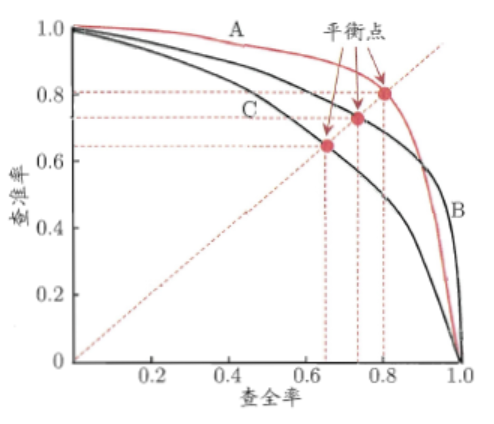

# 问题建模

## 1.1 评估指标
线下使用机器学习评估指标，线上使用的是业务指标。需要进行多轮模型迭代使两个指标变化趋势相同。  

### 1.1.1 分类指标
**精确率和召回率**  

用于二分类问题，结合混淆矩阵。   

精确率 P = $\frac{TP}{TP+FP}$
召回率 R = $\frac{TP}{TP+FN}$  

精确率：也称作查准率。在被识别为正类别的样本中，确实是正类别的比例。

召回率：也成为查全率。在所有正类别样本中，被正确识别为正类别的比例

以召回率R为横轴，以精确率P为纵轴画P-R曲线，越靠近右上角性能越好。曲线下的面积为AP分数(Average Precision Score)  。

如果一个PR曲线完全包含另一个，则前者性能更优。如果两个曲线发生交叉，则比较平衡点，远离原点的更好。

**F值**

$\frac{2}{F_1} = \frac{1}{P} + \frac{1}{R}$

可泛化成为$F_\alpha = \frac{(1+\alpha^2)*P*R}{\alpha^2*P+R}$

在不同的情况下，对精准率和召回率的偏重是不一样的，如在推荐系统中，为了尽可能少打扰用户，更希望推荐的内容是用户喜欢的，这时，精准率比较重要；而在逃犯检索系统中，更希望尽可能少漏掉逃犯，此时召回率比较重要。

当参数$\alpha$>1时，召回率有更大影响，可以考虑为，$\alpha$无穷大时，分母中的R和分子中的1都可忽略不计，则F=R，只有召回率起作用。

**准确率和错误率**

不要将精确率和准确率搞混。准确率是模型预测正确的结果所占的比例。

而且精确率仅仅适用于二分类概念。

**ROC和AUC**

接受者操作特征 Receiver Operating Characteristic (ROC)

解决了使用精确率等指标进行模型评估时，需要对预测概率设分类阈值，增添超参数，的问题。

真正率 TPR = $\frac{TP}{TP+FN}$  

假正率 FPR = $\frac{FP}{FP+TN}$   

以假正率为x轴，以真正率为y轴，ROC曲线越靠近左上角越好。此时TPR=1，FPR=0。在采用有限测试样例绘制ROC图时，无法画出光滑曲线。过程：给定$m_1$个正例和$m_2$个反例，根据预测结果对样例进行排序，把分类阈值设为最大，即把所有样例均预测成为反例，此时TPR=FPR=0，在(0,0)处标记一个点。然后，将分类阈值依次设为每个样例的预测值，依次将每个样例划分为正例。设前一个标记点坐标为$(x,y)$，当前若为真正例，则对应标记点坐标为$(x,y+\frac{1}{m_1})$，否则对应标记点坐标为$(x+\frac{1}{m_2},y)$。用线段连接相邻点。

Area Under ROC Curve (AUC)是指ROC曲线下的面积。取值越大，说明模型越可能将正样本放在负样本前面。AUC计算主要与排序有关，对预测分数没那么敏感。

$l_{rank}  = \frac{1}{m_1+m_2} \sum_{x^+}\sum_{x^-} I(f(x^+)<f(x^-) + 0.5I(f(x^+) = f(x^-)))$

$AUC = 1-l_{rank}$

在非均等代价下，ROC曲线不能直接反映出学习器的期望总体代价，而代价曲线可以。横轴是取值为[0,1]的正例概率代价，纵轴是取值为[0,1]的归一化代价。

$cost_{01}, cost_{10}$ 分别代表type one error和type two error。

$P(+)cost = \frac{p*cost_{01}}{p*cost_{01} + (1-p)*cost_{10}}$

$cost_{norm} = \frac{FNR*p*cost_{01} + FPR*(1-p)*cost_{10}}{p*cost_{01} + (1-p)*cost_{10}}$

**对数损失**

logistic loss = $-logP(Y|X)$ = $-\frac{1}{NC}\sum_{i=0}^N\sum_{j=0}^C{y_{ij}*logp_{ij}}$

衡量预测概率分布和真实概率分布的差异性。取值越小越好。对预测概率敏感。

### 1.1.2 回归指标

**平均绝对误差**

平均绝对误差Mean Absolute Error，也称为L1范数损失。

MAE = $\frac{1}{N}\sum_{i=0}^N{|y_i-p_i|}$

对数据分布的中值进行拟合。

缺点：

- 有些模型（如XGBoost）必须要求损失函数有二阶导，不能直接优化MAE。

加权平均绝对误差Weighted Mean Absolute Error是其变种。比如可以考虑时间因素。

WMAE = $\frac{1}{N}\sum_{i=0}^N{w_i|y_i-p_i|}$

**平均绝对百分误差**

MAPE = $\frac{100}{N}\sum_{i=0}^N{\frac{|y_i-p_i|}{y_i}}$，要求$y_i\neq0$

优点：

- 其计算与量纲无关，易于比较。

缺点：

- 对负值误差的惩罚大于正值误差（因为分母y小了）。
- 在$y_i$ = 0处无定义，或者太小的时候导致MAPE过大

**均方根误差**

对数据分布的平均值进行拟合。

RMSE = $\sqrt{\frac{1}{N}\sum_{i=0}^N{(y_i-p_i)^2}}$

缺点：

- 对大误差样本有更大惩罚。
- 对离群点敏感，健壮性不如MAE

均方根对数误差Root Mean Squared Logarithmic Error (RMSLE)

RMSLE = $\sqrt{\frac{1}{N}\sum_{i=0}^N{(log(y_i+1)-log(p_i+1))^2}}$

缺点：

- 对预测值偏小的样本惩罚比对预测值偏大的样本惩罚更大。

- 有可能无法直接优化RMSLE，但是若可以优化RMSE，可以先对预测目标进行对数变换$y_{new}=log(y+1)$。

### 1.1.3 排序指标

// TODO

**平均准确率均值**

Mean Average Precision (MAP)

公式分两部分计算

AP@K = 

**归一化贴现累计收益** NDCG

Normalized Discounted Cumulative Gain

### 1.1.4 比较检验

#### 假设检验

我们不知道学习器泛化错误率，只能知道测试错误率。设泛化错误率是$\epsilon$，测试错误率是$\hat\epsilon$, 测试样本为m，其中有e个样本被误分类。则该学习器被测出来测试错误率为$\hat\epsilon$的概率是$P(\hat\epsilon;\epsilon)=C(m, \hat\epsilon*m)\epsilon^{\hat\epsilon*m}(1-\epsilon)^{m-\hat\epsilon}$. 

#### 交叉验证t test

可采用5*2交叉验证：做5次2折交叉验证。每次2折交叉验证之前随即将数据打乱。

$t = \frac{\mu}{\sqrt{0.2\sum_{i=1}^5\sigma_i^2}}$

#### McNemar检验

若我们假设两学习器性能相同，应该有$e_{01}$ = $e_{10}$（下标分别表示两个学习器分类是否正确的情况）. 变量|$e_{01}$-$e_{10}$|应当服从正态分布，均值为1，方差为$e_{01}$+$e_{10}$。称作卡方分布。

#### Friedman检验与Nemenyi后续检验

在一组数据集上比较多组算法。

## 1.2 样本选择

选择最少量的训练集S$\sub$完整训练集T，模型效果不会变差。

优势：

- 缩减模型计算时间
- 相关性太低的数据对解决问题没有帮助，直接剔除
- 去除噪声

### 1.2.1 数据去噪

**噪声数据**

1. 特征值不对（缺失、超出值域范围），可能提升模型健壮性
2. 标注不对，降低数据质量。

**处理方法**

基于融合或者投票的思想

1. 集成过滤法Ensemble Filter
2. 交叉验证委员会过滤法Cross-Validated Committees Filter
3. 迭代分割过滤法Iterative-Partitioning Filter

基于业务本身

1. 清洗爬虫数据
2. 过滤掉无效曝光
3. 过滤掉最后一次点击之后的展示（用户可能没看到）

### 1.2.2 采样

#### 优点

- 克服高维特征以及大量数据导致的问题，缩短时间
- 在不平衡分类问题中帮助平衡样本比例

#### 计算样本大小

$P(|e-e_0|\geq\epsilon) \leq \delta$

e代表样本的估计，通常是样本大小n的函数。

$e_0$代表真实样本，一般未知

#### 采样方法

目标：无偏性Unbiasedness + 小样本方差 Sampling Variance

1. 无放回简单随机抽样
2. 有放回简单随机抽样
3. 平衡采样
4. 整群采样
5. 分层采样

### 1.2.3 原型选择和悬链及选择

原型选择

在样本选择过程中不需要训练模型，只选取相似度指标来找到分类精度和数据量最佳的训练集，多采用KNN算法。

训练集

构建预测模型来进行样本选择的方法，比如决策树和SVM等算法。

## 1.3 交叉验证

### 1.3.1 留出法

概念：

随机划分成两份互斥的数据集。

优点：

- 时间序列数据可用早一些的数据做训练集，晚一些的做测试集

缺点：

- 不能充分利用数据训练模型
- 划分结果严重影响最终结果

解决方案：

- 多次留出，将多次得到的实验结论进行平均

### 1.3.2 K折交叉验证

概念：

平均分成K份，每次用一份数据测试，其余数据训练。K=N时，就是留一法Leave One Out (LOO)。还有一种变体是分层K折，适用于不均衡分类问题。

优点：

- 数据利用率高

缺点：

- 稳定性和K取值有关。太小则稳定性偏低，太大则实验成本搞。

### 1.3.3 自助法 Bootstrapping

概念：

自主采样，有放回的重复采样，构建n条样本的训练集。一些样本在训练集重复出现，另一些没有出现的作为测试集。适用于数据量比较小。

每条样本没被采到的概率$P_0 =  1 - \frac{1}{n}$，经过n次采样还没有采到的概率是$lim_{n->+\infty}(1-\frac{1}{n})^n = e^{-1} = 0.368$

优点：

- 解决了其他采样得到的模型会因为训练集大小不一致产生一定偏差的问题

缺点：

- 改变了初始数据集分布，引入估计偏差

# Reference

- 《美团机器学习实践》by美团算法团队，第一章
- 《机器学习》by周志华，第二章