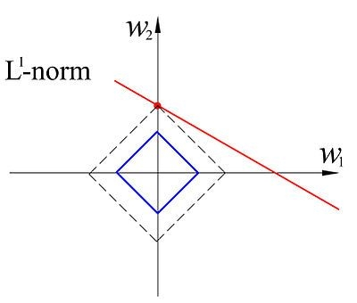
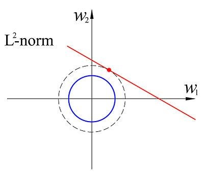

# 线性回归

## 原理

#### 输入

训练集数据$D = {(x_1,y_1) ... (x_M,y_M)}$，$x_i \in \mathcal{X} \subseteq R^p$，$y_i \in  R$

$X = (x_1\ x_2\ ...\ x_M)^T \in R^{M*p}$

$f(x) = w^Tx+b$

正则化参数$\lambda_1$ ，$\lambda_2$

#### 输出

线性回归模型$\hat f(x)$

#### 损失函数

均方误差对应欧氏距离。基于均方误差最小化求解的方法称为最小二乘法least square method。

一般的几何意义，会将误差分散在每一个样本上。

$L(w) = \sum^M_{i=1}(w^Tx_i - y_i)^2 = (w^TX^T - Y^T)(Xw - Y)$

对w进行求导，
$$
\frac{\part L(w)}{\part w} = 2X^TXw - 2X^TY
$$
$w^* = (X^TX)^{-1}X^Ty$，此时$(X^TX)$是满秩矩阵。我们也将$(X^TX)X^{T}$称为投影矩阵。这个矩阵可以将$y$投影到$X$所处于的空间中。

另外有一种几何意义，将误差分散在x的p个维度上。

令$f(w) = w^Tx = x^T\beta$.相当于实际的y在x平面上的投影。由$X^T(Y - X\beta) = 0$可以推导出$\beta = (X^TX)^{-1}X^Ty$。

## 概率推导

我们下面开始推导最小二乘的由来。

假设噪声是服从高斯分布的。$\epsilon \sim N(0, \sigma^2)$。由$y = w^Tx + \epsilon$很容易可以得到$y \sim N(w^Tx, \sigma^2)$。

计算MLE，
$$
MLE(w) = log P(Y|X; w) \\\\
= log \prod_{i=1}^{M} P(y_i|x_i;w) \\\\
= \sum_{i=1}^{M} log P(y_i|x_i;w) \\\\
= \sum_{i=1}^M log \frac{1}{(2\pi)^{1/2}\sigma} + log[exp[{-\frac 1 {2\sigma^{2}} (y_i-w^Tx_i)^2}]] \\\\
= \sum_{i=1}^M log \frac{1}{(2\pi)^{1/2}\sigma} - \frac 1 {2\sigma^{2}} (y_i-w^Tx_i)^2 \\\\
$$
对w进行求导，
$$
w^* = argmax_w MLE(w) \\\\
= argmax_w \sum_{i=1}^M - \frac 1 {2\sigma^{2}} (y_i-w^Tx_i)^2 \\\\
= argmin_w \sum_{i=1}^M (y_i-w^Tx_i)^2 \\\\
$$

## 适用场景

自变量和因变量之间是线性关系。当然我们也可以用模型逼近$y$的衍生物，比如$ln(y)$。在形式上仍是线性回归，不过实质上已是在求输入空间到输出空间的非线性函数映射。

**优点**

1. 模型计算简单，建模速度快
2. 可解释性好

**缺点**

1. 需要数据服从分布（具有严格假设）
2. 对离群数据非常敏感

# 正则化

通常可以使用$w^* = (X^TX)^{-1}X^Ty$得到答案。但是实际数据不一定满足$M>p$，这就会导致$X^TX$不可逆，从而导致严重的过拟合问题。解决方案之一就是正则化。我们使用$C(w)$代表对于$w$进行的惩罚(penalty)。线性回归正则化的一般形式可以写成$argmin_w L(w) + \lambda C(w)$。

## Lasso Regression

$C(w) = ||w||_1$。保证了$w^*$的唯一性。从下图可以看出，Lasso Regression倾向于让$x$的某一维度参数成为0，从而得到稀疏的$w$，具有选择参数的功能。

## 岭回归Ridge Regression

也叫权值衰减。$C(w) = ||w||_2^2$。保证了$w^*$的唯一性。

$$
L(w) = \sum_{i=1}^M ||w^Tx_i - y_i||^2 + \lambda ||w||_2^2 \\\\
= (w^TX^T - Y^T)(Xw - Y) + \lambda w^T w \\\\
= w^TX^TXw - 2w^Tx^TY + Y^TY + \lambda w^T w \\\\
= w^T(X^TX + \lambda I)w - 2w^Tx^TY + Y^TY
$$
对w进行求导，
$$
\frac{\part L(w)}{\part w} = 2(X^TX + \lambda I)w - 2X^TY
$$
可以得到$w^* = (X^TX + \lambda I)^{-1}X^Ty$。

### 概率推导

从概率学的角度，将w看做一个变量，$w \sim N(0, \sigma_0^2)$，$p(w|y) = p(y|w) * p(w)/ p(y)$

我们已经知道$p(y|w)$ 和 $p(w)$。
$$
p(y|w) = \frac{1}{(2\pi)^{1/2}\sigma} + exp[-\frac 1 {2\sigma^{2}} (y_i-w^Tx_i)^2] \\\\
p(w) = \frac{1}{(2\pi)^{1/2}\sigma_0} + exp[-\frac 1 {2\sigma_0^{2}} ||w||_2^2]
$$
通过求解w的MAP，
$$
w^* = argmax_w p(w|y) \\\\
= argmax_w p(y|w)*p(w) \\\\
= argmax_w log[p(y|w)*p(w)] \\\\
= argmax_w log(\frac{1}{(2\pi)^{1/2}\sigma*(2\pi)^{1/2}\sigma_0}) + log[exp[-\frac 1 {2\sigma^{2}} (y_i-w^Tx_i)^2-\frac 1 {2\sigma_0^{2}} ||w||_2^2]] \\\\
= argmax_w -\frac 1 {2\sigma^{2}} (y_i-w^Tx_i)^2-\frac 1 {2\sigma_0^{2}} ||w||_2^2 \\\\
= argmin_w \frac 1 {2\sigma^{2}} (y_i-w^Tx_i)^2 + \frac 1 {2\sigma_0^{2}} ||w||_2^2 \\\\
= argmin_w (y_i-w^Tx_i)^2 + \frac{\sigma^{2}}{\sigma_0^{2}}||w||_2^2
$$
发现和我们的损失函数是相同的。

# Reference

- 《美团机器学习实践》by美团算法团队，第三章
- 《机器学习》by周志华，第三、四章
- [白板推导系列](https://github.com/shuhuai007/Machine-Learning-Session)，shuhuai007