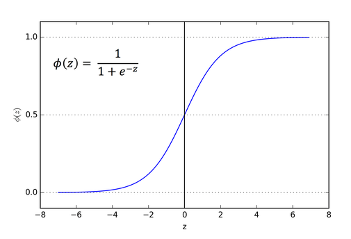

# 逻辑回归

广义线性模型。

## 原理

### 输入

训练集数据$T = {(x_1,y_1) ... (x_M,y_M)}$，$x_i \in \mathcal{X} \subseteq R^n$，$y_i \in \mathcal{Y} \subseteq R^K$，二分类$y_i \in  \{-1, +1\}$

损失函数$Cost(y,f(x))$

正则化参数$\lambda_1$ ，$\lambda_2$

学习速率$\alpha$，$\beta$

### 输出

逻辑回归模型$\hat f(x)$

### 判断函数候选

**单位阶跃函数**

不连续并且不充分光滑

**对数概率函数 Sigmoid**

$y = \frac{1}{1+e^{-z}}$    $z = w^Tx+b$

如果将y视为样本x作为正例的可能性，则1-y是反例可能性，两者的比值y/(1-y)称为几率，反映了x作为正例的相对可能性。上式是在用线性回归模型的预测结果去逼近真实标记的对数几率。

我们可以通过极大似然法来估计w和b。

$l(w,b) = \sum_{i=1}^M ln p(y_i | x_i;w,b)$

$P_w(y=j|x) = \frac{exp(x^Tw^{(j)})}{\sum_{k=1}^{K}exp(x^Tw^{(k)})}$

### 损失函数

$cost = -ylog(\hat{p}) - (1-y)log(1-\hat{p})$. 

我们之所以使用对数概率函数而不是MSE的原因：(1)对数概率函数是一个凸函数；(2) 当误差较大时，对数概率函数可以提供较大的更新。

推导w的MLE。
$$
w^* = argmax_x P(Y|X) \\\\
= argmax_w \prod_{i=1}^{M} P(Y_i|x_i) \\\\
= argmax_w \sum_{i=1}^{M} log P(Y_i|x_i) \\\\
= argmax_w \sum_{i=1}^{M} [y_i log p_1 + (1-y_i) log p_0] \\\\
$$

## 算法

### 逻辑回归算法

1. 随机初始化$\theta$
2. 计算$\theta_{j+1} = \theta_{j} - \alpha\frac{1}{m}\sum_{i=1}^{m}x_i[h(x_i)-y_i]$

3. 迭代

在迭代求解时使用高效的优化算法，如LBFGS、信赖域算法。这些求解方法是基于批量处理的，无法高效处理超大规模的数据集，也无法对线上模型进行快速实时更新。

随机梯度下降（SGD）是另一种优化方法，比如google的FTRL算法。

### FTRL算法

1. 对于$i\in\{i \sim d\}$，初始化$z_i = 0, n_i = 0$

2. 对样本t = 1 to T,

   1. 计算$$x_{t+1,i} = \left\{\begin{aligned} &0 ,&if |z_{t,i}| \leq \lambda_1 \\\ & -(\frac{\beta+\sqrt{n_i}}{\alpha}+\lambda_2)^{-1}(z_{t,i} - sign(z_{t,i})\lambda_1),& otherwise\end{aligned}\right.$$ 

   2. 计算$p_t = \sigma(x_tw)$，使用label函数和预测值$p_t$迭代

   3. 对于i

      $g_i = (p_t - y_t)x_i$

      $\sigma_i = \frac{1}{\alpha}(\sqrt{n_i + g_i^2} - \sqrt{n_i})$ 

      $z_i = z_i + g_i - \sigma_iw_{t,i}$

      $n_i = n_i +g_i^2$

3. 迭代

建议$\beta$取1。

# Reference

- 《美团机器学习实践》by美团算法团队，第三章
- 《机器学习》by周志华，第三、四章
- [白板推导系列](https://github.com/shuhuai007/Machine-Learning-Session)，shuhuai007

