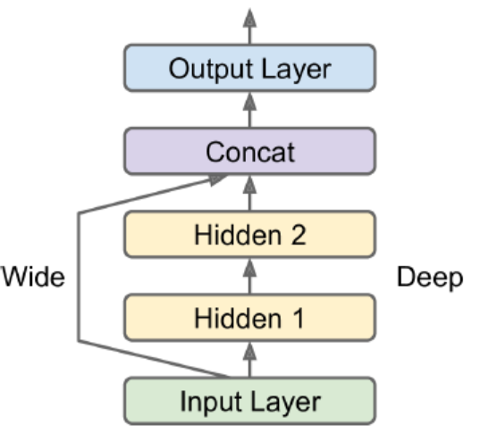

# Biological to Artificial Neurons

### Threshold Logic Unit (TLU)

input/output: numbers. compute a weighted sum of its inputs and then applies step function. 

When all neurons in a layer are connected to every neuron in the previous layer, this layer is called a fully connected layer, or a dense layer. 

*perceptron learning rule*

$w_{i,j}^{t+1} = w_{i,j}^{t} + \eta(y_j-\hat{y}_j)x_i$

### Multilayer Perceptron (MLP)

The layers close to the input layer are called the lower layers. 

Automatically computing gradients is called automatic differentiation, or autodiff. The one used by BP is called reverse-mode autodiff, suited when the function has many variables and few outputs. 

It is important to init all hidden layers' connection weights randomly (non-zero). This breaks the symmetry, and let different neurons in different layers learn different patterns. 

### Regression MLPs

No activation function should be used for the output layer unless we  want to guarantee they fall in a range. 

The loss function to use is typically the MSE. If there are a lot of outliers, we can use MAE or Huber loss. 

### Classification MLPs

Multiclass classification: use softmax activation for the whole output layer, which ensures all estimated probabilities are between 0 and 1 and they add up to 1. 

Cross-entropy loss (log loss) is a good choice. 


# Implementing MLPs with Keras

Two implementations of the Keras API: multibackend Keras and tf.keras (supports TF-specific features)

```python
import tensorflow as tf
from tensorflow import keras
tf.__version__ #2.0.0
keras.__version__ #2.2.4-tf
```


## Sequential API

E.g.: Classification Problem for a image problem. 

#### Build a Model for Classification

```python
model = keras.models.Sequential()
# similar to X.reshape(-1, 1)
model.add(keras.layers.Flattern(input_shape=[28,28]))
model.add(keras.layers.Dense(300, activation="relu"))
model.add(keras.layers.Dense(100, activation="relu"))
model.add(keras.layers.Dense(300, activation="softmax"))
```

The first Dense layer has 28\*28\*300 connection weights, plus 300 bias terms. It is recommended but not required to specify the input shape. If not specified, certain operations such as printing the model summary or saving the model will not allowed. Keras will create the model when real data is fed or build() is called. 

Instead of adding layers one by one, we can create our model by passing a list. 

```python
model = keras.models.Sequential([
    keras.layers.Flatter(), 
    keras.layers.Dense()
])
```

Get a model's list of layers.

```python
layers = model.layers
hidden1 = layers[1]
hidden1.name
```

Get parameters of a layer. 

```python
w, b = hidden1.get_weights()
w.shape  # (784, 300)
```

#### Compile the model

```python
model.compile(loss="sparse_categorical_crossentropy", 
             optimizer="sgd",
             metrics=["accuracy"])
```

If we want to convert sparse labels (class indices) to one hot vector labels, use the keras.utils.to_categorical() function. To go the other way round, use the np.argmax(axis=1).

#### Train and Evaluate

```python
history = model.fit(xtrain, ytrain, epochs=30, 
                    validation_data=(xval, yval))
model.evaluate(xtest, ytest)
```

If classes are skewed, use **class_weight** argument, which would give a larger weight to underrepresented classes. Similarly, if some instances were more important (e.g., labeled by experts), use **sample_weight** argument.

Calling fit() again we resume where the models left off. 

Plot the metric curves. 

```python
pd.DataFrame(history.history).plot(figsize=(8,5))
plt.grid(True)
plt.gca().set_ylim(0,1)
plt.show()
```

When plotting the training curve, it should be shifted by half an epoch to the left. The training error is computed using a running mean during each epoch, whereas the validation error is computed at the end of each epoch. 

Hyperparameters to check: learning rate, optimizer, number of layers, number of neurons, activation function

#### Make Prediction

```python
y_proba = model.predict(xtest)
y_proba.round(2)
y_pred = model.predict_classes(xtest)
```


E.g.: Regression Problem.

#### Preprocess For Regression

```python
xtrain_full, xtest, ytrain_full, ytest = train_test_split(data, target)
xtrain, xval, ytrain, yval = train_test_split(xtrain_full, ytrain_full)

scaler = StandardScaler()
xtrain = scaler.fit_transform(xtrain)
xval = scaler.transform(xval)
xtest = scaler.transform(xtest)
```

#### Model for Regression

```python
model = keras.models.Sequential([
    keras.layers.Dense(30, activation="relu", input_shape=xtrain.shape[1:])
    keras.layers.Dense(1)
])
model.compile(loss="mean_squared_error", optimizer="sgd")
hist = model.fit(xtrain, ytrain, validation_data=(xval, yval))
mse_test = model.evaluate(xtest, ytest)
y_pred = model.predict(xtest)
```


 ## Functional API

Sequential models make data go through the full stack of layers. The workflow can be distorted by wide&deep neural network. 



```python
input_ = keras.layers.Input(shape=xtrain.shape[1:])
hid1 = keras.layers.Dense(30, activation="relu")(input_)
hid2 = keras.layers.Dense(30, activation="relu")(hid1)
concat = keras.layers.Concatenate()([input_, hid2])
output = keras.layers.Dense(1)(concat)
model = keras.Model(inputs=[input_], outputs=[output])
```

If we want to send a subset of the features through the wide path and a different subset through the deep path, one solution is to use multiple inputs. 


```python
input_A = keras.layers.Input(shape=[5], name="wide_input")
input_B = keras.layers.Input(shape=[6], name="deep_input")
hid1 = keras.layers.Dense(30, activation="relu")(input_B)
hid2 = keras.layers.Dense(30, activation="relu")(hid1)
concat = keras.layers.concatenate([input_A, hid2])
out = keras.layers.Dense(1, name="output")(concat)
model = keras.Model(inputs=[input_A, input_B], outputs=[out])

xtrain_A, xtrain_B = xtrain[:, :5], xtrain[:, 2:]
xval_A, xval_B = xval[:, :5], xval[:, 2:]
# pass a pair of inputs
model.fit((xtrain_A, xtrain_B), ytrain, 
          validation_data=((xval_A, xval_B), yval))
```

Cases when we want multiple outputs:

- Task needs. For example, locate and classify the main object. 
- Multiple independent tasks based on same data. NN can learn features across tasks. 
- Regularization technique. 

```python
out = keras.layers.Dense(1, name="main")(concat)
aux_out = keras.layers.Dense(1, name="aux")(hid2)
model = keras.Model(inputs=[input_A, input_B], 
                   outputs=[out, aux_out])
# each output needs its own loss function
model.compile(loss=["mse", "mse"], loss_weights=[0.9, 0.1])
```


## Subclassing API

Sequential API and Functional API are declarative. The model can easily be saved, cloned, and shared; structured can be displayed. 

Subclassing API are dynamic. The model can involve loops, varying shapes, and conditional branching. 

```python
class MyModel(keras.Model):
    def __init__(self, units=30, activation="relu", **kwargs):
        # handles standard args (e.g.: names)
        super().__init__(**kwargs)
        self.hid1 = Dense(units ,activation=activation)
        self.hid2 = Dense(units, activation=activation)
        self.main_output = Dense(1)
        self.aux_output = Dense(1)
    
    def call(self, inputs):
        input_A, input_B = inputs
    	hid1 = self.hid1(input_B)
        hid2 = self.hid2(hid1)
        concat = keras.layers.concatenate([input_A, hid2])
        main_out = self.main_output(concat)
        aux_out = self.aux_output(hid2)
    	return main_out, aux_out

model = MyModel()
```

When we call summary(), we only get a list of layers, w/o any connecting info. Moreover, Keras cannot check types and shapes ahead of time. 


## Save and Restore and Callbacks

Use the HDF5 format to save both architecture and values of all model parameters. 

```python
model = Sequential()
model.compile()
model.fit()
model.save("my_keras.h5")
model = keras.models.load_model("my_keras.h5")
```

In fit(), **callbacks** argument lets us specify a list of objects that Keras will call at the start and end of training/epoch/batch. 

```python
checkpoint = keras.callbacks.ModelCheckpoint("my_keras.h5", 
                                          save_best_only=True)
es_cb = keras.callbacks.EarlyStopping(patience=10, 
                                    restore_best_weights=True)
hist = model.fit(xtrain, ytrain, 
                 callbacks=[checkpoint, es_cb])
```

We can also define custom callbacks. 

```python
class MyCB(keras.callbacks.Callback):
	def on_epoch_end(self, epoch, logs):
        print("val/train:{:.2f}".format(logs["val_loss"]/logs["loss"]))

    '''
    def on_train_begin()
    def on_train_end()
    def on_epoch_begin()
    def on_epoch_end()
    def on_batch_begin()
    def on_batch_begin()
    '''
```


## TensorBoard

TensorBoard is a great interactive visualization tool that we can use to view the learning curves during training and analyze statistics. We have to modify our program and output the data to a special binary log files called event files. 

```python
import os 
root_logdir = os.path.join(os.curdir, "my_logs")

def get_dir():
    import time
    run_id = time.strftime("run_%Y_%m_%d-%H_%M_%S")
    return os.path.join(root_logdir, run_id)

run_logdir = get_dir()
tensorboard_cb = keras.callbacks.TensorBoard(run_logdir)
```

There is one directory per fun, each containing one subdir for training logs and one for validation logs. 

Next, start the TensorBoard server. 

```shell
tensorboard --logidr=./my_logs --port=6006
```

If we have installed Jupiter. 

```python
%load_ext tensorboard
%tensorboard --logdir=./logs --port=6006
```


## Fine Tuning Hyperparameter

Try many combinations and see which one works best on the validation set. We can use GridSearchCV or RandomizedSearchCV to explore by wrapping our models in objects that mimic regular scikit-learn regressors.

```python
def build_model(n_hid=1, n_neurons=30, lr=0.1, shape=[9]):
    model = Sequential()
    model.add(InputLayer(input_shape=shape))
    for layer in range(n_hid):
        model.add(Dense(n_neurons, activation="relu"))
    model.add(Dense(1))
    optimizer = keras.optimizers.SGD(lr=lr)
    model.compile(loss="mse", optimizer=optimizer)
    return model
```

```python
keras_reg = keras.wrappers.scikit_learn.KerasRegressor(build_model)
param_dist = {
    "n_hid": [0,1,2,3],
    "n_neurons": np.arange(1,100),
    "lr": scipy.stats.reciprocal(1e-4, 1e-2)
}
rnd_search_cv = RandomizedSearchCV(keras_reg, param_dist, 
                                  n_iter=10, cv=5)
rnd_search_cv.fit(xtrain, ytrain, 
                  callbacks=EarlyStopping(patience=10))
```

When a region of the space turns out to be good, it should be explored more. In this way, searching space is more efficient. 

- Hyperopt
- Hyperas, kopt, Talos
- Keras Tuner
- Scikit-Optimize
- Spearmint
- Hyperband
- Sklearn-Deap


