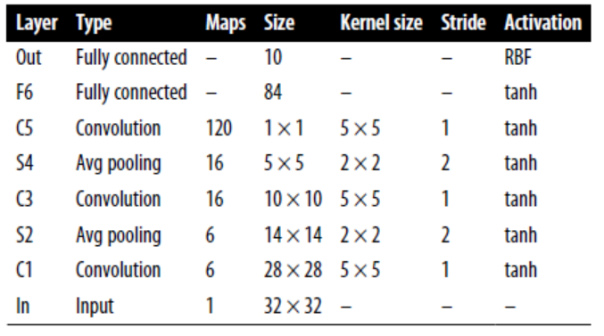
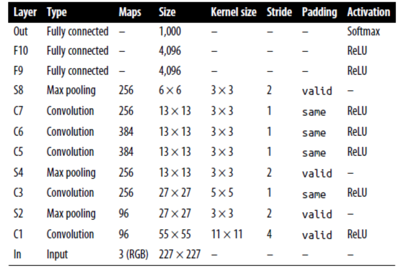
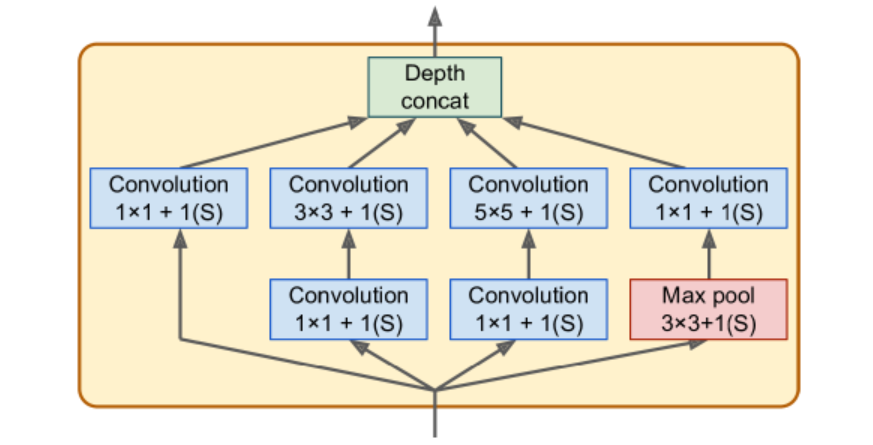
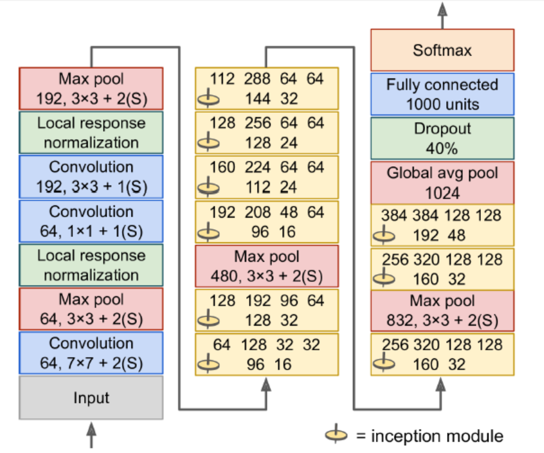
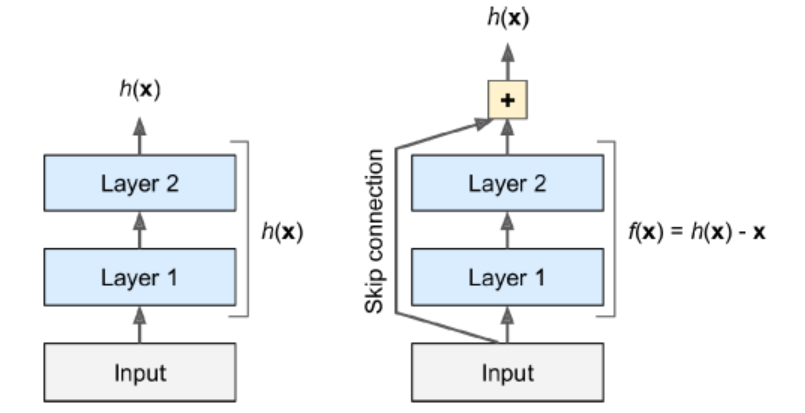
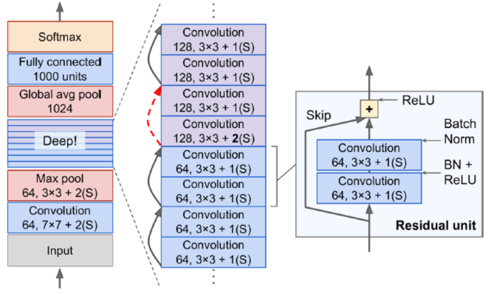

# Conv Layers

In turn, each neuron in the second conv layer is connected only to neurons located within a small rectangle in the first layer. 

### Filters

Also called convolution kernels. 

A layer full of neurons using the same filters outputs a feature map. 

During training, the conv layer will automatically learn the most useful filters for its task, and the layers above will learn to combine them into more complex patterns. 

### Stacking Multiple Feature Maps

It has one neuron per pixel in each feature map, and all neurons within a given feature map share the same parameters. (dramatically reduces the number of parameters)

Input images are composed of multiple sublayers: one per color channel (RGB). 

A neuron located in $(i, j)$ in feature map $k$ in a given conv layer $l$ is connected to the outputs of the neurons in the previous layer $l-1$, located in rows $i*s_h$ to $i*s_h+f_h-1$ and columns  $i*s_w$ to $i*s_w+f_w-1$ across all feature maps. 

### TensorFlow Implementation

Each input image is represented as a 3D tensor of shape [height, width, channels]. A mini-batch is represented as a 4D tensor [mini-batch size, height, width, channels]. The weights of a conv layer are represented as a 4D tensor of shape $[f_h, f_w, f_{n'}, f_n]$. 

```python
# loads two color image
from sklearn.datasets import load_sample_image
china = load_sample_image("china.jpg")/255
flower = load_sample_image("flower.jpg")/255
images = np.array([china, flower])
batch_size, height, width, channels = images.shape

# create 2 filters
filters = np.zeros(shape=(7,7,channels, 2), dtype=np.float32)
filters[:, 3, :, 0] = 1 # vertical line
filters[3, :, :, 1] = 1 # horizontal line

outputs = tf.nn.conv2d(images, filters, strides=1, padding="same")
# plot 1st image's 2nd feature map 
plt.imshow(outputs[0, :, :, 1], cmap="gray")
plt.show()
```

The pixel intensity for each color channel is represented as byte from 0 to 255, so we scale these features by dividing 255 to get flats ranging from 0 to 1.

We create two 7*7 filters.  The tf.nn.conv2d() is part of TF's low-level deep learning API. Images is the input mini-batch. **strides** can also be a 1D array with four elements, where the two central elements are the vertical and horizontal strides, and the first and last elements must be equal to 1. 

In a real CNN, we normally define filters as trainable variables. 

```python
conv = keras.layers.Conv2D(filters=32, kernel_size=3, strides=1, padding="same", activation="relu")
```

### Mem Requirements

Requires a huge amount of RAM. During inference the RAM occupied by one layer can be released as soon as the next layer has been computed, so we only need as much RAM as required by two consecutive layers. But during training everything computed during the FP needs to preserved for the reverse pass. If training crashes because of an out-of-mem error, we can try reducing mini-batch size. Alternatively, we can try reducing dimensionality using a stride, or removing a  few layers. 

# Pooling Layers

Goal is to subsample the input image to reduce the computational load, the mem usage, and the number of parameters. 

A pooling neuron has no weights. A pooling layer typically works on every input channel independently, so the output depth is the same as the input depth. 

**Down side**

1. even with a 2*2 kernel and a stride of 2, the output will be 2 times smaller in both direction (dropping 75% of the input values in total)
2. Invariance to small translations is not desirable sometimes

### TF Implementation

```python
max_pool = keras.layers.MaxPool2D(pool_size=2)
```

To create an average pooling layer, just use AvgPool2D instead of MaxPool2D.  

MaxPooling preserves only the strongest features, getting rid of all the meaningless ones, so the next layers get a cleaner signal to work with. 

Pooling can also be performed along the depth dimension rather than the spatial dimensions, although this is not as common. This allows the CNN to learn to be invariant to various features. For example, it could learn multiple filters, each detecting a different rotation of the same pattern (e.g.: hand-written digits), and the depthwise max pooling layer would ensure that the output is the same regardless of the rotation. The CNN could similarly learn to be invariant to anything else: thickness, brightness, skew, color, and so on. 

Keras does not include a depthwise max pooling layer, but TF's low-level API does. 

```python
output = tf.nn.max_pool(images, ksize=(1,1,1,3), 
                       strides=(1,1,1,3),
                       padding="valid")
```

The first three values of kernel size and strides should be 1. The last value should be whatever kernel size and stride we want along the depth dimension (must be a divisor of the input depth). 

We can wrap this in our Keras models using Lambda layer. 

```python
depth_pool = keras.Layers.Lambda(lambda X: tf.nn.max_pool(X, ksize=(1,1,1,3), strides=(1,1,1,3), padding="valid"))
```

One last type of pooling layer is global average pooling layer. It computes the mean of each entire feature map (outputs a single number per feature map and per instance). 

```python
global_avg_pool = keras.layers.GlobalAvgPool2D()
```

It is equivalent to the following Lambda layer. 

```python
global_avg_pool = keras.layers.Lambda(lambda X: tf.reduce_mean(X, axis=[1,2]))
```

# CNN Architectures

The image gets smaller and smaller as it progresses through the network, but also deeper (with more feature maps).

A common mistake is to use conv kernels that are too large. 

The following code can be used to tackle Fashion MNIST. 

```python
model = Sequential([
    Conv2D(64, 7, activation="relu", padding="same", input_shape=[28,28,1]),
    MaxPooling2D(2), 
    Conv2D(128, 3, activation="relu", padding="same"), 
    Conv2D(128, 3, activation="relu", padding="same"), 
    MaxPooling2D(2), 
    Conv2D(256, 3, activation="relu", padding="same") 
    Conv2D(256, 3, activation="relu", padding="same"), 
    MaxPooling2D(2), 
    Flatten(), 
    Dense(128, activation="relu"), 
    Dropout(0.5), 
    Dense(64, activation="relu"), 
    Dropout(0.5), 
    Dense(10, activation="softmax")
])
```

The first layer uses 64 large filters but no stride, because the input images are not very large. The input shape is [28,28,1] because the images are 28*28 pixels, with a single color channel. 

We repeat the same structure twice: two conv layers followed by a max pooling layer. For larger images, we could repeat this structure several more times. 

The number of filters grows as we climb up the CNN toward the output layer. The number of low-level features is often fairly low, but there are many different ways to combine them into higher level  features. It is a common practice to double the number of filters after each pooling layer, since a pooling layer divides each spatial dimension by a factor of 2, we can afford to double the number of feature maps in the next layer without fear of exploding the number of parameters, mem usage, or computational load. 

### LeNet-5

Most widely known CNN architecture. It is used to tackle MNIST handwritten number. 



MNIST images are 28\*28 pixels, but they are zero-padded to 32\*32 pixels and normalized before being fed to the network. The rest of the network does not use padding. 

The average pooling layers are slightly more complex than usual: each neuron computes the mean of its inputs, then multiplies the result by a learnable coefficient (one per map) and adds a learnable bias term. 

Most neurons in C3 maps are connected to neurons in only three or four S2 maps. 

The output layer is a bit special: instead of computing the matrix multiplication of the inputs and the weight vector, each neuron outputs the square of the Euclidian distance between its input vector and its weight vector. Each output measures how much the image belongs to a particular digit class. 

### AlexNet

Similar to LeNet-5, but larger and deeper. The first to stack conv layers directly on top of one another, instead of stacking a pooling layer on top of each conv layer. 



To reduce overfitting, the authors used reg tech. First, they applied dropout during training to the outputs of layers F9 and F10. Second, they performed data augmentation by randomly shifting the training images by various offset, flipping and changing the lighting conditions. 

**data aug**

The generated instances should be as realistic as possible: human should not be able to tell whether it augmented. Simply adding white noise will not help; the modifications should be learnable. 

ALexNet also uses a competitive normalization step immediately after the ReLU step of layers C1 and C3, called local response normalization (LRN): the most strongly activated neurons inhibit other neurons located at the same position in neighboring feature maps. This encourages different feature maps to specialize, pushing them apart and forcing them to explore a wider range of features. 

$b_i = a_i(k+\alpha\sum_{j=j_{low}}^{j_{high}}\alpha_j^2)^{-\beta}$. 

$j_{low} = max(0, i-r/2)$

$j_{high} = min(i+r/2, f_n - 1)$

In the equation, $b_i$ is the normalized output of the neuron located in feature map i, at some row u and column v. $a_i$ is the activation of that neuron after the ReLU step, but before normalization. $k$ is bias, $r$ is depth radius, $f_n$ is the number of feature maps.  

This step can be implemented using the tf.nn.local_response_normalization() function. 

### GoogLeNet

The network was much deeper than previous CNNs, which was made possible by subnetworks called inception modules, which allow GoogLeNet to use parameters much more efficiently than previous architectures (has 10 times fewer param than AlexNet). 

Below is the arch for inception modules. The notation "3\*3+1(S)" means that the layer uses a 3*3 kernel, stride 1, and same padding. The input signal is first copied and fed to four different layers. All conv layers use ReLU activation function. The second set of conv layers uses different kernel sizes, allowing them to capture patterns at different scales. Every single layer uses a stride of 1 and same padding (even the max pooling layer), so their outputs all have the same height and width as their inputs. 



There are some 1\*1 kernel conv layer. First, although they cannot capture spatial patterns, they can capture patterns along the depth dimension. Second, they are configured to output fewer feature maps than their inputs, so they serve as bottleneck layers, meaning they reduce dimensionality. Third, each pair of conv layers acts like a single powerful conv layer, capable of capturing more complex patterns. 

The architecture is so deep that it has to be represented in three columns, but GoogLeNet is actually one tall stack, including nine inception modules. The six numbers in the inception modules represent the number of feature maps output by each conv layer in the module. 



Input images are typically expected to be 224\*224 pixels. 

The first two layers divide the image's height and width by 4 (so area is divided by 16) to reduce the computational load. The first layer uses a large kernel size so that much of the info is preserved. 

The local response normalization layer ensures that the previous layers learn a wide variety of features. 

Two conv layers follows, where the first acts like a bottleneck layer. Think of this pair as a single smarter conv layer. 

Max pooling layer reduces the image height and width by 2, again to speed up computations. 

Tall stack of nine inception modules. 

The global average pooling layer outputs the mean of each feature map. This drops any remaining spatial info (not much is left at that point). Moreover, it is a classification task, not localization, so it does not matter where the object is. Thanks to the dim reduction brought by this layer, there is no need to have several fully connected layers at the top of the CNN. 

The original GoogLeNet  architecture also included two auxiliary classifiers plugged on top of the third and sixth inception modules. They were composed of one average pooling layer, one conv layer, two fully connected layers, and a softmax activation layer. During training, their loss scaled down by 70% was added to the overall loss. The goal was to fight the vanishing gradients problem and regularize the network. (Later shown that their effect was relatively minor). 

### VGGNet

Developed Karen Simonyan and Andrew Zisserman from the Visual Geometry Group (VGG) research lab at Oxford Univ. 

Architecture: 2 or 3 conv layers and a pooling layer, then again 2 or 3 conv layers and a pooling layer, and so on. Plus a final dense network with 2 hidden layers and the output layer. It used only 3\*3 filters, but many filters. 

### ResNet

It confirmed the general trend: models are getting deeper and deeper, with fewer and fewer params. The key is to use skip connections. 

When training a neural network, the goal is target function h(x). If you add the input x to the output of the network, then the network will be forced to model f(x) = h(x) - x rather than h(x). This is called residual learning. If the target function is fairly close to the identity function (which is often the case), this will speed up training considerably.  



Moreover, if we add many skip connections, the network can start making progress even if several layers have not started learning yet. The deep residual network can be seen as a stack of residual units(RUs), where each RU is a small NN with a skip connection. 

Each RU is composed of two conv layers (no pooling), with Batch Normalization and ReLU activation, using 3\*3 and preserving spatial dimensions. 



Note that the number of feature maps is doubled every few RN, at the same time as their height and width are halved. The inputs cannot be added directly to the outputs of the RU because they don't have the same shape. To solve this problem, the inputs are passed through a 1\*1 conv layer with stride 2 and the right number of output feature maps. 

### Xception

Extreme Inception. It replaces the inception modules with a special type of layer called a depthwise separable conv layer. While a regular conv layer uses filters that try to simultaneously capture spatial patterns and cross channel patterns (e.g., mouth+nose+eyes=face), a separable conv layer makes the strong assumption that spatial patterns and cross-channel patterns can be modeled separately. Thus, it is composed of two parts: first part applies a single spatial filter for each input feature map, second part looks exclusively for cross channel patterns. 

Since separable conv layers only have one spatial filter per input channel, we should avoid using them after layers that have too few channels. 

### SENet

Squeeze and Excitation Network. The extended versions of inception networks and ResNets are called SE-Inception and SE-ResNet. 

An SE block analyzes the output of the unit it is attached to, focusing exclusively on the depth dimension. For example, an SE block may learn that mouths, noses, and eyes usually appear together in pictures. So, if the block sees a strong activation in the mouth and nose feature maps, but only mild activation in the eye feature map, it will boost the eye feature. (recalibrated feature maps)

An SE block is composed of just 3 layers: a global average pooling layer, a hidden dense layer using ReLU, and a dense output layer using sigmoid. The first dense layer is used to reduce dim (usually 16 times fewer than the number of feature maps): using low-dim vector representation of the distribution of feature responses. Finally the output layer takes the embedding and outputs a recalibration vector containing one number per feature map (same depth as the input), each between 0 and 1. 

### Implement ResNet-34 CNN using Keras

```python
class ResidualUnit(keras.layers.Layer):
    def __init__(self, filters, stride=1, activation="relu", **kwargs):
        super().__init__(**kwargs)
        self.activation = keras.activations.get(activation)
        self.main_layers = [
            Conv2D(filters, 3, strides=stride, padding="same", use_bias=False), 
            BatchNormalization(), 
        	self.activation, 
        	Conv2D(filters, 3, strides=1, padding="same", use_bias=False), 
        	BatchNormalization()]
        self.skip_layers = []
        if stride > 1:
            slef.skip_layers = [
                Conv2D(filters, 1, strides=stride, padding="same", use_bias=False), 
                BatchNormalization()
            ]
    def call(self, inputs):
        Z = inputs
        for layer in self.main_layers:
            Z = layer(X)
        skip_Z = inputs
        for layer in self.skip_layers:
            skip_Z = layer(skip_Z)
        return self.activation(Z + skip_Z)
```

Next, we can build ResNet 34 using Sequential model. 

```python
model = keras.models.Sequential()
model.add(Conv2D(64, 7, strides=2, input_shape=[224, 224, 3], padding="same", use_bias=False))
model.add(BatchNormalization())
model.add(Activation("relu"))
model.add(MaxPool2D(pool_size=3, strides=2, padding="same"))
prev_filters = 64
for filters in [64]*3 + [128]*4 + [256]*6 + [512]*3:
    strides = 1 if filters == prev_filters else 2
    model.add(ResidualUnit(filters, strides=strides))
    prev_filters = filters
    
model.add(GlobalAvgPool2D())
model.add(Flatten())
model.add(Dense(10, activation="softmax"))
```

# Using Pretrained Models from Keras

We can load standard models from Keras. 

```python
model = keras.applications.resnet50.ResNet50(weights="imagenet")
```

We need to ensure our images have the right size. A ResNet-50 model expects 224*224 pixel images. 

```python
images_resized = tf.image.resize(images, [224, 224])
# To preserve the aspect ratio, use the following
# tf.image.crop_and_resize()
```

The pretrained models assume the images are preprocessed in a specific way. 

```python
inputs = keras.applications.resnet50.preprocess_input(images_resized*255)
```

Now we can use the pretrained model to make predictions. 

```python
y_proba = model.predict(inputs)
```

If we want to display the top K predictions, including the class name and the estimated proba of each predicted class, use the decode_predictions() function. 

```python
top_K = keras.applications.resnet50.decode_preditions(y_proba, top=3)
for image_idx in range(len(images)):
    print("Image #{}".format(image_idx))
    for class_id, name, y_p in top_K[image_idx]:
        print(" {} - {:12s} {:.2f}%".format(class_id, name, y_p*100))
        print()
```

### Pretrained Models for Transfer Learning

Load dataset. If we want to get information about the dataset, set **with_info**=True. 

```python
import tensorflow_datasets as tfds
dataset, info = tfds.load("tf_flowers", as_supervised=True, with_info=True)
dataset_size = info.splits["train"],num_examples
class_names = info.features["label"].names
n_classes = info.features["label"].num_class
```

We want to split the training set. 

```python
test_split, valid_split, train_split = tfds.Split.TRAIN.subsplit([10, 15, 75])
test_set = tfds.load("tf_flowers", split=test_split, as_supervised=True)
valid_set = tfds.load("tf_flowers", split=valid_split, as_supervised=True)
train_set = tfds.load("tf_flowers", split=train_split, as_supervised=True)
```

Nest, preprocess the images. 

```python
def preprocess(img, label):
    resized_image = tf.image.resize(img, [224, 224])
    final_image = keras.applications.xception.preprocess_input(resized_image)
    return final_image, label
```

Apply the preprocess to all datasets. 

```python
batch_size = 32
train_set = train_set.shuffle(1000)
train_set = train_set.map(preprocess).batch(batch_size).prefetch(1)
valid_set = valid_set.map(preprocess).batch(batch_size).prefetch(1)
test_set = test_set.map(preprocess).batch(batch_size).prefetch(1)
```

We can also perform data augmentation, change the preprocessing function for the training set, adding some random transformations to the training images. Use tf.image.random_crop() to randonly flip the images horizontally, and so on. The keras.preprocessing.image.ImageDataGenerator class makes it easy to do data augmentation. However, building a tf.data pipeline reads the images efficiently. 

Load models. We exclude the top: excludes the global average pooling layer and the dense output layer. 

```python
base_model = keras.applications.xception.Xception(weights="imagenet", include_top=False)
avg = GlobalAveragePooling2D()(base_model.output)
out = Dense(n_classes, activation="softmax")(avg)
model = keras.Model(inputs=base_model.input, outputs=out)
```

Freeze the weights. Since our model uses the base model's layers directly, rather than the base_model object itself, setting `base_model.trainable = False` would have no effect. 

```python
for layer in base_model.layers:
    layer.trainable = False
```

Compile the model. 

```python
optm = SGD(lr=0.2, momentum=0.9, decay=0.01)
model.compile(loss="sparse_categorical_crossentropy", optimizer=optimizer, metrics=["accuracy"])
hist = model.fit(train_set, epochs=5, validation_cata=valid_set)
```

After training the model for a few epochs, its validation accuracy should reach about 80%. We should unfreeze all layers and continue training. Use a lower learning rate to avoid damaging the pretrained weights. 

```python
for layer in base_model.layers:
    layer.trainable = True
optm = SGD(lr=0.01, momentum=0.9, decay=0.001)
model.compile(loss="sparse_categorical_crossentropy", optimizer=optimizer, metrics=["accuracy"])
hist = model.fit(train_set, epochs=5, validation_cata=valid_set)
```

# Localization

Can be seen as regression. Train with MSE. 

```python
base_model = keras.applications.xception.Xception(weights="imagenet", include_top=False)
avg = keras.layers.GlobalAveragePooling2D()(base_model.output)
class_output = Dense(n_classes, activation="softmax")(avg)
loc_output = Dense(4)(avg)
model = keras.Model(inputs=base_model.input, outputs=[class_output, loc_output])
model.compile(loss=["sparse_categorical_crossentropy", "mse"], loss_weights=[0.8,0.2], optimizer=optm, metrics=["accuracy"])
```

Sometimes, the dataset does not have bounding boxes, and we need to add them ourselves. We can use an open source image labeling tool like VGG Image Annotator, LabelImg, OpenLabeler, or ImgLab. 

Each item should be a tuple of the form (images, (class_labels, bounding_boxes)). The bounding boxes should be normalized so that the horizontal and vertical coordinates range from 0 to 1. Also, it is common to predict the sqrt of the height and width rather than the height and width directly: this way, a 10 pixel error for a large bounding box will not be penalized as much as a 10 pixel error for a small bounding box. 

The most common metric for evaluating how well the model predicts bounding boxes is the Intersection over Union (IoU): the area of overlap between the predicted bounding box and the target, divided by the area of their union. It is implemented in `tf.keras.metrics.MeanIoU`. 

# Object Detection 

Non-max suppression

1. We need to add an extra objectness output to our CNN, to estimate the prob that an object is indeed present in the image. It must use sigmoid activation (can be trained with binary cross-entropy loss). Then get rid of all bounding boxes for which the objectness score is below threshold. 
2. Find the bounding box with highest objectness score, and get rid of all other boxes that overlap a lot with it (IoU >= 60%). 
3. Repeat until there are no more bounding boxes to get rid of

# Fully Conv Networks (FCN)

The idea of FCNs was introduced for semantic segmentation (classifying every pixel in an image according to the class of the object it belongs to).

To convert a dense layer to a conv layer, the number of filters in the conv layer must be equal to the number of units in the dense layer, the filter size must be equal to the size of the input feature maps with "valid" padding.

A dense layer expects a specific input size, whereas a conv layer will happily process images of any size. Since FCN contains only conv layers and pooling layers, it can be trained on images of any size.  


# YOLO

Yolo3

1. output five bounding boxes for each grid cell (instead of one), and 20 class proba per grid cell. In total, 45 numbers per grid cell: 5 bounding boxes (*4 coordinate), plus 5 objectness scores, plus 20 class proba. 
2. predicts an offset relative to the coordinates of the grid cell. (0, 0) means the top left. 
3. Before training the NN, finds five representative bounding box dimensions, called anchor boxes, by applying K-Means to the height and width of bounding boxes. For each grid cell and each anchor box, predicts the log of the vertical and horizontal rescaling factors. 
4. trained using images of diff scales: every few batches during training, the network choose a new image dimension (330 - 608). 

**mAP**

A metric used in object detection. 

In AUC, there may contain a few sections where precision goes up when recall increases. We can get a fair idea of the model's performance by computing max precision we can get with at least 0% recall then 10%, 20%... Calculate the mean of these maximum precisions (AP). When there are more than two classes, calculate AP for each class, and then compute mean AP. 

# Semantic Segmentation

Each pixel is classified according to the class of the object it belongs to. Different objects of the same class are not distinguished. (e.g., bicycles on the right side of the segmented image end up as one big lump of pixels). The main difficulty is when images go through a CNN, they gradually lose their spatial resolution. 

One solution for upsampling (increasing the size of an image) is to use transposed convolutional layer. It is equivalent to first stretching the image by inserting 0s, then performing a regular conv. Use `Conv2DTranspose` layer. 

**dilation_rate**

value>=2: using a regular conv layer with a filter dilated by inserting 0s. For example, **dilation_rate**=4, [[1,2,3]] will be converted to  [[1,0,0,0,2,0,0,0,3]]

Another solution is to add skip connections from lower layers. Sometimes, we can scale up beyond the size of the original image, called super-resolution. 


