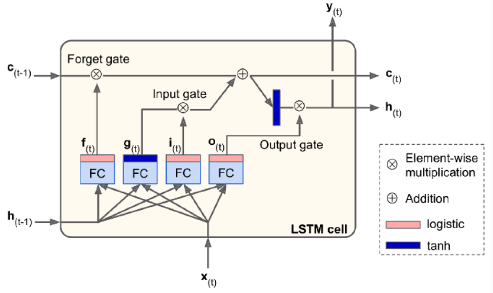
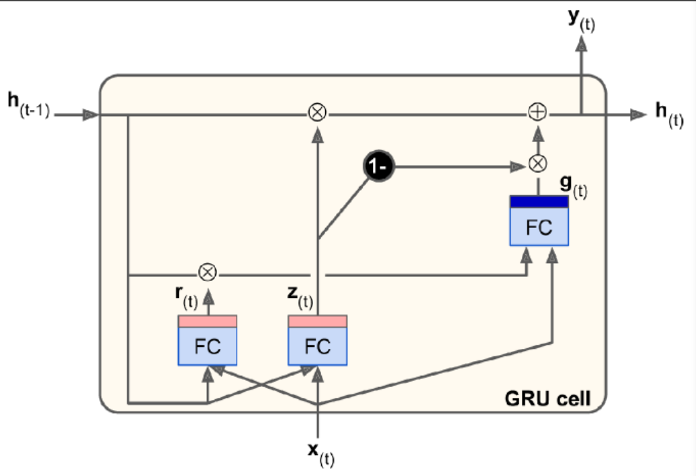

# RNN

RN: recurrent neuron

RNN has connections pointing backward. At time step t, RN receives the inputs $x_t$ as well as its own output from the previous time step, $y_{(t-1)}$. Thus, each RN has two sets of weights. We can represent it against the time axis (unrolling the network through time). 

### Memory Cells

A part of a NN that preserves some state across time steps is called a memory cell. RN is capable of learning short patterns. 

### Input and Output Sequences

An RNN can simultaneously take a seq of inputs and produce a seq of outputs. This type of seq-to-seq network is useful for predicting time series. 

Alternatively, we can ignore all outputs except for the last one. This seq-to-vec network can be used to tackle classification/regression problem. 

Conversely, we can feed the network the input vec at each time step and let it output a seq. This vect-to-seq network can be used to tackle problems like sequence generating (e.g., outputting a caption for an image). 

### Forecasting

Univariate: one value per time step 

BPTT: backprop through time. 

We are using a time series generated by generate_time_series() as an example. 

```Python
def generate_time_series(batch_size, n_steps):
    freq1, freq2, offset1, offset2 = np.random.rand(4, batch_size, 1)
    time = np.linspace(0, 1, n_steps)
    series = 0.5 * np.sin((time-offset1)*(freq1*10+10))
    series += 0.2 * np.sin((time-offset2)*(freq2*10+20))
    series += 0.1 * (np.random.rand(batch_size, n_steps)-0.5)
    return series[...,np.newaxis].astype(np.float32)
```

The input features are generally represented as 3D arrays [batch size, time steps, dimensionality]. 

Create a training set. 

```python
n_steps = 50
seres = generate_time_eries(10000, n_steps+1)
xtrain, ytrain = seres[:7000, :n_steps], seires[:7000, -1]
xval, yval = seres[7000:9000, :n_steps], seires[7000:9000, -1]
xtest, ytest = seres[9000:, :n_steps], seires[9000:, -1]
```

### Baseline Metrics

The simplest approach is to predict the last value in each series (naive forecasting), which is surprisingly difficult to outperform. 

```python
y_pred = xval[:, -1]
np.mean(keras.losses.mean_squared_error(yval, y_pred))
```

Another simple approach is to use a fully connected network. 

```python
model = Sequential([
    Flatten(input_shape=[50,1]),
    Dense(1)
])
```

### Simple RNN

We do not need to specify the length of the input sequences. To process any number of time steps, we set the first input dimension to None. 

Use a tanh activation funciton by default. 

```python
model = Sequential([
    keras.layers.SimpleRNN(1, input_shape=[None, 1])
])
```

### Deep RNN

Stack. 

```python
model = Sequential([
    keras.layers.SimpleRNN(20, return_sequences=True, input_shape=[None, 1]),
    keras.layers.SimpleRNN(20, return_sequences=True),
    keras.layers.SimpleRNN(1)
])
```

Make sure to set **return_sequences** to True for all recurrent layers except the last one (if only care about the last output). 

Note that the last layer has only a single unit, because we want to forecast a univariate time series. This means we must have a single output value per time step. We can replace it with a Dense layer. 

### Forecasting Several Time Steps Ahead

We can predict the next 10 steps just like below. 

```python
series = generate_time_series(1, n_steps+10)
X_new, Y_new = series[:, :n_steps], sries[:, n_steps:]
X = X_new
for step_ahead in range(10):
    y_pred_one = model.predict(X[:, step_ahead:])[:, np.newaxis, :]
    X = np.concatenate([X, y_pred_one], axis=1)
Y_pred = X[:, n_steps:]
```

The prediction for the next step will usually be more accurate than the predictions for later time steps, since the errs might accumulate. 

We can also train RNN to predict all 10 next val at once. 

```python
series = generate_time_series(10000, n_steps+10)
xtrain, ytrain = series[:7000, :n_steps], series[:7000, -10:, 0]
xval, yval = series[7000:9000, :n_steps], series[7000:9000, -10:, 0]
xtest, ytest = series[9000:, :n_steps], series[9000:, -10:, 0]

model = Sequentail([
    SimpleRNN(20, return_sequences=True, input_shape=[None, 1]),
    SimpleRNN(20), 
    Dense(10)
])
```

Instead of training the model to forecast the next 10 values only at very last time step, we can train it to forecast the next 10 values at each time step. This will stabilize and speed up training. 

At t=0, the model will output a vector containing the forecasts for time steps 1 to 10. At t=1, it will forecast steps 2 to 11. 

```python
Y = np.empty((10000, n_steps, 10))
for step_ahead in range(1, 11):
    Y[:, :, step_ahead-1] = series[:, step_ahead:step_ahead+n_steps, 0]
    
Ytrain = Y[:7000]
Yval = Y[7000:9000]
Ytest = Y[9000:]
```

This turns our model into seq-to-seq model. We must apply the output Dense layer at every time step. In Keras, `TimeDistributed` layer wraps any layer (e.g., a Dense layer) and applies it at every time step of its input seq. It reshapes the input from [batch size, time steps, input dim] to [batch size*time steps, input dim]. Finally, it reshapes the outputs back to seq. 

```python
model = Sequentail([
    SimpleRNN(20, return_sequences=True, input_shape=[None, 1]),
    SimpleRNN(20, return_sequences=True), 
    TimeDistributed(Dense(10))
])
```

All outputs are needed during training, but only the output at the last time step is useful for predictions and evaluation. We need a custom metric for eval. 

```python
def last_step_mse(ytrue, ypred):
    return keras.metrics.mean_squred_error(ytrue[:, -1], ypred[:, -1])

optm = Adam(lr=0.01)
model.compile(loss="mse", optimizer=optm, metrics=[last_step_mse])
```

When forecasting time series, it is often useful to have some error bars along with predictions. An efficient tech is MC Dropout. 


# Long Seq

### Fighting Unstable Gradients

If we notice that training is unstable, we may want to monitor the size of the gradients (using TensorBoard) and perhaps use Gradient Clipping. 

Batch Normalization cannot be used as efficiently with RNNs as with deep feedforward nets. It is slightly better when applied between recurrent layers, but not within recurrent layers (horizontally).

Layer Normalization works better. It normalizes across the feature dimension. It can compute the required stat on the fly at each time step independently for each instance. It behaves the same during training and testing.  

We can implement Layer Normalization within a simple mem cell. 

```python
class LNRNNCell(keras.layers.Layer):
    def __init__(self, units, activation="tanh", **kwargs):
        super().__init__(**kwargs)
        self.state_size = units
        self.output_size = units
        self.simple_rnn_cell = SimpleRNNCell(units, activation=None)
        self.layer_norm = keras.layers.LayerNormalization()
        self.activation = keras.activations.get(activation)
        
    def call(self, inputs, states):
        outputs, new_states = self.simple_rnn_cell(inputs, states)
        norm_outputs = self.activation(self.layer_norm(outputs))
        return norm_outputs, [norm_outputs]
```

We create a `SimpleRNNCell` with no activation function, because we want to perform LN after the linear operation but before the activation function. The outputs for SimpleRNNCell are just equal to the hidden states. To use this custom cell, all we need is create a keras.layers.RNN layer. 

```python
model = Sequential([
    RNN(LNSimpleRNNCell(20), return_sequences=True, input_shape=[None,1]),
    RNN(LNSimpleRNNCell(20), return_sequences=True),
    TimeDistributed(Dense(10))
])
```

Similarly, we can create a custom cell to apply dropout between each time step. But all recurrent layers except for keras.layers.RNN layer provided by Keras have a dropout hyperparameter and a recurrent_dropout hyperparam: the former defines the dropout rate to apply to the inputs at each time step, and the latter defines the dropout rate for the hidden states. 

### Tackle Short Term Mem

#### LSTM

```python
model = Sequential([
    LSTM(20, return_sequences=True, input_shape=[None, 1]),
    LSTM(20, return_sequences=True),
    TimeDistributed(Dense(10))
])
```

Alternatively, we can use the general-purpose keras.layers.RNN layer. 

```python
model = Sequential([
    RNN(LSTM(20), return_sequences=True, input_shape=[None, 1]),
    RNN(LSTM(20), return_sequences=True),
    TimeDistributed(Dense(10))
])
```

The LSTM uses an optimized implementation when running on a GPU. So, in general it is preferable to use it. 

It has two states: $h_t$ and $c_t$, short-term state and long-term state respectively. 



When long term states $c_{t-1}$ traverses the network, it first goes through a forget gate, dropping some mem, and then it adds some new mem via the addition operation. The result is  $c_t$, which is sent w/o further transformation. After the addition operation, the long-term state is copied and passed thru the tanh func, and then the result is filtered by the output gate, which produce short timer mem $h_t$. 

Now let's look at where new mem comes from and how gates work. 

First, the current input vec $x_t$ and the previous short term state  $h_{t-1}$ are fed to four different fully connected layers. 

1. The main layer is the one that outputs $g_t$. It is the same as in any other basic cell. In LSTM, this layer's output does not go straight out, but its most important parts are stored in the long term state. 
2. The three other layers are gate controllers. They use logistic activation func, their outputs range from 0 to 1. They output 0s meaning close the gate, otherwise open the gate. The forget gate controls which parts of the long-term state should be erase. The input gate controls which parts of $g_t$ should be added to the long-term state. The output gate controls which parts of the long-term state should be read and output at this time step, both the $h_t$ and to $y_t$. 

#### Peehole connections

It may be a good idea to give LSTM a bit more context by letting them peek at the long-term state as well. Peehole connections is an extra connections. 

In Keras, the LSTM layer does not support peepholes. The experimental tf.keras.experimental.PeepholeLSTMCell does. 

#### GRU

The Gated Recurrent Unit. 



Simplified version of LSTM. 

Both state vectors are merged into a single vector $h_t$. A single gate controller $z_t$ controls both the forget gate and input gate. If the gate controller outputs 1, the forget gate is open and input gate is closed. In other words, whenever a mem must be stored, the location where it will be stored is erased first. There is not output gate, but there is a new gate controller $r_t$ controlling which part of the previous state will be shown to the main layer $g_t$. 

#### 1D Conv Layers

The methods above try to learn long-term patterns. This tech tries to reduce input seq length. 

A 1D conv layer slides several kernels across a seq, producing a 1D feature map per kernel. Each kernel will learn to detect a single very short seq pattern. The example below downsamples the input seq by a factor of 2 using a stride=2. The kernel size is larger than the stride, so all inputs will be used to compute the layer's output. Note we must also crop off the first three time steps in the targets (kernel_size=4, the first output of the conv layer will be based on the input time steps 0 to 3). 

```python
model = Sequential([
    Conv1D(filters=20, kernal_size=4, strides=2, padding="valid", input_shape=[None,1]),
    GRU(20, return_sequences=True),
    GRU(20, return_sequences=True),
    TimeDistributed(Dense(10))
])
model.compile(loss="mse", optimizer="adam", metrics=[last_time_step_mse])
hist = model.fit(xtrian, ytrain[:, 3::2], epochs=20, validation_data=(xval, yval[:, 3::2]))
```

#### WaveNet

Stacked 1D conv layers, doubling the dilation rate at every layer. This way, the lower layers learn short term patterns, while the higher layers learn long term patterns. 

In WaveNet paper, they stacked 10 conv layers with dilation rates of 1~512, then repeat 3 such blocks. 

```python
model = Sequential()
model.add(InputLayer(input_shape=[None,1]))
for rate in (1,2,4,8)*2:
    model.add(Conv1D(filters=20, kernel_size=2, padding="causal", activation="relu", dilation_rate=rate))
   
model.add(Conv1D(filters=10, kernel_size=1))
model.compile(loss="mse", optimizer="adam", metrics=[last_step_mse])
hist = model.fit(xtrain, ytrain, epochs=20, validation_data=(xval, yval))
```

"causal" padding ensures that the conv layer does not peek into the future when making predictions (equivalent to padding the inputs with right amount of zeros on the left and using valid padding).  


