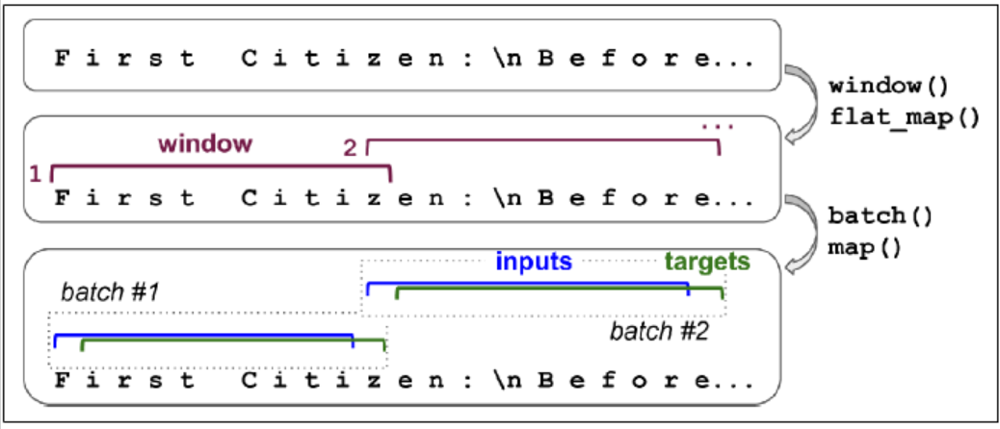

# Generate Text with Character RNN

Encode every character as an integer. Encode the full text so each character is represented by its ID. 

```python
tok = keras.preprocessing.text.Tokenizer(char_level=True)
tok.fit_on_texts([shakespeare])
[encoded] = np.array(tokenizer.texts_to_sequences([shakespeare]))-1
```

### Split a Sequential Dataset

It is often safer to split across time, which assumes that the patterns in the past still exist in the future (financial markets may violate this). If split across correlated samples, the test set will not be as useful. 

```python
train_size = data_size * 90 // 100 
data = tf.data.Dataset.from_tensor_slices(encoded[:train_size])
```

### Chopping into Multiple Windows

**Truncated backpropagation through time**

Every instance in the dataset will be a fairly short substring of the whole text. 

```python
n_steps = 10
window_len = n_steps + 1
data = data.window(window_len, shift=1, drop_remainder=True)
```

The window() method creates a dataset that contains windows, each of which is also represented as a dataset (nested dataset). To feed this as input to models, we need to flat them. 

```python
data = data.flat_map(lambda w: w.batch(window_len))
```

We shuffle these windows. 

```python
batch_size = 32
data = data.shuffle(10000).batch(batch_size)
data = data.map(lambda w: (w[:, :-1], w[:, 1:]))
```


Categorical input features needed to be encoded. 

```python
data = data.map(lambda xBatch, yBatch: (tf.one_hot(xBatch, depth=max_id), yBatch))
data = data.prefetch(1)
```

### Create the Model

```python
model = Sequential([
    GRU(128, return_sequence=True, 
        input_shape=[None, max_id], 
        dropout=0.2, recurrent_dropout=0.2),
    GRU(128, return_sequence=True, 
        input_shape=[None, max_id], 
        dropout=0.2, recurrent_dropout=0.2),
    keras.layers.TimeDistributed(Dense(max_id, 
                                activation="softmax"))
])
model.compile()
```

We need to preprocess the text before feed to the model. 

```python
def preprocess(text):
    x = np.array(tokenizer.texts_to_sequences(text))-1
    return tf.one_hot(x, max_id)
```

```python
x_test = preprocess(["how are yo"])
y_pred = model.predict_classes(x_test)
tokenizer.sequences_to_texts(y_pred+1)[0][-1]
```

### Generate Text

To have more control over the diversity of the generated text, we can divide the logits by a number called the temperature. If the temperature is close 0, models favor the high probability characters; otherwise, models will give all characters an equal probability. 

```python
def next_char(text, temp=1):
    x_new = preprocess([text])
    y_proba = model.predict(x_new)[0, -1:, :]
    rescaled_logits = tf.math.log(y_proba)/temp
    char_id = tf.random.categorical(rescaled_logits, 
                                   num_samples=1)+1
    return tokenizer.sequences_to_texts(char_id, numpy())[0]

def complete_text(text, n_chars=50, temp=1):
    for _ in range(n_chars):
        text += next_char(text, temp)
    return text
```

### Stateful RNN

stateless RNN: at each training iteration, the model starts with a hidden state full of zeros. 

stateful RNN: Preserve the final state after processing one batch and use it as initial state for the next batch. This only makes sense if each input sequence in a batch starts exactly where the corresponding sequence in the previous batch left off. 

```python
data = tf.data.Dataset.from_tensor_slices(encoded[:train_size])
data = data.window(window_len, shift=n_steps, 
                   drop_remainder=True)
data = data.flat_map(lambda w: w.batch(window_len))
data = data.batch(1)
data = data.map(lambda w: (w[:, :-1], w[:, 1:]))
data = data.map(lambda x, y: (tf.one_hot(x, depth=max_id), y))
data = data.prefetch(1)
```



create the model. 

```python
model = Sequential([
    GRU(128, return_sequences=True, stateful=True, 
       dropout=0.2, recurrent_dropout=0.2, 
       batch_input_shape=[batch_size, None, max_id]),
    GRU(128, return_sequences=True, stateful=True, 
       dropout=0.2, recurrent_dropout=0.2, 
       batch_input_shape=[batch_size, None, max_id]),
    TimeDistributed(Dense(max_id, activation="sm"))
])
```

At the end of each epoch, we need to reset the states before we go back to the beginning of the text. 

```python
class ResetStates(keras.callbacks.Callback):
    def on_epoch_begin(self, epoch, logs):
        self.model.reset_states()
model.compile()
model.fit(data, epochs=50, callbacks=[ResetStates])
```

After this model is trained, it will only be possible to use it to make predictions for batches of the same size as were used during training. To avoid this restriction, create an identical stateless model, and copy the weights. 


# Sentiment Analysis

Preprocessing. 

```python
def prep(x, y):
    x = tf.strings.substr(x, 0, 300)
    x = tf.strings.regex_replace(x, b"<br\\s*/?>", b" ")
    x = tf.strings.regex_replace(x, b"[^a-zA-Z']", b" ")
    x = tf.strings.split(x)
    return x.to_tensor(default_value=b"<pad>"), y
```

Truncating the reviews and keeping only first 300 chars will not impact performance too much and will speed up training. In the end, it splits by spaces, which returns a ragged tensor, and converts to a dense tensor. 

```python
voc = Counter()
for x, y in dataset["train"].batch(32).map(prep):
    for review in x:
        voc.update(list(review.numpy()))
```

We do not need low freq words. 

```python
voc_size = 10000
truncated_voc = [w for w, c in voc.most_common()[:voc_size]]
```

Replace each word with its index in the vocab. 

```python
words = tf.constant(truncated_voc)
word_idx = tf.range(len(truncated_voc), dtype=tf.int64)
vocab_init = tf.lookup.KeyValueTensorInitializer(words, word_idx)
num_oov_buckets = 1000
table = tf.lookup.StaticVocabularyTable(vocab_init, num_oov_buckets)

# look up the idx of words
table.lookup(tf.constant([b"This movie was goooood".split()]))
```

A word found in table will be mapped to ID lower than 10,000. Else, it will be mapped to one of oov buckets, with an ID $\ge$ 10,000.

We batch and then convert them to short sequences, and then encode them. 

```python
def encode_words(x, y):
    return table.lookup(x), y

train_set = dataset["train"].batch(32).map(preprocess)
train_set = train_set.map(encode_words).prefetch(1)
```

Create the model. 

```python
embed_size = 128
model = Sequential([
    Embedding(vocab_size + num_oov_buckets, 
             embed_size, input_shape=[None]),
    GRU(128, return_sequences=True),
    GRU(128), 
    Dense(1, activation="sigmoid")
])
model.compile()
```

The first layer convert word index into embedding. The embedding matrix needs to have one row per word index and one column per embedding dimension (hyperparameter). The input of the model will be 2D tensors of shape [batch size, time steps], and the output of the embedding layer will be of shape [batch size, time steps, embedding size]. 

### Masking

The model should learn that the padding tokens should be ignored. The following code means that padding tokens will be ignored by all downstream layers. 

```python
Embedding(mask_zero=True)
```

It works by creating a mask tensor (boolean tensor) on time dimension. All layers that receive the mask must support masking, or an exception will be raised. 

The following code demonstrates the case we need to explicitly compute the mask. 

```python
K = keras.backend
inputs = keras.layers.Input(shape=[None])
mask = keras.layers.Lambda(lambda inputs: K.not_equal(inputs, 0))(inputs)
z = Embedding(vocab_size+num_oov_buckets, embed_size)(inputs)
z = GRU(128, return_sequences=True)(z, mask=mask)
z = GRU(128)(z, mask=mask)
out = Dense(1, activation="sigmoid")(z)
model = keras.Model(inputs=[inputs], outputs=[out])
```

### Reuse Pretrained Embeddings

Pretrained model components are called modules. Not all TF Hub modules support TensorFlow 2. 

```python
import tensorflow_hub as hub
model = Sequential([
    hub.KerasLayer("https:", dtype=tf.string, 
                  input_shape=[], output_shape=[50]),
    Dense(128, activation="relu"),
    Dense(1, activation="sigmoid")
])
```


# Neural Machine Translation (NMT)

For example, English to Chinese. 

English are fed to the encoder, and the decoder outputs the Chinese. Note that the Chinese translations are also used as inputs to the decoder, but shifted back by one step. For the very first word, it is given the start-of-seq token. 

Before fed to the encode, English sentences are reversed, which ensures that the beginning will be fed last to the encoder, which is useful because that is generally the first thing that the decoder needs to translate. 

At each step, the decoder outputs a score for each word in the output vocab, and softmax turns these into probabilities. 

We assumed that all input sequences have a constant length. We can group sentences into buckets of similar lengths, using padding for the shorter sequences to ensure all sentences in a bucket have the same length. 

We want to ignore any output past the EOS token, so they should not contribute to the loss. 

When output vocab is large, outputting a probability for each and every possible word would be slow. We can look only at the logits output by the model for the correct word and for a random sample of incorrect words. 

```python
import tensorflow_addons as tfa
encoder_inputs = Input(shape=[None], dtype=np.int32)
decoder_inputs = Input(shape=[None], dtype=np.int32)
seq_len = Input(shape=[], dtype=np.int32)

embeddings = Embedding(vocab_size, embed_size)
encoder_embeddings = embeddings(encoder_inputs)
decoder_embeddings = embeddings(decoder_inputs)

encoder = LSTM(512, return_state=True)
encoder_out, state_h, state_c = encoder(encoder_embeddings)
encoder_staet = [state_h, state_c]

sampler = tfa.seq2seq.sampler.TrainingSampler()

decoder_cell = LSTMCell(512)
output_layer = Dense(vocab_size)
decoder = tfa.seq2seq.basic_decoder.BasicDecoder(
decoder_cell, sampler, output_layer=output_layer)
final_out, final_state, final_seq_len = decoder(
decoder_embeddings, initial_state=encoder_state, 
sequence_length=seq_len)
y_proba = tf.nn.softmax(final_out.rnn_output)

model = keras.Model(inputs=[encoder_inputs, decoder_inputs, seq_len], outputs=[y_proba])
```

When creating the LSTM layer, we get its final hidden state and pass it to the decoder. It returns two hidden states, short and long term. The TrainingSampler tells the decoder at each step what it should pretend the previous output was. 

### Bidirectional RNNs

```python
Bidirectional(GRU(10, return_sequences=True))
```

Create a copy with reverse direction at each layer. 

### Beam Search 

By greedily outputting the most likely word at each step, the model may end up with a suboptimal translation. We should keep a short list at each step. 

```python
beam_width = 10
decoder = tfa.seq2seq.beam_search_decoder.BeamSearchDecoder(
cell=decoder_cell, beam_width=beam_width, output_layer=output_layer)
decoder_initial_state = tfa.seq2seq.beam_search_decoder.tile_batch(encoder_state, multiplier=beam_width)
outputs, _, _ = decoder(embedding_decoder, 
        start_tokens=start_tokens, end_token=end_token, 
        initial_staet=decoder_inital_state)

```

# Attention Mechanisms

A technique that allows the decoder to focus on the appropriate words at each time step. Instead of send the encoder's final hidden state to the decoder, we now send all of its outputs to the decoder. 

**Bahdanau attention/Additive attention**

Concatenates the encoder output with the decoder's previous hidden state, it is sometimes called concatenative attention. 

**Luong attention/Multiplicative attention**

Both encoder and decoder vectors must have same dimensionality (roughly same length, solved by padding). The dot product gives a score, and all the scores go through a softmax layer to give the final weights. 

```python
att_me = tfa.seq2seq.attention_wrapper.LuongAttention(
units, encoder_state, memory_sequence_length=encoder_seq_len)
att_decoder_cell = tfa.seq2seq.attention_wrapper.AttentionWrapper(decoder_cell, attention_mechanism, attention_layer_size=n_units)
```

### Visual Attention

Attention mechanisms extend to other purposes. A CNN processes the image and outputs some feature maps, then a decoder RNN equipped with an attention mechanism generates the caption, one word at a time. 

### Transformer Architecture


The lefthand is the encoder. The input shape is [batch size, max input sentence length]. It encodes each word into a 512-dim representation. The top part of the encoder is stacked 6 times.

The right hand is the decoder. During training, it takes the target sentence as input, shifted one time step to the right. It also receives the outputs of the encoder. The top part of the decoder is also stacked 6 times. The encoder stack's final outputs are fed to the decoder at each of these 6 levels. 

During inference, the decoder cannot be fed targets, so we feed it the previously output words. So the model needs to be called repeatedly. 

The encoder's multi-head attention layer encodes each word's relationship with every other word in the same sentence, paying more attention to the most relevant ones. 

#### positional embeddings

A dense vector that encodes the position of a word within a sentence: the $i^{th}$ positional embedding is simply added to the word embedding of the the $i^{th}$ word in the sentence. 

$P_{p, 2i} = sin(p/10000^{2i/d})$

$P_{p, 2i+1} = cos(p/10000^{2i/d})$

It can extend to arbitrarily long sentences. The choice of oscillating functions makes it possible for the model to learn relative positions as well. 

There is no Positional Embedding layer in TF. Need to create one. 

```python
class PositionalEncoding(keras.layers.Layer):
    def __init__(slef, max_steps, max_dims, dtype=tf.float32, **kwargs):
        super().__init__(dtype=dtype, **kwargs)
        if max_dims % 2 == 1:
            max_dims += 1
        p, i = np.meshgrid(np.arange(max_steps), 
                          np.arange(max_dims//2))
        pos_emb = np.empty((1, max_steps, max_dims))
        pos_emb[0, :, ::2] = np.sin(p/10000**(2*i/max_dims)).T
        pos_emb[0, :, 1::2] = np.cos(p/10000**(2*i/max_dims)).T
        self.positional_embedding = tf.constant(pos_emb.astype(self.dtype))

    def call(self, inputs):
        shape = tf.shape(inputs)
        return inputs+self.positional_embedding[:, :shape[-2], :shape[-1]]
```

Create the first layers of the transformer. 

```python
embed_size = 512
max_steps = 500
vocab_size = 10000
encoder_inputs = keras.layers.Input(shape=[None], dtype=np.int32)
decoder_inputs = keras.layers.Input(shape=[None], dtype=np.int32)
encoder_embeddings = embeddings(encoder_inputs)
decoder_embeddings = embeddings(decoder_inputs)
pos_encoding = PositionalEncoding(max_steps, max_dims=embed_size)
encoder_in = pos_encoding(encoder_embeddings)
decoder_in = pos_encoding(decoder_embeddings)
```

#### multi-head attention

Based on scaled dot-product attention layer. 

$Attention(Q,K,V) = softmax(\frac{QK^T}{\sqrt{d_{keys}}})V$

Q is the matrix containing one row per query with shape [$n_{queries}, d_{keys}$]. K is a matrix containing one row per key with shape [$n_{keys}, d_{keys}$]. V is a matrix containing one row per value with shape [$n_{keys}, d_{values}$]. 

The shape of $QK^T$ is [$n_{queries}, n_{keys}$]. It contains one similarity score for each query/key pair. The output of the softmax function has the same shape. 

The scaling factor scales down the similarity scores to avoid saturating the softmax function. 

During training, we must mask out future output tokens. 

```python
Z = encoder_in
for N in range(6):
    Z = keras.layers.Attention(use_scale=True)([Z,Z])
    
encoder_out = Z
Z = decoder_in
for N in range(6):
    Z = keras.layers.Attention(use_scale=True, causal=True)([Z, Z])
    Z = keras.layers.Attention(use_scale=True)([Z, encoder_out])

out = keras.layers.TimeDistributed(Dense(vocab_size, activation="softmax"))(Z)
```


