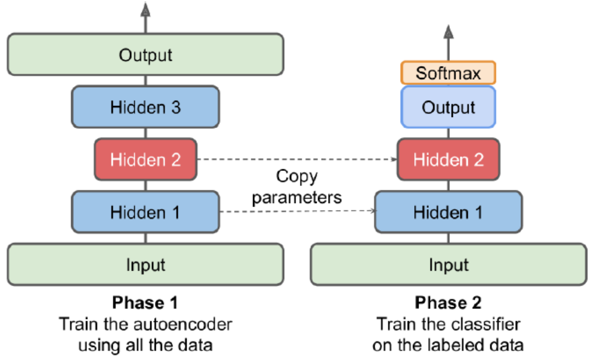

# Performing PCA with an Undercomplete Linear Autoencoder

The following code builds a simple linear autoencoder to perform PCA on a 3D dataset projecting it to 2D. 

```python
encoder = Sequential([Dense(2, input_shape=[3])])
decoder = Sequential([Dense(3, input_shape=[2])])
autoencoder = Sequential([encoder, decoder])
autoencoder.compile(loss="mse", optimizer=SGD(lr=0.1))
```

The autoencoder's number of outputs is equal to the inputs. To perform simple PCA, we do not use any activation function. 

```python
hist = autoencder.fit(xtrain, xtrain, epochs=20)
codings = encoder.predict(xtrain)
```

# Stacked Autoencoders

Stacked/deep autoencoders: have multiple hidden layers

The following one is built for MNIST. 

```python
encoder = Sequential([
    Flatten(input_shape=[28,28]),
    Dense(100, activation="selu"),
    Dense(30, activation="selu")
])
decoder = Sequential([
    Dense(100, activation="selu", input_shape=[30]),
    Dense(28*28, activation="sigmoid"),
    keras.layers.Reshape([28,28])
])
ae = Sequantial([encoder, decoder])
ae.compile(loss="binary_crossentropy", 
          optimizer=SGD(lr=1.0))
hist = ae.fit(xtrain, xtrain, epochs=10, 
             validation_data=[xvalid, xvalid])
```

When compiling the stacked autoencoder, we use binary cross-entropy loss rather than MSE. We are treating the reconstruction task as a multilabel binary classification problem. This makes the model converges faster. 

### Visualize the Reconstructions

```python
def plot_image(image):
    plt.imshow(image, cmap="binary")
    plt.axis("off")
def show_reconstructions(model, n_images=5):
    reconstr = model.predict(xval[:n_images])
    fig = plt.figure(figsize=(n_images*1.5, 3))
    for image_idx in range(n_images):
        plt.subplot(2, n_images, 1+image_idx)
    	plot_image(xval[image_idx])
        plt.subplot(2, n_images, 1+n_images+image_idx)
        plot_image(reconstr[image_idx])
show_reconstructions(ae)
```

For visualization, autoencoder does not give great results, but it can handle large datasets. So one strategy is to use an autoencoder to reduce the dimensionality down to a reasonable level, then use another dimensionality reduction algorithm for visualization. 

```python
from sklearn.manifold import TSNE
xval_compressed = encoder.predict(xval)
tsne = TSNE()
xval_2d = tsne.fit_transform(xval_compressed)
plt.scatter(xval_2d[:, 0], xval_2d[:, 1], c=yval, s=10, 
           cmap="tab10")
```

### Unsupervised Pretraining using AE



Having plenty of unlabeled data and a little labeled data. Use autoencoder to pretrain and copy the weights to new model which can be used to train labeled data. 

### Tying Weights

When an autoencoder is symmetrical, a common tech is to tie the weights of the decoder layers to the weights of the encoder. This halves the number of weights in the model, speeding up training and limiting the risk of overfitting. 

```python
class DenseTranspose(keras.layers.Layer):
    def __init(self, dense, activation=None, **kwargs):
        self.dense = dense
        self.activation = keras.activations.get(activation)
        super().__init__(**kwargs)
        
    def build(self, batch_input_shape):
        self.biases = self.add_weight(name="bias", initializer="zeros", shape=[self.dense.input_shape[-1]])
        super().build(batch_input_shape)
        
    def call(self, inputs):
        z = tf.matmul(inputs, self.dense.weights[0], transpose_b=True)
        return self.activation(z + self.biases)
```

Next, we can build a new stacked AE. 

```python
dense_1 = Dense(100, activation="selu")
dense_2 = Dense(30, activation="selu")
tied_encoder = Sequential([
    Flatten(input_shape=[28,28]),
    dense_1, 
    dense_2
])
tied_decoder = Sequential([
    DenseTranspose(dense_2, activation="selu"),
    DenseTranspose(dense_1, activation="sigmoid"),
    Reshape([28,28])
])
tied_ae = Sequential([tied_encoder, tied_decoder])
```

### Training One AE at a time

Rather than training the whole stacked autoencoder in one go, we can train one shallow autoencoder at a time and then stack all of them. 

During the first phase of training, the first AE learns to reconstruct the inputs. We encode the whole training set using this AE to get a new compressed training set. During, second phase, we then train a second autoencoder on this new set. Finally, we build a big sandwich using all these AE. 

### Convolutional AE

The encoder is a regular CNN composed of convolutional layers and pooling layers. It typically reduces the spatial dimensionality of the inputs while increasing the depth. The decoder must do the reverse. 

Below is a example for Fashion MNIST. 

```python
conv_encoder = Sequential([
    Reshape([28,28,1], input_shape=[28,28]),
    Conv2D(16, kernel_size=3, padding="same", activation="selu"),
    MaxPool2D(pool_size=2),
    Conv2D(32, kernel_size=3, padding="same", actvation="selu"),
    MaxPool2D(pool_size=2),
    Conv2D(64, kernel_size=3, padding="same", activation="selu"),
    MaxPool2D(pool_size=2)
])
conv_decoder = Sequential([
    Conv2DTranspose(32, kernel_size=3, strides=2, padding="valid", activation="selu", input_shape=[3,3,64]),
    Conv2DTranspose(16, kernel_size=3, strides=2, padding="same", activation="selu"),
    Conv2DTranspose(1, kernel_size=3, strides=2, padding="same", activation="sigmoid"),
    Reshape([28,28])
])
conv_ae = Sequential([conv_encoder, conv_decoder])
```

### Recurrent AE

Build an autoencoder for sequences. The encoder is a sequence-to-vector RNN which compresses the input sequence down to a single vector. The decoder is a vector-to-sequence RNN that does the reverse. 

```python
recurrent_encoder = Sequential([
    LSTM(100, return_sequences=True, input_shape=[None, 28]), 
    LSTM(30)
])
recurrent_decoder = Sequential([
    RepeatVector(28, input_shape=[30]),
    LSTM(100, return_sequences=True),
    TimeDistributed(Dense(28, activation="sigmoid"))
])
recurrent_ae = Sequential([recurrent_encoder, recurrent_decoder])
```

The recurrent autoencoder can process sequences of any length. We use a RepeatVector layer as the first layer of the decoder, to ensure that its input vector gets fed to the decoder at each time step. 

### Denoising AE

Another way to force the AE to learn useful features is to add noise to its inputs, training it to recover the original, noise-free inputs. The implementation is a regular stacked AE with an additional Dropout layer applied to the encoder's inputs. 

```python
dropout_encoder = Sequential([
    Flatten(input_shape=[28,28]),
    Dropout(0.5),
    Dense(100, activation="selu"),
    Dense(30, activation="selu")
])
dropout_decoder = Sequential([
    Dense(100, activation="selu", input_shape=[30]),
    Dense(28*28, activation="sigmoid"),
    Reshape([28,28])
])
dropout_ae = Sequential([dropout_encoder, dropout_decoder])
```

### Sparse AE

Sparsity often leads to good feature extraction. We can force the AE to represent each input as a combination of a small number of activations. As a result, each neuron in the coding layer typically ends up representing a useful feature. 

```python
sparse_encoder = Sequential([
    Flatten(input_shape=[28,28]),
    Dense(100, activation="selu"),
    Dense(300, activation="sigmoid"),
    ActivityRegularization(l1=1e-3)
])
sparse_decoder = Sequential([
    Dense(100, activation="selu", input_shape=[300]),
    Dense(28*28, activation="sigmoid"),
    Reshape([28,28])
])
sparse_ae = Sequential([sparse_encoder, sparse_decoder])
```

The ActivityRegularization layer just return its inputs, but adds a training loss equal to the sum of absolute values of its input (only has an effect during training). Equivalently, we can remove this layer and set **activity_regularizer=keras.regularizers.l1(1e-3)** in the previous layer. 

Another approach is to measure the actual sparsity of the coding layer at each training iteration, and penalize the model when the measured sparsity differs from a target sparsity. We can simply adding the squared error to the cost function, but it is better to use Kullback-Leibler divergence. We want to measure the divergence between the target probability p that a neuron in the coding layer will activate and the actual probability q (i.e., the mean activation over the training batch).

$D_{KL}(p||q) = p*log\frac{p}{q} + (1-p)*log\frac{1-p}{1-q}$

Once we have computed the sparsity loss for each neuron in the coding layer, we sum up these losses and add the result to the cost function. 

```python
K = keras.backend
kl_diver = keras.losses.kullback_leibler_divergence
class KLDiverRegularizer(keras.regularizers.Regularizer):
    def __init__(self, weight, target=0.1):
        self.weight = weight
        self.target = target
    def __call__(self, inputs):
        mean_activities = K.mean(inputs, axis=0)
        return self.weight*(kl_diver(self.target, mean_activities)+kl_diver(1.-selftarget, 1.-mean_activities))
```

Now we can build the sparse autoencoder. 

```python
kld_reg = KLDiverRegularizer(weight=0.05, target=0.1)
sparse_kl_encoder = Sequential([
    Flatten(input_shape=[28,28]),
    Dense(100, activation="selu"),
    Dense(300, activation="sigmoid", 
         activity_regularizer=kld_reg)
])
sparse_kl_decoder = Sequential([
    Dense(100, activation="selu", input_shape=[300]),
    Dense(28*28, activation="sigmoid"),
    Reshape([28,28])
])
sparse_kl_ae = Sequential([sparse_kl_encoder, sparse_kl_decoder])
```

### Variational Autoencoders

Difference:

1. probabilistic autoencoders (outputs are partly determined by chance, even after training)
2. generative autoencoders (generate new instances that look like they were sampled from the training set)

Instead of directly producing a coding for a given input, the encoder produces a mean coding and a std. The actual coding is then sampled randomly from a Gaussian distribution. 

Cost function:

1. reconstruction loss (push the AE to reproduce its inputs)
2. latent loss (push the AE to have codings that look as though they were sampled from a simple Gaussian distribution)

Latent Loss: $L = -0.5\sum_{i=1}^K 1 + log(\sigma_i^2) - \sigma_i^2 - \mu_i^2$. 

A common trick is to make the encoder output $\gamma = log(\sigma_i^2)$ instead of $\sigma$. It is more numerically stable and speeds up training. 

```python
class Sampling(keras.layers.Layer):
    def call(self, inputs):
        mean, log_var = inputs
        return K.random_normal(tf.shape(log_var))*K.exp(log_var/2)+mean
```

When we create the encoder, we need Functional API, since the model is not entirely sequential. 

```python
# encoder
coding_size = 10
inputs = Input(shape=[28,28])
z = Flatten()(inputs)
z = Dense(150, activation="selu")(z)
z = Dense(100, activation="selu")(z)
codings_mean = Dense(codings_size)(z)
codings_log_var = Dense(codings_size)(z)
codings = Sampling() ([codings_mean, codings_log_var])
variational_encoder = keras.Model(inputs=[inputs], outputs=[codings_mean, codings_log_var, codings])

# decoder
decoder_inputs = Input(shape=[coding_size])
x = Dense(100, activation="selu")(decoder_inputs)
x = Dense(150, activation="selu")(x)
x = Dense(28*28, activation="sigmoid")(x)
outputs = Reshape([28,28])(x)
variational_decoder = keras.Model(inputs=[decoder_inputs], outputs=[outputs])

_, _, codings = variational_encoder(inputs)
reconstructions = variational_decoder(codings)
variational_ae = keras.Model(inputs=[inputs], outputs=[reconstructions])
```

Lastly, we must add the latent loss and the reconstruction loss. 

```python
latent_loss = -0.5*K.sum(1+codings_log_var-K.exp(codings_log_var)-K.square(codings_mean), axis=-1)
variational_ae.add_loss(K.mean(latent_loss)/784.)
variational_ae.compile(loss="binary_crossentropy", optimizer="rmsprop")
hist = variational_ae.fit(xtrain, xtrain, validation_data=[xval, xval])
```

We can generate images that look like fashion items by sampling random codings from a Gaussian distribution and decode them. 

```python
codings = tf.random.normal(shape=[12, codings_size])
images = variational_decoder(codings).numpy()
```

Variational AE make it possible to perform semantic interpolation. 

```python
# organized in a 3*4 grid and then resize to 5*7
codings_grid = tf.reshape(codings, [1,3,4,codings_size])
larger_grid = tf.image.resize(codings_grid, size=[5,7])
interpolated_codings = tf.reshape(larger_grid, [-1, codings_size])
images = variational_decoder(interpolated_codings).numpy()
```

# Generative Adversarial Networks

Make NN compete against each other in the hope that this will push them to excel. 

Generator: takes a random distribution as input and outputs some data (typically an image). It tries to produce images that look real enough to trick the discriminator. 

Discriminator: takes either a fake image from the generator or a real image from the training set as input, and must guess whether the input image is fake or real. 

Training iteration:

1. train the discriminator. A batch of real images is sampled from the training set and is completed with an equal number of fake images produced by the generator. The loss is binary cross-entropy. BP only optimizes the weights of the discriminator during this phase.
2. train the generator. The generator produce another batch of fake images, and set all labels to 1, which means we want the generator to produce images that the discriminator will wrongly believe to be real. BP only optimizes the weights of the generator during this phase. 

The generator never actually sees any real images, and it only gets the gradients flowing back through the discriminator. However, the better the discriminator gets, the more info about the real images is contained in these secondhand gradients. 

```python
coding_size = 30
generator = Sequential([
    Dense(100, activation="selu", input_shape=[coding_size]),
    Dense(150, activation="selu"),
    Dense(28*28, activation="sigmoid"),
    Reshape([28,28])
])
discriminator = Sequential([
    Flatten(input_shape=[28,28]),
    Dense(150, activation="selu"),
    Dense(100, activation="selu"),
    Dense(1, activation="sigmoid")
])
gan = Sequential([generator, discriminator])
```

We do not need to compile generator. Besides, the discriminator should not be trained during the second phase. 

```python
discriminator.compile(loss="binary_crossentropy", optimizer="rmsprop")
discriminator.trainable = False
gan.compile(loss="binary_crossentropy", optimizer="rmsprop")
```

We need to write a custom training loop. 

```python
batch_size = 32
data = tf.data.Dataset.from_tensor_slices(xtrain).shuffle(1000)
data = data.batch(batch_size, drop_remainder=True).prefetch(1)

def train_gan(gan, data, batch_size, coding_size, n_epochs=50):
    generator, discriminator = gan.layers
    for epoch in range(n_epochs):
        for X in data:
            # phase 1
            noise = tf.random.normal(shape=[batch_size, coding_size])
            generated = generator(noise)
            X_all = tf.concat([generated, X], axis=0)
            y1 = tf.constant([[0.]]*batch_size + [[1.]]*batch_size)
            discriminator.trainable = True
            discriminator.train_on_batch(X_all, y1)
            # phase 2
            noise = tf.random.normal(shape=[batch_size, coding_size])
            y2 = tf.constant([[1.]]*batch_size)
            discriminator.trainable = False
            gan.train_on_batch(noise, y2)
        
train_gan(gan, data, batch_size, coding_size)
```

### Difficulties of Training GANs

GAN can only reach a single Nash equilibrium: the generator produces perfectly realistic images, and the discriminator is forced to guess. But nothing guarantees this equilibrium will be reached. 

Sometimes, a GAN can forget what it learnt. The biggest difficulty is called mode collapse: when the generator's outputs gradually become less diverse. The GAN may gradually cycle across a few classes, never really becoming very good at any of them. 

Moreover, the parameters of gen and dis may end up becoming unstable. GAN is very sensitive to the hyperparams. 

One solution is experience replay: storing the images produced by the generator at each iteration in a buffer, and training the discriminator using real images plus fake images drawn from this buffer rather than just fake images produced by the current generator. 

Another solution is mini-batch discrimination: it measures how similar images are across the batch and provides this stat to the discriminator, so it can easily reject a whole batch of fake images that lack diversity. 

### Deep Conv GANs

Principles:

1. replace any pooling layers with strided convolutions in the discriminator and transposed convolutions in the generator
2. use batch normalization, except in generator's output layer and the discriminator's input layer
3. remove fully connected hidden layers for deeper architectures
4. use ReLU activation in the generator for all layers except the output layer, which should use tanh
5. use leaky ReLU activation in the discriminator for all layers

````python
coding_size = 100
generator = Sequential([
    Dense(7*7*128, input_shape=[codings_size]),
    Reshape([7,7,128]),
    BatchNormalization(),
    Conv2DTranspose(64, kernel_size=5, strides=2, padding="same", activaton="selu"),
    BatchNormalization(),
    Conv2DTranspose(1, kernel_size=5, strides=2, padding="same", activation="tanh")
])
discriminator = Sequential([
    Conv2D(64, kernel_size=5, strides=2, padding="same", activation=LeakyReLU(0.2), input_shape=[28,28, 1]),
    Dropout(0.4),
    Conv2D(128, kernel_size=5, strides=2, padding="same", activation=LeakyReLU(0.2)),
    Dropout(0.4),
    Flatten(),
    Dense(1, activation="sigmoid")
])
gan = Sequential([generator, discriminator])
````

Before using this GAN, we need to rescale the training set, because the output for tanh is from -1 to 1. 

```python
xtrain = xtrain.reshape(-1, 28, 28, 1)*2.-1.
```

### Progressive Growing of GANs

Generate small images at the beginning of training, then gradually adding conv layers to both the generator and the discriminator to produce larger images. 

There are more techniques aiming at increasing the diversity of the outputs and making training more stable. 

1. minibatch standard deviation layer

   added near the end of the discriminator. For each position in the inputs, it computes the std across all channels and instances in the batch.  These std are averaged across all points to get a single value. Finally, an extra feature map is added to each instance in the batch and filled with the computed value. If the generator produces images with little variety, then there will be a small standard deviation across feature maps in the discriminator. The dis will have easy access to this stat, making it less likely to be fooled by a generator that produces too little diveristy. 

   ```python
   S = tf.math.reduce_std(inputs, axis=[0,-1])
   v = tf.reduce_mean(S)
   tf.concat([inputs, tf.fill([batch_size, height, width, 1], v)], axis=-1)
   ```

2. equalized learning rate

   Init all weights using a simple Gaussian distribution. However, the weights are scaled down at runtime by the same factor as in He init. This technique significantly improved the GAN's performance when using RMSProp, Adam, or other adaptive gradient optimizers. Params that have a larger dynamic range will take longer to train. By rescaling the weights, it ensures that the dynamic range is the same for all params.

3. pixelwise normalization layer

   Added after each conv layer. It normalize each activation across all channels. 

### StyleGANs

People used style transfer tech in the generator to ensure that the generated images have the same local structure as the training images. The dis and the loss function were not modified. 

Mapping network: an eight-layer MLP that maps the latent representations z to a vector w. These vectors control the style of the generated image at different levels, from fine-grained texture, to high level features. 

Synthesis network: responsible for generating the images. It has a constant learned input. It processes this input thru multiple conv and upsampling layers. Some noise is added to the input and to all the outputs of the conv layers. Each noise layer is followed by an Adaptive Instance Normalization layer: it standardizes each feature map independently subtracting the feature map's mean and dividing by its standard deviation. 

The idea of adding noise independently from the codings is important. Some parts of an image are quite random. If the noise instead comes from the codings, then the generator had to dedicate a significant portion of codings' representational power to store noise. 

StyleGAN uses a tech called mixing regularization (style mixing), where a percentage of the generated images are produced using two different codings. This prevents the network from assuming that styles at adjacent levels are correlated. 

