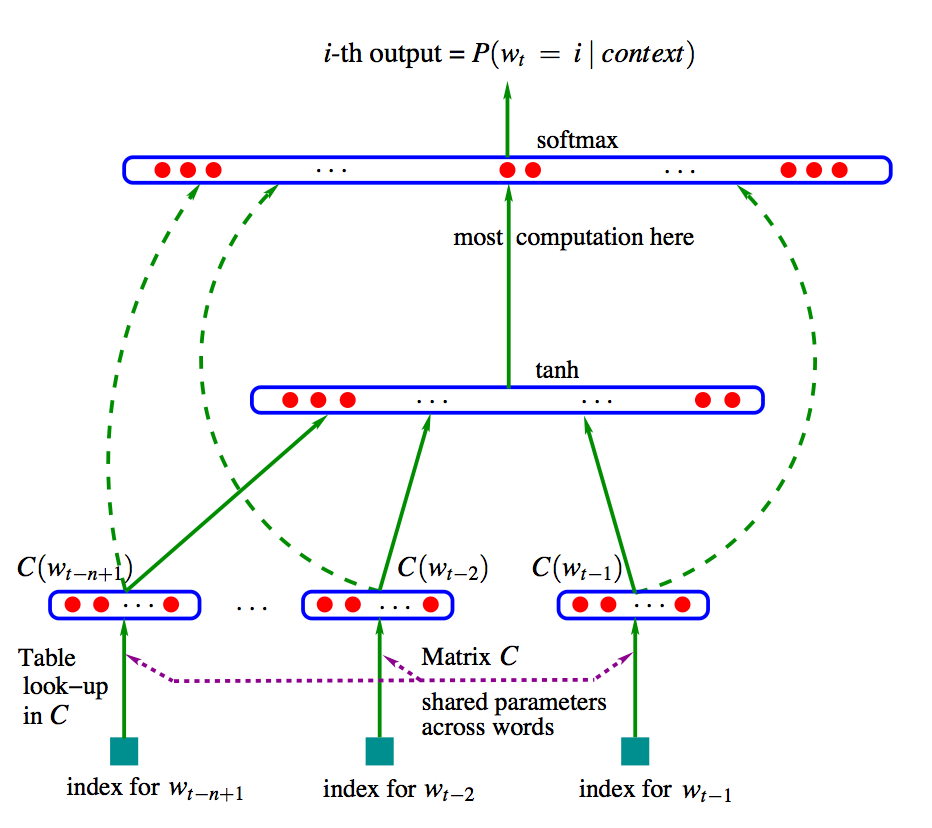

### 简介

neural network probabilistic language model. Bengio, 2003. 

三层神经网络模型。用前n-1个词来预测当前词。该模型会学习到（1）词汇的分布式表达（2）通过学习到的分布式表达构建概率函数。

### 优点

1. 不需要向one-hot encoding那样维度大的表示，统一了NLP的特征形式，dense vector embedding

2. 具有很强的泛化能力，对于训练语料里没有出现过的句子，模型能够通过见过的相似词组成的相似句子来学习。

# Reference

