# 简介

软件工程中，设计模式是对软件设计中普遍存在的各种问题所提出的解决方案。

编写代码，需要解决耦合性、内聚性、可维护性、可扩展性、重用性、灵活性的问题。

低耦合：该是哪个模块的错误就在哪个模块报错

高内聚：

代码重用性：相同功能的代码，不用多次编写

可读性：编程规范性，便于其他程序员的阅读和理解

可扩展性：需要增加新的功能时成本低

可靠性：增加新的功能后，对原来的功能没有影响

### 七大设计原则核心思想

1. 单一职责
2. 接口隔离
3. 依赖倒转
4. 里式替换
5. 开闭原则ocp
6. 迪米特法则
7. 合成复用原则

#### 单一职责 single responsibility

一个类只负责一项职责，降低类的复杂度。

```java
public class SingleResp{
    psvm() {
        // 1
        Vehicle vehicle = new Vehicle();
        vehicle.run("摩托车");
        vehicle.run("汽车");
        vehicle.run("飞机");
        
        // 2
        RoadVehicle roadVehicle = new RoadVehicle();
        roadVehicle.run("摩托车");
        roadVehicle.run("汽车");
        AirVehicle airVehicle = new AirVehicle();
        airVehicle.run("飞机");

        // 3
        Vehicle3 vehicle3 = new Vehicle3();
        vehicle3.run("汽车");
		vehicle3.runWater("轮船");
		vehicle3.runAir("飞机");
	}
}

//方案 1 的分析
// 在方式1的run方法中，违反了单一职责原则(海陆空都管)
class Vehicle {
    public void run(String vehicle) { 		
        System.out.println(vehicle + " 在公路上运行");
    }
}

//方案 2 的分析
// 遵守单一职责原则，但是这样做的改动很大，即将类分解，同时修改客户端
class RoadVehicle {
    public void run(String vehicle) { 
        System.out.println(vehicle + "公路运行");
    }
}


class AirVehicle {
    public void run(String vehicle) { 
        System.out.println(vehicle + "天空运行");
    }
}

//方案 3 的分析
// 在方法级别上，仍然是遵守单一职责
class Vehicle3 {
    public void run(String vehicle) {
        System.out.println(vehicle + " 在公路上运行....");
    }


    public void runAir(String vehicle) { 
        System.out.println(vehicle + " 在天空上运行....");
    }


    public void runWater(String vehicle) { 
        System.out.println(vehicle + " 在水中行....");
    }
}
```

#### 接口隔离原则 Interface Segregation Principle

客户端不应该依赖它不需要的接口，即一个类对另一个类的依赖应该建立在最小的接口上。

```java
public class Segregation1 {
    public static void main(String[] args) {

    }
}

//接口
interface Interface1 {
	void operation1(); 
    void operation2();
	void operation3(); 
    void operation4(); 
    void operation5();
}


class B implements Interface1 { 
    public void operation1() {
		System.out.println("B 实现了 operation1");
	}
    public void operation2() {
        System.out.println("B 实现了 operation2");
    }
    public void operation3() {
        System.out.println("B 实现了 operation3");
    }
    public void operation4() {
    	System.out.println("B 实现了 operation4");
    }
    public void operation5() {
    	System.out.println("B 实现了 operation5");
    }
}

class D implements Interface1 { 
    public void operation1() {
		System.out.println("D 实现了 operation1");
	}
    public void operation2() {
    	System.out.println("D 实现了 operation2");
    }
    public void operation3() {
    	System.out.println("D 实现了 operation3");
    }
    public void operation4() {
    	System.out.println("D 实现了  operation4");
    }
    public void  operation5()  { 
        System.out.println("D 实现了  operation5");
    }
}

//A 类通过接口Interface1依赖(使用) B 类，但是只会用到 1,2,3 方法
class A { 
    public void depend1(Interface1 i) { 
        i.operation1();
    }
    public void depend2(Interface1 i) { 
        i.operation2();
    }
    public void depend3(Interface1 i) { 
        i.operation3();
    }
}

//C 类通过接口Interface1依赖(使用) D 类，但是只会用到 1,4,5 方法
class C { 
    public void depend1(Interface1 i) { 
        i.operation1();
    }
    public void depend4(Interface1 i) { 
        i.operation4();
    }
    public void depend5(Interface1 i) { 
        i.operation5();
    }
}
```

修改后的代码，将接口拆分。

```java
public class Segregation1 {
    public static void main(String[] args) {
        // 使用一把
        A a = new A();
        a.depend1(new B()); // A 类通过接口去依赖 B 类
        a.depend2(new B());
        a.depend3(new B());

        C c = new C();
        c.depend1(new D()); // C 类通过接口去依赖(使用)D 类
        c.depend4(new D());
        c.depend5(new D());
    }
}

// 接 口 1
interface Interface1 { 
    void operation1();
}

// 接 口 2
interface Interface2 { 
    void operation2();
	void operation3();
}

// 接 口 3
interface Interface3 { 
    void operation4();
	void operation5();
}


class B implements Interface1, Interface2 {
    public void operation1() {
    	System.out.println("B 实现了 operation1");
    }

    public void operation2() {
    	System.out.println("B 实现了 operation2");
    }

    public void operation3() {
    	System.out.println("B 实现了 operation3");
    }
}


class D implements Interface1, Interface3 { 
    public void operation1() {
		System.out.println("D 实现了  operation1");
	}

    public void  operation4()  { 
        System.out.println("D 实现了  operation4");
    }

    public void operation5() {
    	System.out.println("D 实现了 operation5");
    }
}

// A 类通过接口 Interface1,Interface2 依赖(使用) B 类，但是只会用到 1,2,3 方法
class A { 
    public void depend1(Interface1 i) { 
        i.operation1();
    }

    public void depend2(Interface2 i) { 
        i.operation2();
    }

    public void depend3(Interface2 i) { 
        i.operation3();
    }
}

// C  类通过接口 Interface1,Interface3  依赖(使用) D 类，但是只会用到 1,4,5 方法
class C { 
    public void depend1(Interface1 i) { 
        i.operation1();
    }

    public void depend4(Interface3 i) { 
        i.operation4();
    }

    public void depend5(Interface3 i) {
    	i.operation5();
    }
}
```

#### 依赖倒转原则 Dependence Inversion Principle

高层模块不应该依赖底层模块，二者都应该依赖其抽象。抽象不应该依赖细节。中心思想是面向接口编程。使用接口的目的是制定好规范。

依赖传递三种方式：通过接口传递，通过构造方法，通过setter方式传递。

```java
public class DependencyInversion {
    public static void main(String[] args) { 
        Person person = new Person(); 
        person.receive(new Email());
    }
}

class Email {
    public String getInfo() {
        return "电子邮件信息: hello,world";
    }
}

//完成 Person 接收消息的功能
//方式 1 分析
//1. 简单，比较容易想到
//2. 如果我们获取的对象是 微信，短信等等，则新增类，同时 Person 也要增加相应的接收方法

class Person {
    public void receive(Email email) { 			
        System.out.println(email.getInfo());
    }
}

```

解决思路：引入一个抽象的接口 IReceiver, 表示接收者, 这样 Person 类与接口 IReceiver 发生依赖。因为 Email, WeiXin 等等属于接收的范围，他们各自实现 IReceiver 接口就 ok,  这样我们就符合依赖倒转原则。

```java
public class DependencyInversion {
    public static void main(String[] args) {
        //客户端无需改变
        Person person = new Person(); 
        person.receive(new Email());
        person.receive(new WeiXin());
    }
}

//定义接口
interface IReceiver { 
    public String getInfo();
}

class Email implements IReceiver { 
    public String getInfo() {
		return "电子邮件信息: hello,world";
	}
}
//增加微信
class WeiXin implements IReceiver { 
    public String getInfo() {
        return "微信信息: hello,ok";
	}
}

//方式 2
class Person {
//这里我们是对接口的依赖
    public void receive(IReceiver receiver ) { 
        System.out.println(receiver.getInfo());
    }
}
```

#### 里式替换原则

1)    继承包含这样一层含义：父类中凡是已经实现好的方法，实际上是在设定规范和契约，虽然它不强制要求所有的子类必须遵循这些契约，但是如果子类对这些已经实现的方法任意修改，就会对整个继承体系造成破坏。

2)    继承在给程序设计带来便利的同时，也带来了弊端。比如使用继承会给程序带来侵入性，程序的可移植性降低， 增加对象间的耦合性，如果一个类被其他的类所继承，则当这个类需要修改时，必须考虑到所有的子类，并且父类修改后，所有涉及到子类的功能都有可能产生故障

在使用继承时，遵循里氏替换原则，在子类中尽量不要重写父类的方法。原来的父类和子类都继承一个更通俗的基类。如果需要发生关系，可以采用聚合、组合。

#### 开闭原则 Open Closed Principle

一个软件实体应该对扩展开放（对提供方），对修改关闭（对使用方）。用抽象构建框架，用实现扩展细节。当软件需要变化时，尽量通过扩展软件实体的行为来实现，而不是通过修改。

#### 迪米特法则

也叫最少知道原则。一个对象应该对其他对象保持最少的了解。类和类关系越密切，耦合度越大。

直接的朋友：耦合的方式包括依赖、关联、组合、聚合等。出现了成员变量，方法参数，方法返回值中的类是直接的朋友。出现在局部变量中的类不是直接的朋友。

#### 合成复用原则

尽量使用合成、聚合的方式，而不是使用继承。


# UML类图

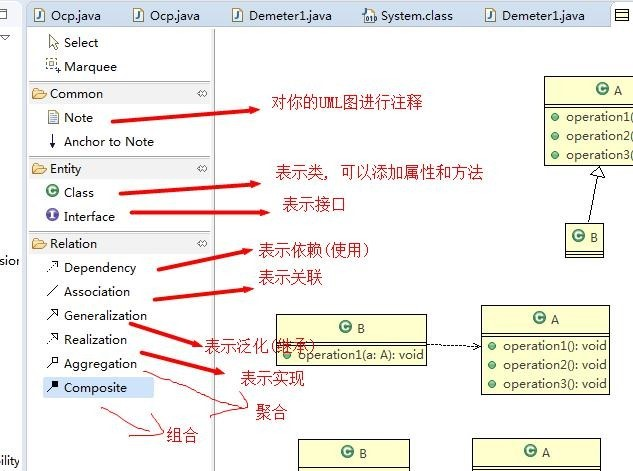

### 类之间的关系

#### 依赖

在类中用到了对方。

#### 泛化

实际上就是继承，依赖关系的特例。

#### 实现

实现了接口。

#### 关联

依赖关系的特例。具有导航性，即双向或单向关系。有单向一对一关系，双向一对一关系。

#### 聚合

整体与部分可以分开，是关联关系的特例。

```java
public class Computer {
    private Mouse mouse;
    Private Monitor monitor;
    
    public void setMouse(Mouse m) {
        mouse = n;
    }
    
    public void setMonitor(Monitor m) {
        monitor = m;
    }
}
```

#### 组合

整体与部分不能分开，是关联关系的特例。

```java
public class Computer {
    private Mouse mouse = new Mouse(); //鼠标和 computer 不能分离
	private Moniter moniter = new Moniter();//显示器和 Computer 不能分离
    public void setMouse(Mouse mouse) {
		this.mouse = mouse;
	}
	public void setMoniter(Moniter moniter) { 
        this.moniter = moniter;
	}
}
```


# 设计模式

## 创建型模式

### 单例模式

整个软件系统中一个类只能有一个对象，节省了系统资源。

java.lang.Runtime是经典的案例。

#### 饿汉式

构造器私有化（防止new），在类的内部创建对象，对外暴露一个静态公共对象。

**优点**

1. 类装载的时候完成实例化，避免了线程同步问题

**缺点**

1. 如果从始至终没有使用过，可能造成内存浪费

```java
// 写法1
class Singleton {
    private Singleton(){}
    
    private final static Singleton instance = new Singleton();
    
    public static Singleton getInstance() {
        return instance;
    }
}

// 写法2
class Singleton {
    private static Singleton instance;
    
    static {
        instance = new Singleton();
    }
    
    private Singleton() { }   
    
    public static Singleton getInstance() {
        return instance;
    }
}
```

#### 懒汉式

**优点**

1. 懒加载

**缺点**

1. 使用静态内部类无法传参

```java
// 线程不安全
class Singleton {
    private static Singleton instance;
    
    private Singleton() {}
    
    public static Singleton getInstance() {
        if (instance == null)
            instance = new Singleton();
        return instance;
    }    
}

// 线程安全，效率较低
class Singleton {
    private static Singleton instance;
    
    private Singleton() {}
    
    public static synchronized Singleton getInstance() {
        if (instance == null)
            instance = new Singleton();
        return instance;
    }    
}

// 双重检查
class Singleton {
    private static volatile Singleton instance;
    
    private Singleton() {}
    
    public static Singleton getInstance() {
        if (instance == null) {
            synchronized (Singleton.class) {
                if (stance == null)
                    instance = new Singleton();
            }            
        }
        return instance;
    }    
}

// 静态内部类
class Singleton { 
    private Singleton() {}
    
    private static class SingletonInstance {
        private static final Singleton INSTANCE = new Singleton();
    }
    
    public static Singleton getInstance() {
        return SingletonInstance.INSTANCE;
    }    
}
```

#### 枚举

借助jdk1.5中添加的枚举来实现单例模式。

**优点**

1. 防止反序列化重新创建新的对象

**缺点**

1. 

```java
enum Singleton{
    INSTANCE; //属性
    public void sayOK() { 
        System.out.println("ok~");
    }
}
```

### 简单工厂

定义了一个创建对象的类，用它来封装实例化对象的行为。

在`java.util.Calendar`中`createCalendar()`有使用。

**意义**

放到一个类中统一管理和维护，达到和主项目的解耦。

**依赖抽象原则**

1. 创建对象实例，不要直接new，把这个动作放在一个工厂的方法中作为返回值
2. 不要继承具体类，继承抽象类或者实现接口
3. 不要覆盖基类中已经实现的方法

**优点**

1. 提高扩展性和维护性。

```java
public class SimpleFactory {
    //更加 orderType 返回对应的 Pizza 对象
    public Pizza createPizza(String orderType) {
    	Pizza pizza = null;
    	System.out.println("使用简单工厂模式"); 
        if (orderType.equals("greek")) {
    		pizza = new GreekPizza();
    		pizza.setName(" 希腊披萨 ");
    	} else if (orderType.equals("cheese")) { 
            pizza = new CheesePizza();
    		pizza.setName(" 奶酪披萨 ");
    	} else if (orderType.equals("pepper")) { 
            pizza = new PepperPizza();
    		pizza.setName("胡椒披萨");
    }
    return pizza;
}

class OrderPizza {
    //定义一个简单工厂对象
    SimpleFactory simpleFactory; 
    Pizza pizza = null;

    //构造器
    public OrderPizza(SimpleFactory simpleFactory) { 		
        setFactory(simpleFactory);
    }

    public void setFactory(SimpleFactory simpleFactory) {
        String orderType = ""; //用户输入的
        this.simpleFactory = simpleFactory; //设置简单工厂对象
        do {
            orderType = getType();
            pizza = this.simpleFactory.createPizza(orderType);
            //输出 pizza
            if(pizza != null) { //订购成功
            	pizza.prepare(); 
                pizza.bake();
            	pizza.cut();
            	pizza.box();
            } else {
            	System.out.println(" 订购披萨失败 "); 
                break;
            }
        } while(true);
    }
}
```

### 工厂方法模式

定义了一个创建对象的抽象方法，由子类决定要实例化的类。工厂方法模式将对象的实例化推迟到子类。

```java
public abstract class OrderPizza {
    //定义一个抽象方法，createPizza(),  让各个工厂子类自己实现
    abstract Pizza createPizza(String orderType);

    // 构造器
    public OrderPizza() { 
        Pizza pizza = null;
    	String orderType; //  订购披萨的类型
        do {
            orderType = getType();
            //抽象方法，由工厂子类完成
            pizza = createPizza(orderType); 
            //输出 pizza 制作过程
            pizza.prepare(); 
            pizza.bake();
            pizza.cut();
            pizza.box();
        } while (true);
    }
}

//还可以创建其他的OrderPizza，实现方法类似
public class BJOrderPizza extends OrderPizza {
    @Override
    Pizza createPizza(String orderType) {
        Pizza pizza = null; 
        if(orderType.equals("cheese")) {
            pizza = new BJCheesePizza();
        } else if (orderType.equals("pepper")) { 
            pizza = new BJPepperPizza();
        }
    }
}
```

### 抽象工厂

定义了一个interface用于创建相关或有依赖关系的对象簇，而无需指明具体的类。将简单工厂模式和工厂方法模式进行整合。

### 原型模式

实现clone的java类需要实现Cloneable接口。用原型实例指定创建对象的种类，通过拷贝这些原型，创建新的对象。

在Spring框架中创建bean有使用。

数据类型是引用数据类型的，浅拷贝进行引用传递，而不是值拷贝。

**优点**

1. 创建新对象比较复杂时，使用原型模式提高效率
2. 能够动态获取对象运行时的状态

**缺点**

1. 需要为每一个类配备一个克隆办法，对已有的类进行改造时需要修改其源代码，违背了ocp原则

```java
public class Sheep implements Cloneable { 
    private String name;
    private int age; 
    private String color;
    private String address = "蒙古羊";
    public Sheep friend; //默认是浅拷贝
    public Sheep(String name, int age, String color) { 
        super();
    	this.name = name; 
        this.age = age; 
        this.color = color;
    }
    
    @Override
    protected Object clone() {
        Sheep sheep = null; 
        try {
        	sheep = (Sheep)super.clone();
        } catch (Exception e) {
            System.out.println(e.getMessage());
        }
        return sheep;
    }

}

```

深拷贝可以通过序列化和重写clone方法实现。

```java
public class DeepProtoType implements Serializable, Cloneable{

	public String name; //String 属 性
	public DeepCloneableTarget deepCloneableTarget;// 引用类型
	public DeepProtoType() { }

	//深拷贝 - 方式 1  使用 clone 方法
	@Override
	protected Object clone() throws CloneNotSupportedException {
        Object deep = null;
        //这里完成对基本数据类型(属性)和 String 的克隆
        deep = super.clone();
        //对引用类型的属性，进行单独处理
        DeepProtoType deepProtoType = (DeepProtoType)deep;
        deepProtoType.deepCloneableTarget	= (DeepCloneableTarget) deepCloneableTarget.clone();
		return deepProtoType;
}

	//深拷贝 - 方式 2 通过对象的序列化实现 (推荐) 
    public Object deepClone() {
        ByteArrayOutputStream bos = null; 
        ObjectOutputStream oos = null; 
        ByteArrayInputStream bis = null; 
        ObjectInputStream ois = null;

        try {
            //序列化
            bos = new ByteArrayOutputStream(); 
            oos = new ObjectOutputStream(bos);
            oos.writeObject(this); //当前这个对象以对象流的方式输出

            //反序列化
            bis = new ByteArrayInputStream(bos.toByteArray()); 
            ois = new ObjectInputStream(bis);
            DeepProtoType copyObj = (DeepProtoType) ois.readObject();
            return copyObj;
        } catch (Exception e) {
            return null;
        } finally {
            try {
                bos.close();
                oos.close();
                bis.close();
                ois.close();
            } catch (Exception e2) {
                System.out.println(e2.getMessage());
            }
        }
    }
}
```

### 建造者模式

也叫生成器模式。将复杂对象的建造过程抽象出来，是这个过程的不同实现方法可以构造出不同表现的对象。

在StringBuilder中使用了建造者模式。Appendable接口定义了多个append方法(抽象方法)，即Appendable是抽象建造者。AbstractStringBuilder已经是建造者，只是不能实例化。StringBuilder既充当了指挥者，也充当了具体的建造者。

product：具体的产品对象

builder：创建一个product对象的各个部件指定的接口或抽象类

concrete builder：实现接口，装配各个部件

director：构建一个使用builder接口的对象。创建一个复杂的对象。

**优点**

1. 客户端不需要知道产品内部细节
2. 可以精细控制产品创建过程
3. 不需要改变类库代码，符合ocp原则

**缺点**

1. 产品内部变化过于复杂，不适合使用

```java
public class Client {
    public static void main(String[] args) {
        //盖普通房子
        CommonHouse commonHouse = new CommonHouse();
        //准备创建房子的指挥者
        HouseDirector houseDirector = new HouseDirector(commonHouse);
        //完成盖房子，返回产品(普通房子)
        House house = houseDirector.constructHouse();
        System.out.println("--------------------------");
        //盖高楼
        HighBuilding highBuilding = new HighBuilding();
        //重置建造者
        houseDirector = new HouseDirector(highBuilding);
        //完成盖房子，返回产品(高楼) 
        houseDirector.constructHouse();
    }
}

public class CommonHouse extends HouseBuilder {
    @Override
    public void buildBasic() {
    	System.out.println(" 普通房子打地基 5 米 ");
    }

    @Override
    public void buildWalls() {
    	System.out.println(" 普通房子砌墙 10cm ");
    }

    @Override
    public void roofed() {
    	System.out.println(" 普通房子屋顶 ");
    }
}

// 产 品 ->Product 
public class House {
    private String baise; 
    private String wall; 
    private String roofed; 
    // 省略getter & setter
}

// 抽象的建造者
public abstract class HouseBuilder {
	protected House house = new House();
	//将建造的流程写好, 抽象的方法
	public abstract void buildBasic(); 
    public abstract void buildWalls(); 
    public abstract void roofed();

    //建造房子好， 将产品(房子) 返回
    public House buildHouse() { 
        return house;
    }
}

public class HouseDirector {
    HouseBuilder houseBuilder = null;

    //构造器传入 houseBuilder
    public HouseDirector(HouseBuilder houseBuilder) { 
        this.houseBuilder = houseBuilder;
    }

    //如何处理建造房子的流程，交给指挥者 
    public House constructHouse() {
    	houseBuilder.buildBasic(); 
        houseBuilder.buildWalls(); 
        houseBuilder.roofed();
    	return houseBuilder.buildHouse();
    }
}
```

## 结构型模式

### 适配器模式

将某个类的接口转换成客户端期望的另一个接口表示，增强兼容性。三种命名是根据src以怎么样的形式给到Adapter来命名的。

在SpringMVC框架中HandlerAdapter有应用。

**优点**

1. 客户端不知道被适配者，是解耦的

#### 类适配器模式

继承src类，实现dst类接口。

**缺点**

1. Java 是单继承机制，所以类适配器继承 src 类要求 dst 必须是接口，有一定局限性
2. src 类的方法在 Adapter 中都会暴露出来，增加了使用的成本

```java
//被适配的类
public class Voltage220V {
    //输出 220V 的电压
    public int output220V() { 
        int src = 220;
    	System.out.println("电压=" + src + "伏");
    	return src;
    }
}

//适配接口
public interface IVoltage5V { 
    public int output5V();
}

//适配器类
public class VoltageAdapter extends Voltage220V implements IVoltage5V {

    @Override
    public int output5V() {
    	int srcV = output220V();
    	int dstV = srcV / 44 ; //转成 5v 
        return dstV;
    }
}
```

#### 对象适配器模式

对象适配器和类适配器其实算是同一种思想，只不过实现方式不同。根据合成复用原则，使用组合替代继承， 所以它解决了类适配器必须继承 src 的局限性问题，也不再要求 dst必须是接口。

```java
//适配器类
public class VoltageAdapter implements IVoltage5V {
	private Voltage220V voltage220V; // 关联关系-聚合
	//通过构造器，传入一个 Voltage220V 实例
	public VoltageAdapter(Voltage220V voltage220v) {
		this.voltage220V = voltage220v;
	}
    
	@Override
	public int output5V() {
        int dst = 0;
        if(null != voltage220V) {
            int src = voltage220V.output220V();//获取 220V 电压
            System.out.println("使用对象适配器，进行适配~~"); 
            dst = src / 44;
            System.out.println("适配完成，输出的电压为=" + dst);
        }
		return dst;
	}
}
```

#### 接口适配器模式

当不需要全部实现接口提供的方法时，可先设计一个抽象类实现接口，并为该接口中每个方法提供一个默认实现(空方法)，那么该抽象类的子类可有选择地覆盖父类的某些方法来实现需求。

在Android中的属性动画ValueAnimator类可以通过addListener方法添加监听器。

```java
public interface Interface4 { 
    public void m1(); 
    public void m2(); 
    public void m3(); 
    public void m4();
}

public abstract class AbsAdapter implements Interface4 {
    //默认实现
    public void m1() {}
    public void m2() {}
    public void m3() {}
    public void m4() {}
}

public class Client {
    public static void main(String[] args) {
    	AbsAdapter absAdapter = new AbsAdapter() {
            //只覆盖需要使用的接口方法
            @Override
            public void m1() {
                System.out.println("使用了 m1 的方法");
            }
   		};
    	absAdapter.m1();
    }
}
```

### 桥接模式

将实现和抽象放在两个不同的类层次中，使这两个层次可以独立改变。基于类的最小设计原则。

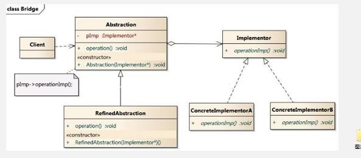

1)   Client 类：桥接模式的调用者

2)   抽象类(Abstraction) :维护了 Implementor / 即它的实现类 ConcreteImplementorA.., 二者是聚合关系, Abstraction充当桥接类

3)   RefinedAbstraction : 是 Abstraction 抽象类的子类

4)   Implementor : 行为实现类的接口

5)   ConcreteImplementorA /B ：行为的具体实现类

6)   从 UML 图：这里的抽象类和接口是聚合的关系，其实调用和被调用关系

在JDBC中的Driver接口中有使用。MySQL, Oracle等的driver。

**优点**

1. 减少子类个数，降低系统管理和维护成本（解决类爆炸问题）

**缺点**

1. 需要能够识别出系统中两个独立变化的维度，应用场景受限

### 装饰者模式

动态的将新功能附加到对象上。体现了ocp。

在Java的IO结构中FilterInputStream有使用。

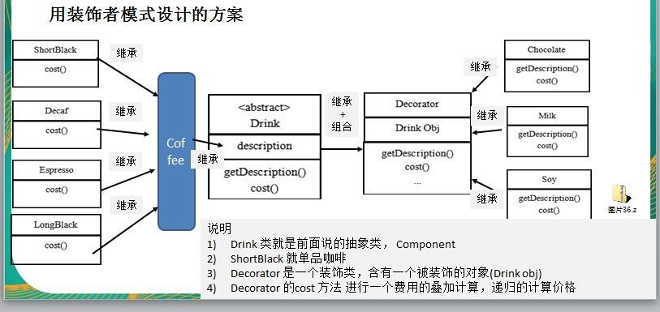

**优点**

1. 减少子类个数，降低系统管理和维护成本（解决类爆炸问题）

```java
public class Coffee	extends Drink {

	@Override
    public float cost() {
    	return super.getPrice();
    }
}


public class CoffeeBar {
    public static void main(String[] args) {
        // 装饰者模式下的订单：2 份巧克力+一份牛奶的 LongBlack

        // 1.  点一份 LongBlack
        Drink order = new LongBlack();
        System.out.println("费用 1=" + order.cost());
        System.out.println("描述=" + order.getDes());

        // 2. order 加入一份牛奶
        order = new Milk(order);

        System.out.println("order 加入一份牛奶 费用 =" + order.cost());
        System.out.println("order 加入一份牛奶 描述 = " + order.getDes());

        // 3. order 加入一份巧克力


        order = new Chocolate(order);

        System.out.println("order 加入一份牛奶  加入一份巧克力	费 用 =" + order.cost());


        System.out.println("order 加入一份牛奶 加入一份巧克力 描述 = " + order.getDes());

        // 3. order 加入一份巧克力


        order = new Chocolate(order);

        System.out.println("order 加入一份牛奶  加入 2 份巧克力	费 用 =" + order.cost());
        System.out.println("order 加入一份牛奶 加入 2 份巧克力 描述 = " + order.getDes());


        System.out.println("===========================");


        Drink order2 = new DeCaf();

        System.out.println("order2 无因咖啡	费 用 =" + order2.cost());
        System.out.println("order2 无因咖啡 描述 = " + order2.getDes());
        order2               =                new                Milk(order2); System.out.println("order2 无因咖啡  加入一份牛奶	费 用 =" + order2.cost());
        System.out.println("order2 无因咖啡 加入一份牛奶 描述 = " + order2.getDes());
    }
}

public class Decorator extends Drink { 
    private Drink obj;

    public Decorator(Drink obj) { //组合 
        this.obj = obj;
    }

    @Override
    public float cost() {
    	// getPrice 自己价格
    	return super.getPrice() + obj.cost();
    }

    @Override
    public String getDes() {
    // TODO Auto-generated method stub
    // obj.getDes() 输出被装饰者的信息
    return des + " " + getPrice() + " && " + obj.getDes();
    }
}

public abstract class Drink { 
    public String des; // 描 述
    private float price = 0.0f; 
    
    public String getDes() {
    	return des;
    }
    public void setDes(String des) { 
        this.des = des;
    }
    public float getPrice() { 
        return price;
    }
    public void setPrice(float price) { 
        this.price = price;
    }

    //计算费用的抽象方法，子类来实现
    public abstract float cost();
}


public class Espresso extends Coffee {
    public Espresso() {
        setDes(" 意大利咖啡 "); 
        setPrice(6.0f);
    }
}


public class LongBlack extends Coffee {
    public LongBlack() {
        setDes(" longblack "); 
        setPrice(5.0f);
    }
}

public class ShortBlack extends Coffee{
    public ShortBlack() { 
        setDes(" shortblack "); 
        setPrice(4.0f);
    }
}

//具体的 Decorator， 这里就是调味品
public class Chocolate extends Decorator {
    public Chocolate(Drink obj) { 
        super(obj);
    	setDes(" 巧克力 ");
    	setPrice(3.0f); // 调味品 的价格
    }
}

public class Milk extends Decorator {
    public Milk(Drink obj) { 
        super(obj);
        setDes(" 牛 奶 "); 
        setPrice(2.0f);
    }
}


public class Soy extends Decorator{
    public Soy(Drink obj) { 
        super(obj);
        setDes(" 豆浆	"); 
        setPrice(1.5f);
    }
}
```

### 组合模式

也叫部分整体模式。创建了对象组的树形结构，将对象组合成树状结构以表示整体到部分的层次关系。

component可以是个类，也可以是个接口。composite是中间节点。leaf是叶子节点。

在HashMap中使用了组合模式，静态内部类Node是leaf，HashMap是composite，Map是component。

**优点**

1. 用户对单个对象和组合对象的访问具有一致性

```java
public class Client {
    public static void main(String[] args) {
    	//从大到小创建对象 学校
    	OrganizationComponent university = new University("清华大学", " 中国顶级大学 ");

    	//创建 学院
    	OrganizationComponent computerCollege = new College("计 算机学院", "计算机学院"); 
        OrganizationComponent infoEngineercollege = new College("信息工程学院", "信息工程学院");

        //创建各个学院下面的系(专业)
        computerCollege.add(new Department("软件工程", "软件工程不错 ")); 
        computerCollege.add(new Department("网络工程", "网络工程不错 "));
        computerCollege.add(new Department("计算机科学与技术", "计算机科学与技术是老牌的专业 "));
        infoEngineercollege.add(new Department("通信工程", "通信工程不好学")); 
        infoEngineercollege.add(new Department("信息工程", "信息工程好学"));

    	//将学院加入到 学校
        university.add(computerCollege); 		
        university.add(infoEngineercollege);
    	university.print(); 
        infoEngineercollege.print();
    }
}

public abstract class OrganizationComponent { 
    private String name; // 名 字
	private String des; // 说 明
 
	protected void add(OrganizationComponent organizationComponent) {
		//默认实现
		throw new UnsupportedOperationException();
}


	protected void remove(OrganizationComponent organizationComponent) {
		//默认实现
		throw new UnsupportedOperationException();
	}

    //构造器
    public OrganizationComponent(String name, String des) { 			super();
    	this.name = name;                                               this.des = des;
    }

	public String getName() { return name;}
	public void setName(String name) { this.name = name;}

	//方法 print,  做成抽象的,  子类都需要实现
	protected abstract void print();
}

//University 就是 Composite, 可以管理 College
public class University extends OrganizationComponent {
	List<OrganizationComponent> organizationComponents = new ArrayList<OrganizationComponent>();

    // 构造器
    public University(String name, String des) {
        super(name, des);
    }

    // 重 写 add @Override
    protected void add(OrganizationComponent oc) {
		organizationComponents.add(oc);
    }

    // 重 写 remove @Override
    protected void remove(OrganizationComponent organizationComponent) {
        organizationComponents.remove(organizationComponent);
    }

    // print 方法，就是输出 University  包含的学院
    @Override
    protected void print() {
        System.out.println("--------------" + getName() + "--------------");
        //遍历 organizationComponents
        for (OrganizationComponent oc: organizationComponents) { 
            oc.print();
        }
    }
}

public class College extends OrganizationComponent {
    //List 中 存放的 Department
    List<OrganizationComponent> organizationComponents = new ArrayList<OrganizationComponent>();

    // 构造器
    public College(String name, String des) { 
        super(name, des);
    }

    // 重 写 add @Override
    protected void add(OrganizationComponent organizationComponent) {
    //	将来实际业务中，Colleage和University的add不一定完全一样
    	organizationComponents.add(organizationComponent);
    }

    // 重 写 remove @Override
    protected void remove(OrganizationComponent organizationComponent) {
        organizationComponents.remove(organizationComponent);
    }

    // print 方法，就是输出 University  包含的学院
    @Override
    protected void print() {
        System.out.println("--------------" + getName() + "--------------");
        //遍历 organizationComponents
        for (OrganizationComponent oc: organizationComponents) { 
            oc.print();
        }
    }
}

public class Department extends OrganizationComponent {
    public Department(String name, String des) { 
        super(name, des);
    }

	//add , remove 就不用写了，因为他是叶子节点

    @Override
    public String getName() {
        return super.getName();
    }


    @Override
    public String getDes() {
        return super.getDes();
    }


    @Override
    protected void print() {
        System.out.println(getName());
    }
}
```

### 外观模式

通过定义一个一致的接口，用以屏蔽内部子系统的细节，使得调用端只跟接口发生调用，不需关心内部细节。

外观类(facade)为调用端提供统一的调用接口，外观类知道哪些子系统负责负责处理请求，从而将调用端的请求代理给适当的子系统对象。调用者(Client)外观接口的调用者。子系统的集合指模块或者子系统，处理外观类对象指派的任务。

外观模式在MyBatis框架中的`Configuration.class`的`newMetaObject()`有应用。`Configuration.class`就是一个外观类。下面有很多Factory作为子系统。

**优点**

1. 通过合理的使用外观模式，更好地划分访问层次
2. 屏蔽了子系统细节，降低了客户端对子系统使用的复杂性

```java
public class Client {
	public static void main(String[] args) {
        HomeTheaterFacade homeTheaterFacade = new HomeTheaterFacade(); 
        homeTheaterFacade.ready();
        homeTheaterFacade.play();
        homeTheaterFacade.end();
    }
}

public class HomeTheaterFacade {
    //定义各个子系统对象
    private TheaterLight theaterLight; 
    private Popcorn popcorn;
    private Stereo stereo; 
    private Projector projector; 
    private Screen screen;
    private DVDPlayer dVDPlayer;

    //构造器
    public HomeTheaterFacade() {    
        this.theaterLight = TheaterLight.getInstance(); 
        this.popcorn = Popcorn.getInstance(); 
        this.stereo = Stereo.getInstance(); 
        this.projector = Projector.getInstance();
		this.screen = Screen.getInstance(); 
        this.dVDPlayer = DVDPlayer.getInstanc();
    }

    //操作分成 4  步
    public void ready() { 
        popcorn.on(); 
        popcorn.pop(); 
        screen.down(); 
        projector.on(); 
        stereo.on(); 
        dVDPlayer.on(); 
        theaterLight.dim();
    }

    public void play() { 
        dVDPlayer.play();
    }


    public void pause() { 
        dVDPlayer.pause();
    }

    public void end() { 
        popcorn.off();
    	theaterLight.bright(); 
        screen.up(); 
        projector.off(); 
        stereo.off(); 
        dVDPlayer.off();
    }
}

public class Popcorn {
	private static Popcorn instance = new Popcorn();
    
	public static Popcorn getInstance() { 
        return instance;
	}

    public void on() {
    	System.out.println(" popcorn on ");
    }

    public void off() { 
        System.out.println(" popcorn ff ");
    }

    public void pop() {
    	System.out.println(" popcorn is poping	");
    }
}

public class DVDPlayer {

	//使用单例模式, 使用饿汉式
	private static DVDPlayer instance = new DVDPlayer();


    public static DVDPlayer getInstanc() { 
        return instance;
    }

    public void on() { 
        System.out.println(" dvd on ");
    }
    
    public void off() { 
        System.out.println(" dvd off ");
    }

    public void play() {
    	System.out.println(" dvd is playing ");
    }

    public void pause() { 
        System.out.println(" dvd pause ..");
    }
}

public class Projector {

    private static Projector instance = new Projector();

    public static Projector getInstance() { 
        return instance;
    }

    public void on() {
    	System.out.println(" Projector on ");
    }

    public void off() {
    	System.out.println(" Projector ff ");
    }

    public void focus() {
    	System.out.println(" Projector is Projector	");
    }
}

public class Screen {
    private static Screen instance = new Screen();

    public static Screen getInstance() { 
        return instance;
    }

    public void up() { 
        System.out.println(" Screen up ");
    }

    public void down() { 
        System.out.println(" Screen down ");
    }
}


public class Stereo {
    private static Stereo instance = new Stereo();

    public static Stereo getInstance() { 
        return instance;
    }

    public void on() { 
        System.out.println(" Stereo on ");
    }

    public void off() { 
        System.out.println(" Screen off ");
    }

    public void up() {
    	System.out.println(" Screen up.. ");
    }
}

public class TheaterLight {
    private static TheaterLight instance = new TheaterLight();

    public static TheaterLight getInstance() { 
        return instance;
    }

    public void on() {
    	System.out.println(" TheaterLight on ");
    }

    public void off() {
    	System.out.println(" TheaterLight off ");
    }

    public void dim() {
    	System.out.println(" TheaterLight dim.. ");
    }
    
    public void bright() {
    System.out.println(" TheaterLight bright.. ");
    }
}

```

### 享元模式 Flyweight Pattern

运用共享技术有效的支持大量细粒度的对象。通过解决重复对象的内存浪费的问题，提高系统的性能。经典应用场景就是池技术。

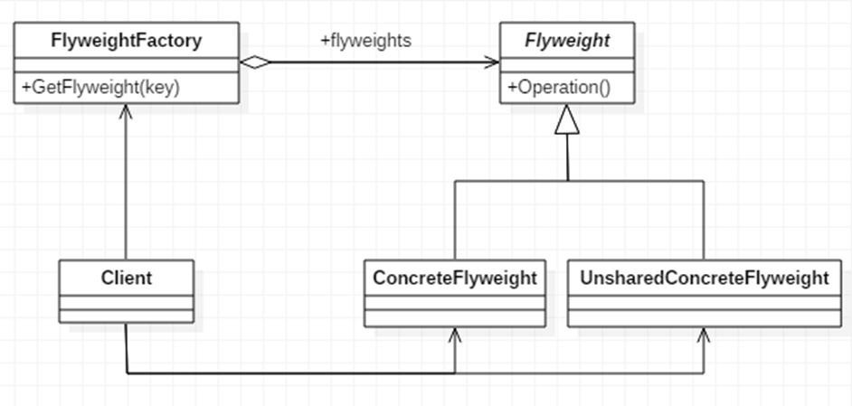

Flyweight是抽象的享元角色。他是产品的抽象类, 同时定义出对象的外部状态和内部状态的接口或实现。

ConcreteFlyWeight是具体的享元角色，是具体的产品类，实现抽象角色定义相关业务。

UnSharedConcreteFlyWeight是不可共享的角色，一般不会出现在享元工厂。

FlyWeightFactory享元工厂类，用于构建一个池容器(集合)， 同时提供从池中获取对象方法。

1)    内部状态指对象共享出来的信息，存储在享元对象内部且不会随环境的改变而改变

2)    外部状态指对象得以依赖的一个标记，是随环境改变而改变的、不可共享的状态。

享元模式在Integer中有使用。如果新创建的Integer对象值在-128~127中，使用享元模式返回。否则，新创建对象返回。

**优点**

1. 降低程序内存占用，减少对象创建，提高效率

**缺点**

1. 需要划分内部和外部状态，还要建立一个工厂

```java
public class Client {
    public static void main(String[] args) {
        // 创建一个工厂类
        WebSiteFactory factory = new WebSiteFactory();

        // 客户要一个以新闻形式发布的网站
        WebSite webSite1 = factory.getWebSiteCategory("新闻");
        webSite1.use(new User("tom"));

        // 客户要一个以博客形式发布的网站
        WebSite webSite2 = factory.getWebSiteCategory("博客");
        webSite2.use(new User("jack"));

        // 客户要一个以博客形式发布的网站
        WebSite webSite3 = factory.getWebSiteCategory("博客");
        webSite3.use(new User("smith"));

        // 客户要一个以博客形式发布的网站
        WebSite webSite4 = factory.getWebSiteCategory("博客");
        webSite4.use(new User("king"));

        System.out.println("网站的分类共=" + factory.getWebSiteCount());
    }
}

//具体网站
public class ConcreteWebSite extends WebSite {
	//共享的部分，内部状态
	private String type = ""; //网站发布的形式(类型)

    //构造器
    public ConcreteWebSite(String type) {
    	this.type = type;
    }

    @Override
    public void use(User user) {
    	System.out.println("网站的发布形式为:" + type + "。使用者是" + user.getName());
    }
}

public abstract class WebSite {
	public abstract void use(User user); //抽象方法
}

// 网站工厂类，根据需要返回压一个网站
public class WebSiteFactory {
	//集合， 充当池的作用
	private HashMap<String, ConcreteWebSite> pool = new HashMap<>();

    //根据网站的类型，返回一个网站, 如果没有就创建一个网站，并放入到池中,并返回
    public WebSite getWebSiteCategory(String type) { 
        if(!pool.containsKey(type)) {
    		//就创建一个网站，并放入到池中
    		pool.put(type, new ConcreteWebSite(type));
    	}
    	return (WebSite)pool.get(type);
    }

	//获取网站分类的总数 (池中有多少个网站类型) 
    public int getWebSiteCount() {
    	return pool.size();
    }
}
```

### 代理模式 Proxy

为对象提供一个替身，以控制对这个对象的访问。增强额外的功能操作，即扩展目标对象的功能。主要是静态代理、动态代理和cglib代理。

#### 静态代理

需要定义接口或者父类，被代理对象(即目标对象)与代理对象一起实现相同的接口或者是继承相同父类。

**优点**

1. 在不修改目标对象的功能前提下, 能通过代理对象对目标功能扩展

**缺点**

1. 因为代理对象需要与目标对象实现一样的接口,所以会有很多代理类
2. 一旦接口增加方法,目标对象与代理对象都要维护

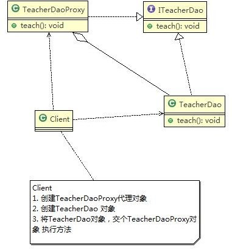

```java
public class Client {
    public static void main(String[] args) {
        //创建目标对象(被代理对象)
        TeacherDao teacherDao = new TeacherDao();

        //创建代理对象, 同时将被代理对象传递给代理对象
        TeacherDaoProxy teacherDaoProxy = new TeacherDaoProxy(teacherDao);

        //通过代理对象，调用到被代理对象的方法
        //即：执行的是代理对象的方法，代理对象再去调用目标对象的方法
        teacherDaoProxy.teach();
    }
}

//接口
public interface ITeacherDao {
	void teach(); // 授课的方法
}

public class TeacherDao implements ITeacherDao {
    @Override
    public void teach() {
        System.out.println(" 老师授课中	。。。。。");
    }
}

//代理对象,静态代理
public class TeacherDaoProxy implements ITeacherDao{
	private ITeacherDao target; // 目标对象，通过接口来聚合

    //构造器
    public TeacherDaoProxy(ITeacherDao target) { 
        this.target = target;
    }

    @Override
    public void teach() {
        System.out.println("开始代理.."); //方法
        target.teach();
        System.out.println("提交。。。。。"); //方法
    }
}
```

#### 动态代理

也称为JDK 代理、接口代理。代理对象,不需要实现接口，但是目标对象要实现接口，否则不能用动态代理。代理对象的生成，是利用 JDK 的 API，动态的在内存中构建代理对象。

**JDK 中生成代理对象的 API**

1)   代理类所在包: java.lang.reflect.Proxy

2)   JDK 实现代理只需要使用 **newProxyInstance** 方法,但是该方法需要接收三个参数,完整的写法是:

```java
static Object newProxyInstance(ClassLoader loader, Class<?>[] interfaces,InvocationHandler h)
```

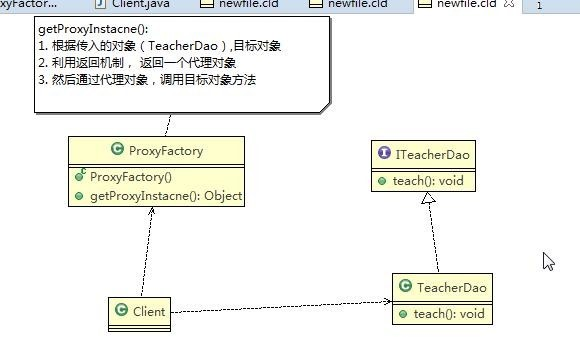

```java
public class Client {

	public static void main(String[] args) {
        //创建目标对象
        ITeacherDao target = new TeacherDao();

        //给目标对象，创建代理对象, 可以转成 ITeacherDao
        ITeacherDao proxyInstance = (ITeacherDao)new ProxyFactory(target).getProxyInstance();

        // proxyInstance=class com.sun.proxy.$Proxy0内存中动态生成了代理对象
        System.out.println("proxyInstance=" + proxyInstance.getClass());

        //通过代理对象，调用目标对象的方法
        proxyInstance.teach();
        proxyInstance.sayHello(" tom ");
    }

}

//接口
public interface ITeacherDao {
    void teach(); // 授课方法
    void sayHello(String name);
}

public class ProxyFactory {

	//维护一个目标对象
    private Object target;

    public ProxyFactory(Object target) {
    	this.target = target;
	}

    //给目标对象  生成一个代理对象
    public Object getProxyInstance() {
/**
newProxyInstance(ClassLoader loader, Class<?>[] interfaces, InvocationHandler h)
1. ClassLoader loader: 指定当前目标对象使用的类加载器, 获取加载器的方法固定
2. Class<?>[] interfaces: 目标对象实现的接口类型，使用泛型方法确认类型
3. InvocationHandler h: 事情处理，执行目标对象的方法时，会触发事情处理器方法, 会把当前执行的目标对象方法作为参数传入
*/
    return Proxy.newProxyInstance(target.getClass().getClassLoader(), target.getClass().getInterfaces(),
        new InvocationHandler() {
            @Override
            public Object invoke(Object proxy, Method method, Object[] args) throws Throwable {
                System.out.println("JDK 代理开始~~");
                //反射机制调用目标对象的方法
                Object returnVal = method.invoke(target, args);
                System.out.println("JDK 代理提交"); 
                return returnVal;
            }
        });
	}
}

public class TeacherDao implements ITeacherDao {
    @Override
    public void teach() {
        System.out.println(" 老师授课中.... ");
    }

    @Override
    public void sayHello(String name) {
        System.out.println("hello " + name);
    }
}
```

#### Cglib代理

有时候目标对象只是一个单独的对象，并没有实现任何的接口，这个时候可使用目标对象子类来实现代理。也叫作子类代理，它是在内存中构建一个子类对象从而实现对目标对象功能扩展，有些书也将Cglib 代理归属到动态代理。Cglib 包的底层是通过使用字节码处理框架 ASM 来转换字节码并生成新的类。

**实现步骤**

1. 需要引入 cglib 的 jar 文件 
2. 在内存中动态构建子类，注意代理的类不能为 final，否则报错`java.lang.IllegalArgumentException`

3. 目标对象的方法如果为 final/static，那么就不会被拦截，即不会执行目标对象额外的业务方法

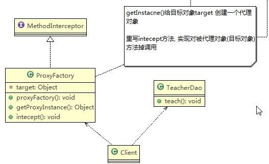

```java
public class TeacherDao {
    public String teach() {
        System.out.println("老师授课中，cglib代理不需要实现接口"); 
        return "hello";
    }
}

public class ProxyFactory implements MethodInterceptor {

    private Object target;
    public ProxyFactory(Object target) {
    	this.target = target;
    }

    public Object getProxyInstance() {
        //1. 创建一个工具类
        Enhancer enhancer = new Enhancer();
        //2. 设置父类
        enhancer.setSuperclass(target.getClass());
        //3. 设置回调函数
        enhancer.setCallback(this);
        //4. 创建子类对象，即代理对象
        return enhancer.create();
    }

    //重写intercept 方法，会调用目标对象的方法
    @Override
    public Object intercept(Object arg0, Method method, Object[] args, MethodProxy arg3) throws Throwable {
    	System.out.println("Cglib 代理模式 ~~ 开始"); 
        Object returnVal = method.invoke(target, args); 		
        System.out.println("Cglib 代理模式 ~~ 提交"); 
        return returnVal;
    }
}

public class Client {
    public static void main(String[] args) {
        //创建目标对象
        TeacherDao target = new TeacherDao();
        //获取到代理对象，并且将目标对象传递给代理对象
        TeacherDao proxyInstance = (TeacherDao) new ProxyFactory(target).getProxyInstance();

        //执行代理对象的方法，触发intecept方法，从而实现对目标对象的调用
        String res = proxyInstance.teach(); 	
        System.out.println("res=" + res);
    }
}
```

#### 变体

防火墙代理，缓存代理，远程代理，同步代理。


## 行为型模式

### 模板模式 Template Method Pattern

在抽象类定义了执行他的方法的模板，子类可以按需要重写。

AbstractClass 抽象类， 类中实现了模板方法(template)，定义了算法的骨架，具体子类需要去实现 其它的抽象方法。 ConcreteClass 实现抽象方法，以完成算法中特点子类的步骤。一般模板方法都加上 final 关键字， 防止子类重写模板方法。

在Spring IOC容器中`ConfigurableApplicationContext.class`的refresh()方法有使用模板模式。

**优点**

1. 实现了最大化代码复用。父类的模板方法和已实现的某些步骤会被子类继承而直接使用。
2. 统一了算法，也提供了很大的灵活性。

**缺点**

1. 每一个不同的实现都需要一个子类实现，导致类的个数增加，使得系统更加庞大

```java
public class Client {
    public static void main(String[] args) {
        System.out.println("----制作红豆豆浆----");
        SoyaMilk redBeanSoyaMilk = new RedBeanSoyaMilk(); 
        redBeanSoyaMilk.make();

        System.out.println("----制作花生豆浆----"); 
        SoyaMilk peanutSoyaMilk = new PeanutSoyaMilk(); 	
        peanutSoyaMilk.make();
    }
}

public class PeanutSoyaMilk extends SoyaMilk {
    @Override
    void addCondiments() {
    	System.out.println(" 加入上好的花生 ");
    }
}

public class RedBeanSoyaMilk extends SoyaMilk {
    @Override
    void addCondiments() {
    	System.out.println(" 加入上好的红豆 ");
    }
}

//抽象类，表示豆浆
public abstract class SoyaMilk {

    //模板方法, make , 模板方法可以做成 final , 不让子类去覆盖. 
    final void make() {
    	select(); 
        addCondiments(); 
        soak();
    	beat();
    }

    //选材料
    void select() {
    	System.out.println("第一步：选择好的新鲜黄豆");
    }

    //添加不同的配料，抽象方法，子类具体实现
    abstract void addCondiments();

    //浸泡
    void soak() {
    	System.out.println("第三步，黄豆和配料开始浸泡，需要3小时");
    }


    void beat() {
    	System.out.println("第四步：黄豆和配料放到豆浆机去打碎");
    }
}
```

在模板方法模式的父类中，我们可以定义一个方法，它默认不做任何事，子类可以视情况要不要覆盖它，该方法称为”钩子“。 还是用上面做豆浆的例子来讲解，我们还希望制作纯豆浆，不添加任何的配料，使用钩子方法对模板方法进行改造。

2)       ConcreteClass 实现抽象方法 operationr2,3,4, 以完成算法中特点子类的步骤

```java
public class PureSoyaMilk extends SoyaMilk {
    @Override
    void addCondiments() {
    	
    }
    
    boolean wantCondiment() {
        return false;
    }
}

//抽象类，表示豆浆
public abstract class SoyaMilk {

    //模板方法, make , 模板方法可以做成 final , 不让子类去覆盖. 
    final void make() {
    	select(); 
        if (wantCondiment())
        	addCondiments(); 
        soak();
    	beat();
    }

    //选材料
    void select() {
    	System.out.println("第一步：选择好的新鲜黄豆");
    }

    //添加不同的配料，抽象方法，子类具体实现
    abstract void addCondiments();

    //浸泡
    void soak() {
    	System.out.println("第三步，黄豆和配料开始浸泡，需要3小时");
    }


    void beat() {
    	System.out.println("第四步：黄豆和配料放到豆浆机去打碎");
    }
    
    boolean wantCondiment() {
        return true;
    }
}
```

### 命令模式 Command Pattern

在软件设计中，我们经常需要向某些对象发送请求，但是并不知道请求的接收者是谁，也不知道被请求的操作是哪个。

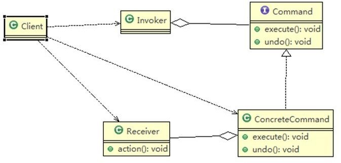

1)   Invoker 是调用者角色

2)   Command: 是命令角色，需要执行的所有命令都在这里，可以是接口或抽象类

3)   Receiver: 接受者角色，知道如何实施和执行一个请求相关的操作

4)   ConcreteCommand: 将一个接受者对象与一个动作绑定，调用接受者相应的操作，实现 execute

在Spring框架JdbcTemplate中有应用。`Interface StatementCallback<T>`类似Command。`class QueryStatementCallback implements StatementCallback<T>, SqlProvider `， 局部内部类，实现了命令接口， 同时也充当命令接收者。命令调用者 是 JdbcTemplate , 其中 `execute(StatementCallback<T> action)`方法中，调用 `action.doInStatement ()`方法。不同的实现 StatementCallback 接口的对象，对应不同的 doInStatemnt 实现逻辑。

**优点**

1. 请求发送者与请求接收者消除彼此之间的耦合，让对象之间的调用关系更加灵活，实现解耦。
2. 容易设计一个命令队列。只要把命令对象放到列队，就可以多线程的执行命令
3. 容易实现对请求的撤销和重做

**缺点**

1. 有过多的具体命令类，增加了系统的复杂度

```java
public class Client {
    public static void main(String[] args) {
        //使用命令设计模式，完成通过遥控器，对电灯的操作
        //创建电灯的对象(接受者)
        LightReceiver lightReceiver = new LightReceiver();
        //创建电灯相关的开关命令
        LightOnCommand lightOnCommand = new LightOnCommand(lightReceiver);
        LightOffCommand lightOffCommand = new LightOffCommand(lightReceiver);

        //需要一个遥控器
        RemoteController remoteController = new RemoteController();

        //给我们的遥控器设置命令, 比如no = 0是电灯的开和关的操作
        remoteController.setCommand(0, lightOnCommand, lightOffCommand);

    	System.out.println("--------按下灯的开按钮-----------"); 
        remoteController.onButtonWasPushed(0); 	
        System.out.println("--------按下灯的关按钮-----------"); 
        remoteController.offButtonWasPushed(0); 
        System.out.println("--------按下撤销按钮-----------"); 
        remoteController.undoButtonWasPushed();

    	System.out.println("=========使用遥控器操作电视机=========="); 
        TVReceiver tvReceiver = new TVReceiver();
    	TVOffCommand tvOffCommand = new TVOffCommand(tvReceiver); 
        TVOnCommand tvOnCommand = new TVOnCommand(tvReceiver);
    	//给我们的遥控器设置命令, 比如 no = 1  是电视机的开和关的操作
    	remoteController.setCommand(1, tvOnCommand, tvOffCommand);

    	System.out.println("--------按下电视机的开按钮-----------");
    	remoteController.onButtonWasPushed(1); 
        System.out.println("--------按下电视机的关按钮-----------"); 
        remoteController.offButtonWasPushed(1); 
        System.out.println("-------- 按下撤销按钮 -----------"); 
        remoteController.undoButtonWasPushed();
    }
}

//创建命令接口
public interface Command {
	//执行动作(操作) 
    public void execute();
	//撤销动作(操作) 
    public void undo();
}

public class LightOffCommand implements Command {
	// 聚合LightReceiver 
    LightReceiver light;
	// 构造器
    public LightOffCommand(LightReceiver light) { 
        super();
    	this.light = light;
    }

    @Override
    public void execute() {
        // 调用接收者的方法
        light.off();
    }

    @Override
    public void undo() {
        // 调用接收者的方法
        light.on();
    }
}

public class LightOnCommand implements Command {
    //聚合LightReceiver 
    LightReceiver light;
    //构造器
    public LightOnCommand(LightReceiver light) { 
        super();
    	this.light = light;
    }


    @Override
    public void execute() {
    	//调用接收者的方法 
        light.on();
    }

    @Override
    public void undo() {
        //调用接收者的方法
        light.off();
    }
}


public class LightReceiver {
    public void on() {
    	System.out.println(" 电灯打开了.. ");
    }

    public void off() {
    	System.out.println(" 电灯关闭了.. ");
    }
}

/**
 *没有任何命令，即空执行: 用于初始化每个按钮, 当调用空命令时，对象什么都不做
 *其实，这也是一种设计模式, 可以省掉对空判断
 */
public class NoCommand implements Command {
    @Override
    public void execute() {}

    @Override
    public void undo() {}
}

public class RemoteController {
	Command[] onCommands; 
    Command[] offCommands;
	// 执行撤销的命令
	Command undoCommand;

    // 构造器，完成对按钮初始化
    public RemoteController() {
    	onCommands = new Command[5]; 
        offCommands = new Command[5];
        for (int i = 0; i < 5; i++) {
        	onCommands[i] = new NoCommand(); 
            offCommands[i] = new NoCommand();
        }
    }

    // 给我们的按钮设置你需要的命令
    public void setCommand(int no, Command onCommand, Command offCommand) { 
        onCommands[no] = onCommand;
    	offCommands[no] = offCommand;
    }

    // 按下开按钮
    public void onButtonWasPushed(int no) { 
        // 找到你按下的开的按钮， 并调用对应方法
        onCommands[no].execute();
        // 记录这次的操作，用于撤销
        undoCommand = onCommands[no];
	}

    // 按下开按钮
    public void offButtonWasPushed(int no) { 
        // 找到你按下的关的按钮， 并调用对应方法
        offCommands[no].execute();
        // 记录这次的操作，用于撤销
        undoCommand = offCommands[no];
    }

    // 按下撤销按钮
    public void undoButtonWasPushed() { 
        undoCommand.undo();
    }
}


public class TVOffCommand implements Command {
    // 聚 合 TVReceiver
    TVReceiver tv;

    // 构造器
    public TVOffCommand(TVReceiver tv) { 
        super();
    	this.tv = tv;
    }

    @Override
    public void execute() {
        // 调用接收者的方法
        tv.off();
    }

    @Override
    public void undo() {
        // 调用接收者的方法
        tv.on();
    }
}

public class TVOnCommand implements Command {
	// 聚 合 TVReceiver TVReceiver tv;
	// 构造器
	public TVOnCommand(TVReceiver tv) { 
        super();
        this.tv = tv;
    }

    @Override
    public void execute() {
    	tv.on();
    }

    @Override
    public void undo() {
    // 调用接收者的方法
    tv.off();
    }
}

public class TVReceiver {
    public void on() {
    	System.out.println(" 电视机打开了.. ");
    }

    public void off() {
    	System.out.println(" 电视机关闭了.. ");
    }
}

```

### 访问者模式 Visitor Pattern

封装一些作用于某种数据结构的各元素的操作，它可以在不改变数据结构的前提下定义作用于这些元素的新的操作。包含访问者和被访问元素两个主要组成部分，这些被访问的元素通常具有不同的类型，且不同的访问者可以对它们进行不同的访问操作。例如：处方单中的各种药品信息就是被访问的元素，而划价人员和药房工作人员就是访问者。

1)    Visitor 是抽象访问者，为该对象结构中的 ConcreteElement 的每一个类声明一个 visit 操作

2)    ConcreteVisitor ：是一个具体的访问值实现每个有 Visitor 声明的操作，是每个操作实现的部分。

3)    ObjectStructure 能枚举它的元素， 可以提供一个高层的接口，用来允许访问者访问元素

4)    Element 定义一个 accept 方法，接收一个访问者对象

5)    ConcreteElement 为具体元素，实现了 accept 方法

双分派：不管类怎么变化，我们都能找到期望的方法运行。执行的操作取决于请求的种类和两个接受者的类型。

**优点**

1. 符合单一职责原则，程序扩展性好
2. 对功能进行统一，适用于数据结构稳定的系统，应用场景有报表、UI、拦截器

**缺点**

1. 具体元素对访问者公布细节，违反了迪米特法则
2. 违背了依赖倒转原则

```java
public abstract class Action {
    //得到男性 的测评
    public abstract void getManResult(Man man);
    //得到女的 测评
    public abstract void getWomanResult(Woman woman);
}

public abstract class Person {
	//提供一个方法，让访问者可以访问
    public abstract void accept(Action action);
}

//说明
//1. 这里我们使用到了双分派,  即首先在客户端程序中，将具体状态作为参数传递 Woman中(第一次分派)
//2. 然后 Woman 类调用作为参数的 "具体方法" 中方法 getWomanResult, 同时将自己(this)作为参数传入，完成第二次的分派
public class Woman extends Person{
    @Override
    public void accept(Action action) {
        action.getWomanResult(this);
    }
}

public class Man extends Person {
    @Override
    public void accept(Action action) {
        action.getManResult(this);
    }
}

public class Success extends Action {
    @Override
    public void getManResult(Man man) {
    	System.out.println(" 男人给的评价该歌手很成功 !");
    }

    @Override
    public void getWomanResult(Woman woman) { 
        System.out.println(" 女人给的评价该歌手很成功 !");
    }
}

public class Fail extends Action {
    @Override
    public void getManResult(Man man) {
    	System.out.println(" 男人给的评价该歌手失败 !");
    }


    @Override
    public void getWomanResult(Woman woman) {
    	System.out.println(" 女人给的评价该歌手失败 !");
    }
}

public class Wait extends Action {
    @Override
    public void getManResult(Man man) {
        System.out.println(" 男人给的评价是该歌手待定 ..");
    }


    @Override
    public void getWomanResult(Woman woman) {
        System.out.println(" 女人给的评价是该歌手待定 ..");
    }
}

//数据结构，管理很多人（Man , Woman） 
public class ObjectStructure {
    //维护了一个集合
    private List<Person> persons = new LinkedList<>();

    //增加到 list
    public void attach(Person p) {
    	persons.add(p);
    }
    
    //移除
    public void detach(Person p) { 
        persons.remove(p);
    }

    //显示测评情况
    public void display(Action action) { 
        for(Person p: persons) 
    		p.accept(action);
    }
}

public class Client {
    public static void main(String[] args) {
        //创建 ObjectStructure
        ObjectStructure objectStructure = new ObjectStructure();
        objectStructure.attach(new Man()); 	
        objectStructure.attach(new Woman());
        System.out.println("==============="); 
        Success success = new Success(); 	
        objectStructure.display(success);
    	System.out.println("==============="); 
        Fail fail = new Fail(); 
        objectStructure.display(fail);
        System.out.println("=======给的是待定的测评========");
        Wait wait = new Wait(); 
        objectStructure.display(wait);
    }
}
```

### 迭代器模式 Iterator Pattern

提供一种遍历集合元素的统一接口，用一致的方法遍历集合元素，不需要知道集合对象的底层表示，即：不暴露其内部的结构。

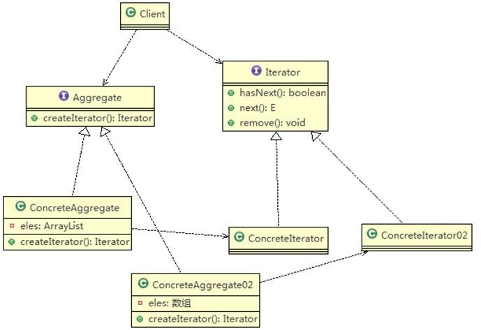

1)	Iterator：迭代器接口，是系统提供，含有 hasNext, next, remove
2)	ConcreteIterator:  具体的迭代器类，管理迭代
3)	Aggregate: 一个统一的聚合接口， 将客户端和具体聚合解耦
4)	ConcreteAggreage：具体的聚合持有对象集合， 并提供一个方法，返回一个迭代器， 该迭代器可以正确遍历集合
5)	Client：客户端，通过Iterator和Aggregate依赖子类

在JDK中ArrayList集合中有应用。内部类Itr充当具体实现迭代器的类。List充当了聚合接口，含有iterator()方法。ArrayList实现了List接口，实现了iterator()方法。

**优点**

1. 解决了不同集合的遍历问题
2. 隐藏了聚合的内部结构
3. 把管理对象集合和遍历对象集合的责任分开，符合单一责任模式

**缺点**

1. 每个聚合对象都要有一个迭代器，存在类爆炸问题

```java
public class ComputerCollegeIterator implements Iterator {
    //这里我们需要 Department以数组方式存放
    Department[] departments;
    int position = 0; //遍历的位置
    public ComputerCollegeIterator(Department[] departments) { 
        this.departments = departments;
    }

    //判断是否还有下一个元素 
    @Override
    public boolean hasNext() {
    if(position >= departments.length || departments[position] == null) 
        return false;
    else 
    	return true;
    }

    @Override
    public Object next() {
        Department department = departments[position]; 
        position += 1;
    	return department;
    }

	//删除的方法，默认空实现 
    public void remove() {}
}

public class InfoColleageIterator implements Iterator {
	List<Department> departmentList; //信息工程学院是以 List 方式存放系
	int index = -1;//索引

    public InfoColleageIterator(List<Department> departmentList) { 
        this.departmentList = departmentList;
    }

    @Override
    public boolean hasNext() {
        if(index >= departmentList.size() - 1) 
    		return false;
    	else {
    		index += 1; 
            return true;
    	}
    }

    @Override
    public Object next() {
        return departmentList.get(index);
    }

    // 空 实 现
	public void remove() {}
}

public interface College {
    public String getName();

    //增加系的方法
    public void addDepartment(String name, String desc);

    //返回一个迭代器,遍历
    public Iterator	createIterator();
}

public class ComputerCollege implements College {
    Department[] departments;
    int numOfDepartment = 0 ;// 保存当前数组的对象个数
    public ComputerCollege() { 
        departments = new Department[5];
        addDepartment("Java 专业", " Java 专业  ");
        addDepartment("PHP 专业", " PHP 专业  ");
        addDepartment("大数据专业", "  大数据专业 ");
	}

    @Override
    public String getName() {
    	return "计算机学院";
    }

    @Override
    public void addDepartment(String name, String desc) {
    	Department department = new Department(name, desc); 
        departments[numOfDepartment++] = department; 
    }

    @Override
    public Iterator createIterator() {
    	return new ComputerCollegeIterator(departments);
    }
}

public class InfoCollege implements College {
    List<Department> departmentList;

    public InfoCollege() {
    	departmentList = new ArrayList<Department>();
        addDepartment("信息安全专业", " 信息安全专业 "); 	
        addDepartment("网络安全专业", " 网络安全专业 ");
    	addDepartment("服务器安全专业", "  服务器安全专业 ");
    }
    
    @Override
    public String getName() {
    	return "信息工程学院";
    }

    @Override
    public void addDepartment(String name, String desc) {
    	Department department = new Department(name, desc); 	
        departmentList.add(department);
    }

    @Override
    public Iterator createIterator() {
    	return new InfoColleageIterator(departmentList);
    }
}

//系
public class Department {
    private String name; 
    private String desc;
    public Department(String name, String desc) {
    	super();
    	this.name = name; 
        this.desc = desc;
    }
    
    public String getName() { return name;}
    public void setName(String name) { this.name = name;}
    public String getDesc() { return desc;}
    public void setDesc(String desc) { this.desc = desc;}
}

public class OutPutImpl {
    //学院集合
    List<College> collegeList;
    public OutPutImpl(List<College> collegeList) {
        this.collegeList = collegeList;
    }
    
    //遍历所有学院,然后调用 printDepartment  输出各个学院的系
    public void printCollege() {
    	//从 collegeList 取出所有学院, Java 中的 List 已经实现 Iterator 
        Iterator<College> iterator = collegeList.iterator();
        while(iterator.hasNext()) {
            //取出一个学院
            College college = iterator.next();
            System.out.println("===="+college.getName()+"====" ); 
            printDepartment(college.createIterator()); 
        }
    }
    
    //输出学院,输出系
    public void printDepartment(Iterator iterator) { 
        while(iterator.hasNext()) {
    		Department d = (Department)iterator.next(); 		
            System.out.println(d.getName());
    	}
    }
}

public class Client {
    public static void main(String[] args) {
        //创建学院
        List<College> collegeList = new ArrayList<College>();
        ComputerCollege computerCollege = new ComputerCollege(); 
        InfoCollege infoCollege = new InfoCollege();

        collegeList.add(computerCollege);
        collegeList.add(infoCollege);
        OutPutImpl outPutImpl = new OutPutImpl(collegeList); 
        outPutImpl.printCollege();
    }
}
```

### 观察者模式

对象之间多对一依赖的一种设计方案，被依赖的对象为 Subject，依赖的对象为 Observer，Subject
通知 Observer 变化。比如这里的奶站是 Subject，是 1 的一方。用户时是Observer，是多的一方。

被观察者(subject)需要至少三个操作：添加观察者，删除观察者，通知观察者。观察者(observer)需要有一个更新的操作。

在JDK源码中`class Observerable`有应用，作用相当于Subject，是一个类，通过集成来实现观察者模式。`Observer`的作用相当于Observer。

**优点**

1. 以集合的方式管理观察者，增加观察者不需要修改核心类代码，符合ocp原则

**缺点**

1. 

```java
//接口, 让 WeatherData 来实现
public interface Subject {
	public void registerObserver(Observer o); 
    public void removeObserver(Observer o); 
    public void notifyObservers();
}

/**
 *	类是核心
 *	1. 包含最新的天气情况信息
 *	2. 含有 观察者集合，使用 ArrayList 管理
 *	3.  当数据有更新时，就主动的调用	ArrayList, 通知所有的（接入方）就看到最新的信息
 */
public class WeatherData implements Subject { 
    private float temperatrue;
	private float pressure;
    private float humidity;
    private ArrayList<Observer> observers; //观察者集合
    
    public WeatherData() {
    	observers = new ArrayList<Observer>();
    }

    public float getTemperature() { return temperatrue;}
    public float getPressure() { return pressure;}
    public float getHumidity() { return humidity;}
    
    public void dataChange() {
    	//调用接入方的 update
    	notifyObservers();
    }

    //当数据有更新时，就调用 setData
    public void setData(float temperature, float pressure, float humidity) { 
        this.temperatrue = temperature;
    	this.pressure = pressure; this.humidity = humidity;
   		//调用dataChange，将最新的信息推送给接入方currentConditions
    	dataChange();
	}

    //注册一个观察者 
    @Override
    public void registerObserver(Observer o) {
        observers.add(o);
    }

    //移除一个观察者 
    @Override
    public void removeObserver(Observer o) {
    	observers.remove(o);
	}

    //遍历所有的观察者，并通知 
    @Override
    public void notifyObservers() {
        for(int i = 0; i < observers.size(); i++) 
            observers.get(i).update(temperatrue, pressure, humidity);
    }

}

//观察者接口，有观察者来实现 
public interface Observer {
    public void update(float temperature, float pressure, float humidity);
}

public class CurrentConditions implements Observer {
	// 温度，气压，湿度
	private float temperature;
    private float pressure; private float humidity;

    // 更新 天气情况，是由 WeatherData 来调用，我使用推送模式
    public void update(float temperature, float pressure, float humidity) { 
        this.temperature = temperature;
    	this.pressure = pressure; 
        this.humidity = humidity; 
        display();
    }

    // 显 示
    public void display() {
    	System.out.println("***Today mTemperature: " + temperature + "***"); 
        System.out.println("***Today mPressure: " + pressure + "***"); 
        System.out.println("***Today mHumidity: " + humidity + "***");
    }
}

public class BaiduSite implements Observer {
	// 温度，气压，湿度
    private float temperature; 
    private float pressure; 
    private float humidity;

    //  更新天气情况，是由  WeatherData  来调用，我使用推送模式
    public void update(float temperature, float pressure, float humidity) {
        this.temperature = temperature;
        this.pressure = pressure; 
        this.humidity = humidity; 
        display();
    }

    // 显 示
    public void display() {
        System.out.println("===百度网站====");
        System.out.println("***百度网站 气温 : " + temperature + "***");
        System.out.println("***百度网站 气压: " + pressure + "***");
        System.out.println("***百度网站 湿度: " + humidity + "***");
    }
}

public class Client {
    public static void main(String[] args) {
        //创建一个 WeatherData
        WeatherData weatherData = new WeatherData();
        //创建观察者
        CurrentConditions currentConditions = new CurrentConditions();
        BaiduSite baiduSite = new BaiduSite();
        // 注 册 到 weatherData 
        weatherData.registerObserver(currentConditions); 
        weatherData.registerObserver(baiduSite);

        // 测试                                                         
        System.out.println("通知各个注册的观察者, 看看信息"); 
        weatherData.setData(10f, 100f, 30.3f);
        weatherData.removeObserver(currentConditions);
        System.out.println();
        System.out.println("通知各个注册的观察者, 看看信息"); 
        weatherData.setData(10f, 100f, 30.3f);
    }
}
```

### 中介者模式

用一个中介对象来封装一系列的对象交互。中介者使各个对象不需要显式地相互引用，从而使其耦合松散，而且可以独立地改变它们之间的交互。

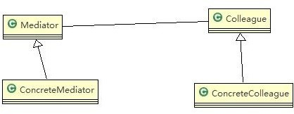

1)	Mediator 就是抽象中介者，定义了同事对象到中介者对象的接口
2)	Colleague 是抽象同事类
3)	ConcreteMediator 具体的中介者对象，实现抽象方法，他需要知道所有的具体的同事类，即以一个集合来管理，并接受某个同事对象消息，完成相应的任务
4)	ConcreteColleague 具体的同事类，会有很多，每个同事只知道自己的行为， 而不了解其他同事类的行为(方法)， 但是他们都依赖中介者对象

在MVC中有使用。

**优点**

1. 对网状结构进行解耦，符合迪米特原则

**缺点**

1. 中介者承担过多责任，如果出现问题，整个系统都会受到影响

```java
public abstract class Mediator {
    //将给中介者对象，加入到集合中
    public abstract void Register(String colleagueName, Colleague colleague);

    //接收消息, 具体的同事对象发出
    public abstract void GetMessage(int stateChange, String colleagueName);

    public abstract void SendMessage();
}

//具体的中介者类
public class ConcreteMediator extends Mediator {
    //集合，放入所有的同事对象
    private HashMap<String, Colleague> colleagueMap;
    private HashMap<String, String> interMap;
 
    public ConcreteMediator() {
    	colleagueMap = new HashMap<String, Colleague>(); 
        interMap = new HashMap<String, String>();
    }

    @Override
    public void Register(String colleagueName, Colleague colleague) {
   		colleagueMap.put(colleagueName, colleague);
        if (colleague instanceof Alarm) 
            interMap.put("Alarm", colleagueName);
        else if (colleague instanceof CoffeeMachine) 
            interMap.put("CoffeeMachine", colleagueName);
        else if (colleague instanceof TV) 
            interMap.put("TV", colleagueName);
        else if (colleague instanceof Curtains)  
            interMap.put("Curtains", colleagueName);
    }
    
    //1. 根据得到消息，完成对应任务
    //2. 中介者在这个方法，协调各个具体的同事对象，完成任务
    @Override
    public void GetMessage(int stateChange, String colleagueName) {
        //处理闹钟发出的消息
        if (colleagueMap.get(colleagueName) instanceof Alarm) { 
            if (stateChange == 0) {
            	((CoffeeMachine) (colleagueMap.get(interMap.get("CoffeeMachine")))).StartCoffee();
            ((TV) (colleagueMap.get(interMap.get("TV")))).StartTv();
            } else if (stateChange == 1) {
            	((TV) (colleagueMap.get(interMap.get("TV")))).StopTv();
            }
        } else if (colleagueMap.get(colleagueName) instanceof CoffeeMachine) 
            ((Curtains) (colleagueMap.get(interMap.get("Curtains")))).UpCurtains();
        else if (colleagueMap.get(colleagueName) instanceof TV) {
            //如果 TV 发现消息
        } else if (colleagueMap.get(colleagueName) instanceof Curtains) {
            //如果是以窗帘发出的消息，这里处理...
        }
    }
}

//具体的同事类
public class Alarm extends Colleague {

    //构造器
    public Alarm(Mediator mediator, String name) {
    	super(mediator, name);
    	//在创建 Alarm 同事对象时，将自己放入到 ConcreteMediator 对象中[集合] 
        mediator.Register(name, this);
    }

    public void SendAlarm(int stateChange) { 
        SendMessage(stateChange);
    }

    @Override
    public void SendMessage(int stateChange) {
    	// 调 用 的 中 介 者 对 象 的 getMessage 
        this.GetMediator().GetMessage(stateChange, this.name);
    }
}

public class CoffeeMachine extends Colleague {
    public CoffeeMachine(Mediator mediator, String name) { 
        super(mediator, name);                       
        mediator.Register(name, this);
    }


    @Override
    public void SendMessage(int stateChange) {
        this.GetMediator().GetMessage(stateChange, this.name);
    }


    public void StartCoffee() { 
        System.out.println("It's time to startcoffee!");
    }


    public void FinishCoffee() {


        System.out.println("After 5 minutes!"); 
        System.out.println("Coffee is ok!"); SendMessage(0);
    }
}

//同事抽象类
public abstract class Colleague {
	private Mediator mediator; 
    public String name;

    public Colleague(Mediator mediator, String name) {
    	this.mediator = mediator; 
        this.name = name;
    }

    public Mediator GetMediator() { 
        return this.mediator;
    }

    public abstract void SendMessage(int stateChange);
}

public class Curtains extends Colleague {

    public Curtains(Mediator mediator, String name) { 
        super(mediator, name);
        mediator.Register(name, this);
    }

    @Override
    public void SendMessage(int stateChange) {
        this.GetMediator().GetMessage(stateChange, this.name);
    }

    public void UpCurtains() {
        System.out.println("I am holding Up Curtains!");
    }
}

public class TV extends Colleague {
    public TV(Mediator mediator, String name) { 
        super(mediator, name);
        mediator.Register(name, this);
    }

    @Override
    public void SendMessage(int stateChange) {
        this.GetMediator().GetMessage(stateChange, this.name);
    }

    public void StartTv() {
        System.out.println("It's time to StartTv!");
    }

    public void StopTv() {
        System.out.println("StopTv!");
    }
}

public class ClientTest {
    public static void main(String[] args) {
    	//创建一个中介者对象
    	Mediator mediator = new ConcreteMediator();
        Alarm alarm = new Alarm(mediator, "alarm");
        CoffeeMachine coffeeMachine = new CoffeeMachine(mediator, "coffeeMachine");
        Curtains curtains = new Curtains(mediator, "curtains");
    	TV tV = new TV(mediator, "TV");

    	//让闹钟发出消息
        alarm.SendAlarm(0); 
        coffeeMachine.FinishCoffee(); 
        alarm.SendAlarm(1);
    }
}
```

### 备忘录模式

在不破坏封装性的前提下，捕获一个对象的内部状态，并在该对象之外保存这个状态。这样以后就可将该对象恢复到原先保存的状态。

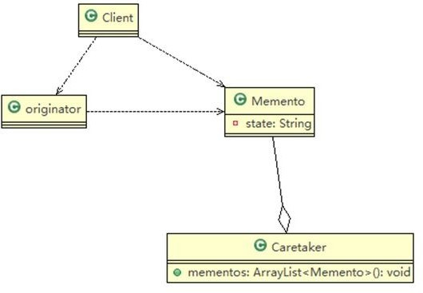

1)	originator :  对象(需要保存状态的对象)
2)	Memento ： 备忘录对象，负责保存好记录，即Originator 内部状态
3)	Caretaker: 守护者对象，负责保存多个备忘录对象，使用集合管理，提高效率
4)	说明：如果希望保存多个 originator 对象的不同时间的状态，需要 HashMap <String, 集合>

**优点**

1. 提供恢复机制，用户可以回到历史状态
2. 实现封装，不暴露细节
3. 可以配合原型模式使用

**缺点**

1. 消耗内存过多

```java
public class Originator {
    private String state;//状态信息
    
    public String getState() {
    	return state;
    }

    public void setState(String state) { 
        this.state = state;
    }

    //保存一个状态对象Memento
    public Memento saveStateMemento() { 
        return new Memento(state);
    }

    //通过备忘录对象，恢复状态
    public void getStateFromMemento(Memento memento) { 
        state = memento.getState();
	}
}

public class Memento { 
    private String state;

    public Memento(String state) { 
        super();
    	this.state = state;
    }

    public String getState() { 
        return state;
    }
}

public class Caretaker {
    //在 List 集合中会有很多的备忘录对象
    private List<Memento> mementoList = new ArrayList<Memento>();


    public void add(Memento memento) { 
        mementoList.add(memento);
    }

    //获取到第 index 个 Originator 的 备忘录对象(即保存状态) 
    public Memento get(int index) {
    	return mementoList.get(index);
    }
}

public class Client {
    public static void main(String[] args) {
        Originator originator = new Originator(); 
        Caretaker caretaker = new Caretaker();
        originator.setState(" 状态#1  攻击力 100 ");
        caretaker.add(originator.saveStateMemento());//保存了当前的状态
        originator.setState(" 状 态 #2 攻 击 力 80 "); 
        caretaker.add(originator.saveStateMemento());
        originator.setState(" 状 态 #3 攻 击 力 50 "); 
        caretaker.add(originator.saveStateMemento());
        System.out.println("当前的状态是 =" + originator.getState());
        //希望得到状态 1, 将 originator 恢复到状态 1 
        originator.getStateFromMemento(caretaker.get(0));
        System.out.println("恢复到状态 1，" + originator.getState());
    }
}
```

### 解释器模式

是指给定一个语言(表达式)，定义它的文法的一种表示，并定义一个解释器， 使用该解释器来解释语言中的句子(表达式)。

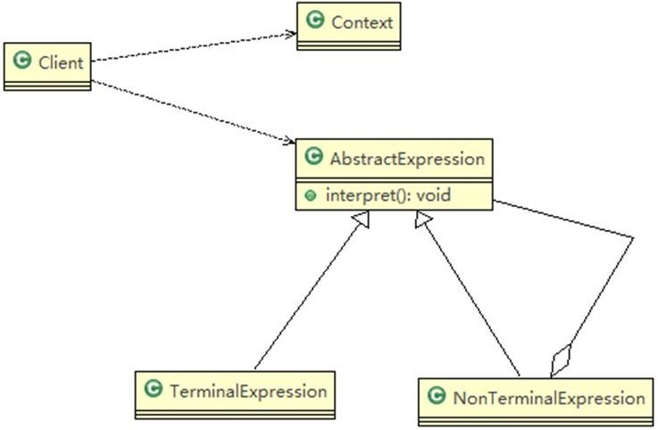

1)	Context: 是环境角色，含有解释器之外的全局信息.
2)	AbstractExpression: 抽象表达式， 声明一个抽象的解释操作，为抽象语法树中所有节点所共享
3)	TerminalExpression: 为终结符表达式，实现与文法中的终结符相关的解释操作
4)	NonTermialExpression: 为非终结符表达式，为文法中的非终结符实现解释操作
5)	说明： 通过 Client输入Context和TerminalExpression信息

在Spring框架中`org.springframework.expression.Expression.SpelExpressionParser`有应用。SpelExpressionParser继承了TemplateAwareExpressionParser，而TemplateAwareExpressionParser实现了ExpressionParser接口。

Expression接口是我们的抽象表达式。是用的时候，根据创建的不同parser对象返回不同的Expression对象。

**优点**

1. 具有良好的扩展性

**缺点**

1. 容易出现类爆炸
2. 采用递归调用方法，将会导致调试非常复杂、效率可能降低

```java
/**
 *	抽象类表达式，通过 HashMap 键值对,可以获取到变量的值
 */
public abstract class Expression {
    // a + b - c
    // 解释公式和数值, key是表达式，参数[a,b,c], value是具体值
    // HashMap {a=10, b=20}
    public abstract int interpreter(HashMap<String, Integer> var);
}

/**
 *	变量的解释器
 */
public class VarExpression extends Expression {
	private String key; // key=a,key=b,key=c
	public VarExpression(String key) { this.key = key;}

    // interpreter 根据 变量名称，返回对应值
    @Override
    public int interpreter(HashMap<String, Integer> var) { 
        return var.get(this.key);
    }
}

/**
 *	抽象运算符号解析器: 每个运算符号，都只和自己左右两个数字有关系，
 *	但左右两个数字有可能也是一个解析的结果，无论何种类型，都是 Expression 类的实现类
 */
public class SymbolExpression extends Expression {
	protected Expression left; 
    protected Expression right;

    public SymbolExpression(Expression left, Expression right) {
    	this.left = left; 
        this.right = right;
    }

    //因为SymbolExpression是让其子类来实现，因此 interpreter 是一个默认实现
    @Override
    public int interpreter(HashMap<String, Integer> var) {
    	return 0;
    }
}

/**
*	加法解释器
*	@author Administrator
*
*/
public class AddExpression extends SymbolExpression	{

    public AddExpression(Expression left, Expression right) { 
        super(left, right);
    }

    //处理相加
    //var 仍然是 {a=10,b=20}..
    public int interpreter(HashMap<String, Integer> var) {
    	//super.left.interpreter(var): 返回 left 表达式对应的值 a = 10
    	//super.right.interpreter(var): 返回 right 表达式对应值 b = 20
    	return super.left.interpreter(var) + super.right.interpreter(var);
    }
}

public class SubExpression extends SymbolExpression {
    public SubExpression(Expression left, Expression right) {
    	super(left, right);
    }

    //求出 left 和 right  表达式相减后的结果
    public int interpreter(HashMap<String, Integer> var) {
    	return super.left.interpreter(var) - super.right.interpreter(var);
    }
}

public class Calculator {
    // 定义表达式
    private Expression expression;
    // 构造函数传参，并解析
    public Calculator(String expStr) { // expStr = a+b
        // 安排运算先后顺序
        Stack<Expression> stack = new Stack<>();
        // 表达式拆分成字符数组
        char[] charArray = expStr.toCharArray();// [a, +, b]

        Expression left = null; 
        Expression right = null;
        //遍历我们的字符数组，即遍历[a, +, b]，针对不同的情况做处理
        for (int i = 0; i < charArray.length; i++) { 
            switch (charArray[i]) {
                case '+': //
                	left = stack.pop();
                	right = new VarExpression(String.valueOf(charArray[++i]));
                    //构建 AddExpresson，加入stack
                	stack.push(new AddExpression(left, right));
                	break; 
                case '-': //
                    left = stack.pop();
                    right = new VarExpression(String.valueOf(charArray[++i])); 
                    stack.push(new SubExpression(left, right));
                    break; 
                default:
                    //如果是一个 Var 就创建要给 VarExpression 对象，并 push 到 stack
                    String var = String.valueOf(charArray[i]);
                    stack.push(new VarExpression(var));
                    break;
            }
        }
    	//当遍历完整个charArray数组后，stack就得到最后Expression 
        this.expression = stack.pop();
    }

    public int run(HashMap<String, Integer> var) {
        //最后将表达式 a+b 和 var = {a=10,b=20}
        //然后传递给 expression 的 interpreter 进行解释执行
        return this.expression.interpreter(var);
    }
}

public class ClientTest {
    public static void main(String[] args) throws IOException {
        String expStr = getExpStr(); // a+b
        HashMap<String, Integer> var = getValue(expStr);// var {a=10, b=20}
        Calculator calculator = new Calculator(expStr);
        System.out.println("运算结果：" + expStr + "=" + calculator.run(var));
    }

    // 获得表达式
    public static String getExpStr() throws IOException {
    	System.out.print("请输入表达式：");
    	return (new BufferedReader(new InputStreamReader(System.in))).readLine();
    }

    // 获得值映射
    public static HashMap<String, Integer> getValue(String expStr) throws IOException { 
        HashMap<String, Integer> map = new HashMap<>();

        for (char ch : expStr.toCharArray()) { 
            if (ch != '+' && ch != '-') {
        		if (!map.containsKey(String.valueOf(ch))) {
                    System.out.print("请输入" + String.valueOf(ch) + "的值：");
                    String in = (new BufferedReader(new InputStreamReader(System.in))).readLine(); 
                    map.put(String.valueOf(ch), Integer.valueOf(in));
            	}
    		}
    	}
    	return map;
    }
}
```

### 状态模式

它主要用来解决对象在多种状态转换时，需要对外输出不同的行为的问题。状态和行为是一一对应的，状态之间可以相互转换。一个对象的内在状态改变时，允许改变其行为，这个对象看起来像是改变了其类。

1)	Context 类为环境角色,  用于维护 State 实例,这个实例定义当前状态
2)	State 是抽象状态角色,定义一个接口封装与 Context  的一个特点接口相关行为
3)	ConcreteState 具体的状态角色，每个子类实现一个与 Context 的一个状态相关行为

**优点**

1. 增强代码可读性，将每个状态行为封装到一个类，方便维护
2. 符合开闭原则

**缺点**

1. 容易出现类爆炸

```java
/**
 *	状态抽象类
 */
public abstract class State {
    // 扣除积分
    public abstract void deductMoney();

    // 是否抽中奖品
    public abstract boolean raffle();

    // 发放奖品
    public abstract	void dispensePrize();
}

/**
 *	不能抽奖状态
 */
public class NoRaffleState extends State {

    // 初始化时传入活动引用，扣除积分后改变其状态
    RaffleActivity activity;

    public NoRaffleState(RaffleActivity activity) { 
        this.activity = activity;
    }

    // 当前状态可以扣积分, 扣除后，将状态设置成可以抽奖状态
    @Override
    public void deductMoney() {
    	System.out.println("扣除50积分成功，您可以抽奖了"); 
        activity.setState(activity.getCanRaffleState());
    }

    // 当前状态不能抽奖
    @Override
    public boolean raffle() {
    	System.out.println("扣了积分才能抽奖喔！"); 
        return false;
    }

    // 当前状态不能发奖品
    @Override
    public void dispensePrize() {
    	System.out.println("不能发放奖品");
    }
}

/**
 *	可以抽奖的状态
 */
public class CanRaffleState extends State {

    RaffleActivity activity;

    public CanRaffleState(RaffleActivity activity) { 
        this.activity = activity;
    }

    //已经扣除了积分，不能再扣 
    @Override
    public void deductMoney() {
    	System.out.println("已经扣取过了积分");
    }
    
    //可以抽奖, 抽完奖后，根据实际情况，改成新的状态
    @Override
    public boolean raffle() { 
        System.out.println("正在抽奖，请稍等！"); 
        Random r = new Random();
    	int num = r.nextInt(10);
    	// 10%中奖机会
        if(num == 0){
    		// 改 变 活 动 状 态 为 发 放 奖 品 context 
            activity.setState(activity.getDispenseState());
    		return true;
    	} else {
       		System.out.println("很遗憾没有抽中奖品！");
            // 改变状态为不能抽奖
            activity.setState(activity.getNoRafflleState()); 
            return false;
    	}
    }

    // 不能发放奖品
    @Override
    public void dispensePrize() {
    	System.out.println("没中奖，不能发放奖品");
    }
}

/**
 *	发放奖品的状态
 */
public class DispenseState extends State {
    // 初始化时传入活动引用，发放奖品后改变其状态
    RaffleActivity activity;
    public DispenseState(RaffleActivity activity) { 
        this.activity = activity;
    }

    @Override
    public void deductMoney() {
    	System.out.println("不能扣除积分");
    }


    @Override
    public boolean raffle() {
    	System.out.println("不能抽奖"); 
        return false;
    }

    //发放奖品 
    @Override
    public void dispensePrize() { 
        if(activity.getCount() > 0){
            System.out.println("恭喜中奖了");
            // 改变状态为不能抽奖
            activity.setState(activity.getNoRafflleState());
        }else{
            System.out.println("很遗憾，奖品发送完了");
            // 改变状态为奖品发送完毕, 后面我们就不可以抽奖
            activity.setState(activity.getDispensOutState());
            //System.out.println("抽奖活动结束");
            //System.exit(0);
        }
    }
}

/**
 *	奖品发放完毕状态
 *	说明，当我们 activity 改变成 DispenseOutState， 抽奖活动结束
 */
public class DispenseOutState extends State {

    // 初始化时传入活动引用
    RaffleActivity activity;

    public DispenseOutState(RaffleActivity activity) { 
        this.activity = activity;
    }
    
    @Override
    public void deductMoney() {
    	System.out.println("奖品发送完了，请下次再参加");
    }

    @Override
    public boolean raffle() {
    	System.out.println("奖品发送完了，请下次再参加"); 
        return false;
    }

    @Override
    public void dispensePrize() {
    	System.out.println("奖品发送完了，请下次再参加");
    }
}

/**
 *	抽奖活动
 */
public class RaffleActivity {
    // state 表示活动当前的状态，是变化
    State state = null;
    // 奖品数量
    int count = 0;

    // 四个属性，表示四种状态
    State noRafflleState = new NoRaffleState(this); 
    State canRaffleState = new CanRaffleState(this);
    State dispenseState = new DispenseState(this); 
    State dispensOutState = new DispenseOutState(this);

    //构造器
    //1. 初始化当前的状态为 noRafflleState（即不能抽奖的状态）
    //2. 初始化奖品的数量
    public RaffleActivity(int count) { 
        this.state = getNoRafflleState(); 
        this.count = count;
    }

    //扣分, 调用当前状态的 deductMoney 
    public void debuctMoney(){
    	state.deductMoney();
    }

    //抽奖
    public void raffle(){
    	// 如果当前的状态是抽奖成功
    	if(state.raffle()){
    		//领取奖品
            state.dispensePrize();
    	}
	}

    public State getState() { return state;}

    public void setState(State state) { this.state = state;}

    public int getCount() {
        int curCount = count; 
        count--;
        return curCount;
    }

    public void setCount(int count) { this.count = count;}

    public State getNoRafflleState() { 
        return noRafflleState;
    }

    public void setNoRafflleState(State noRafflleState) { 
        this.noRafflleState = noRafflleState;
    }

    public State getCanRaffleState() { 
        return canRaffleState;
    }

    public void setCanRaffleState(State canRaffleState) { 
        this.canRaffleState = canRaffleState;
    }

    public State getDispenseState() { 
        return dispenseState;
    }

    public void setDispenseState(State dispenseState) { 
        this.dispenseState = dispenseState;
    }

    public State getDispensOutState() { 
        return dispensOutState;
    }


    public void setDispensOutState(State dispensOutState) { 
        this.dispensOutState = dispensOutState;
    }
}

/**
 *	状态模式测试类
 */	
public class ClientTest {
    public static void main(String[] args) {
        // 创建活动对象，奖品有 1 个奖品
        RaffleActivity activity = new RaffleActivity(1);
        // 我们连续抽 30 次奖
        for (int i = 0; i < 30; i++) {
            System.out.println("--------第" + (i + 1) + "次抽奖----------");
            // 参加抽奖，第一步点击扣除积分
            activity.deductMoney();
            // 第二步抽奖
            activity.raffle();
        }
    }
}
```

### 策略模式

定义算法族（策略组），分别封装起来，让他们之间可以互相替换，此模式让算法的变化独立于使用算法的客户。体现了三个设计原则，第一、把变化的代码从不变的代码中分离出来；第二、针对接口编程而不是具体类（定义策略接口）；第三、多用组合/聚合，少用继承（客户通过组合方式使用策略）。

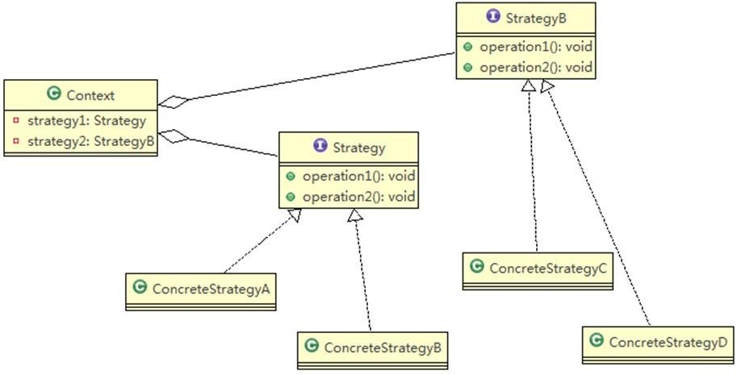

在JDK源码Array有应用。Comparator中的sort方法使用了策略模式。

**优点**

1. 体现ocp原则
2. 将算法封装在独立的strategy类中，使得程序员可以独立于其context改变它，易于扩展

**缺点**

1. 容易出现类爆炸

**案例**

有各种鸭子（野鸭、北京鸭等）， 鸭子有各种行为（叫、飞行等)；显示鸭子的信息。

传统解决方案如下。

缺陷：对超类的局部改动，会影响其他部分，会有溢出效应。

```java
public abstract class Duck {

	public abstract void display();//显示鸭子信息
    
    public void quack() {
    	System.out.println("鸭子嘎嘎叫~~");
    }

    public void swim() {
    	System.out.println("鸭子会游泳~~");
    }

    public void fly() {
    	System.out.println("鸭子会飞翔~~~");
    }
}

public class PekingDuck extends Duck {
    @Override
    public void display() {
    	System.out.println("~~北京鸭~~~");
    }

    //因为北京鸭不能飞翔，因此需要重写 fly 
    @Override
    public void fly() {
    	System.out.println("北京鸭不能飞翔");
    }
}

public class ToyDuck extends Duck{
    @Override
    public void display() {
    	System.out.println("玩具鸭");
    }
    
    //需要重写父类的所有方法 
    public void quack() {
    	System.out.println("玩具鸭不能叫~~");
    }

    public void swim() {
    	System.out.println("玩具鸭不会游泳~~");
    }

    public void fly() {
    	System.out.println("玩具鸭不会飞翔~~~");
    }
}

public class WildDuck extends Duck {
    @Override
    public void display() {
    	System.out.println(" 这是野鸭 ");
    }
}
```

改进方案如下。

```java
public class Client {
    public static void main(String[] args) {
        WildDuck wildDuck = new WildDuck(); 
        wildDuck.fly();
        PekingDuck pekingDuck = new PekingDuck(); 
        pekingDuck.fly();
        ToyDuck toyDuck = new ToyDuck(); 
        toyDuck.fly();

        //动态改变某个对象的行为, 北京鸭不能飞
        pekingDuck.setFlyBehavior(new NoFlyBehavior());
        System.out.println("北京鸭的实际飞翔能力");
        pekingDuck.fly();
    }
}

public interface FlyBehavior {
    void fly(); //  子类具体实现
}

public class GoodFlyBehavior implements FlyBehavior {
    @Override
    public void fly() {
        System.out.println(" 飞翔技术高超 ~~~");
    }
}

public class BadFlyBehavior implements FlyBehavior {
    @Override
    public void fly() {
    	System.out.println(" 飞翔技术一般 ");
    }
}

public class NoFlyBehavior implements FlyBehavior{
    @Override
    public void fly() {
    	System.out.println(" 不会飞翔	");
    }
}

public interface QuackBehavior { 
    void quack();//子类实现
}

public abstract class Duck {
    //属性, 策略接口
    FlyBehavior flyBehavior;
    //其它属性<->策略接口
    QuackBehavior quackBehavior;

    public abstract void display();
    
    public void quack() {
    	System.out.println("鸭子嘎嘎叫~~");
    }

    public void swim() {
    	System.out.println("鸭子会游泳~~");
    }

    public void fly() {  //改进
        if(flyBehavior != null) 
            flyBehavior.fly();
    }

    public void setFlyBehavior(FlyBehavior flyBehavior) { 
        this.flyBehavior = flyBehavior;
    }

    public void setQuackBehavior(QuackBehavior quackBehavior) { 
        this.quackBehavior = quackBehavior;
    }
}

public class PekingDuck extends Duck {
	//假如北京鸭可以飞翔，但是飞翔技术一般 
    public PekingDuck() {
        flyBehavior = new BadFlyBehavior();
	}

    @Override
    public void display() {
    	System.out.println("~~北京鸭~~~");
    }
}

public class ToyDuck extends Duck{
    public ToyDuck() {
        flyBehavior = new NoFlyBehavior();
    }


    @Override
    public void display() {
    	System.out.println("玩具鸭");
    }

    public void quack() {
    	System.out.println("玩具鸭不能叫~~");
    }

    public void swim() {
    	System.out.println("玩具鸭不会游泳~~");
    }
}

public class WildDuck extends Duck {
    //构造器，传入 FlyBehavor 的对象
    public	WildDuck() {
    	flyBehavior = new GoodFlyBehavior();
    }
    @Override
    public void display() {
    	System.out.println(" 这是野鸭 ");
    }
}
```

### 责任链模式 Chain of Responsibility Pattern

为请求创建了一个接收者对象的链(简单示意图)。这种模式对请求的发送者和接收者进行解耦。职责链模式通常每个接收者都包含对另一个接收者的引用。如果一个对象不能处理该请求，那么它会把相同的请求传给下一个接收者，依此类推。应用场景包括有多个对象可以处理同一个请求时，比如：多级请求、请假/加薪等审批流程、Java Web 中 Tomcat对 Encoding 的处理、拦截器。

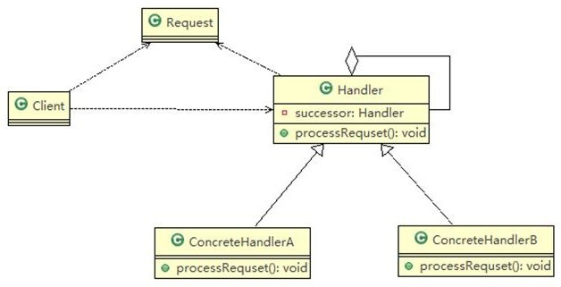

1)	Handler是抽象的处理者,  定义了一个处理请求的接口,  同时含有另外 Handler
2)	ConcreteHandlerA , B  是具体的处理者, 处理它自己负责的请求， 可以访问它的后继者(即下一个处理者),  如果可以处理当前请求，则处理，否则就将该请求交个后继者去处理，从而形成一个职责链
3)	Request表示一个请求，含有很多属性

在SpringMVC的Handler中有应用。springmvc 请求的流程图中，执行了拦截器相关方法 `interceptor.preHandler()` 等等。在处理 SpringMvc 请求时，使用到职责链模式和适配器模式。HandlerExecutionChain 主要负责的是请求拦截器的执行和请求处理，但是他本身不处理请求，只是将请求分配给链上注册处理器执行，这是职责链实现方式；减少职责链本身与处理逻辑之间的耦合，规范了处理流程。HandlerExecutionChain 维护了HandlerInterceptor 的集合，可以向其中注册相应的拦截器。

**优点**

1. 将请求和处理分开，实现解耦，提高系统的灵活性
2. 简化了对象，对象不需要知道链的结构

**缺点**

1. 在链比较长的时候，性能会受到影响，需控制链中最大节点数量，一般通过在 Handler 中设置一个最大节点数量，在 setNext()方法中判断是否已经超过阀值，超过则不允许该链建立。
2. 调试不方便。采用了类似递归的方式，调试时逻辑可能比较复杂

```java
public static void main(String[] args) {
// DispatcherServlet

//说明
/*
*	protected void doDispatch(HttpServletRequest request, HttpServletResponse response) throws Exception {
*	HandlerExecutionChain mappedHandler = null;
*	mappedHandler = getHandler(processedRequest);//获取到 HandlerExecutionChain 对象
*	//在 mappedHandler.applyPreHandle内部得到HandlerInterceptor interceptor
*	//调用了拦截器的	interceptor.preHandle
*	if (!mappedHandler.applyPreHandle(processedRequest, response)) { return;
}

//说明：mappedHandler.applyPostHandle 方法内部获取到拦截器，并调用
//拦截器的	interceptor.postHandle(request, response, this.handler, mv);
mappedHandler.applyPostHandle(processedRequest, response, mv);
*	}
*
*
*	//说明：在	mappedHandler.applyPreHandle 内部中，
*	还调用了	triggerAfterCompletion 方法，该方法中调用了
*	HandlerInterceptor interceptor = getInterceptors()[i]; 
    try {
        interceptor.afterCompletion(request, response, this.handler, ex);
    }
    catch (Throwable ex2) {
        logger.error("HandlerInterceptor.afterCompletion threw exception", ex2);
    }
*/
}
```


```java
//请求类
public class PurchaseRequest {
	private int type = 0; //请求类型
    private float price = 0.0f; //请求金额
	private int id = 0;
    
    public PurchaseRequest(int type, float price, int id) { 
        this.type = type;
    	this.price = price;
    	this.id = id;
    }
    public int getType() { 
        return type;
    }
    public float getPrice() { 
        return price;
    }
    public int getId() { 
        return id;
    }
}

public abstract class Approver {
	Approver approver;	// 下一个处理者，类似链表的next指针
    String name;

    public Approver(String name) {
        this.name = name;
    }

    //下一个处理者
    public void setApprover(Approver approver) { 
        this.approver = approver;
    }

    //处理审批请求的方法，得到一个请求, 处理是子类完成，因此该方法做成抽象
    public abstract void processRequest(PurchaseRequest purchaseRequest);
}

public class DepartmentApprover extends Approver {

    public DepartmentApprover(String name) {
        super(name);
    }

    @Override
    public void processRequest(PurchaseRequest purchaseRequest) {
        if(purchaseRequest.getPrice() <= 5000)    
            System.out.println("请求编号id = " + purchaseRequest.getId() + "被" + this.name + "处理");
    	else 
    		approver.processRequest(purchaseRequest);
	}
}

public class CollegeApprover extends Approver {
    public CollegeApprover(String name) {
        super(name);
    }

    @Override
    public void processRequest(PurchaseRequest purchaseRequest) {
    	if (purchaseRequest.getPrice() > 5000 && purchaseRequest.getPrice() <= 10000) 
    		System.out.println("请求编号id = " + purchaseRequest.getId() + "被" + this.name + "处理");
    	else 
    		approver.processRequest(purchaseRequest);
    }
}

public class ViceSchoolMasterApprover extends Approver {
    public ViceSchoolMasterApprover(String name) {
    	super(name);
    }


    @Override
    public void processRequest(PurchaseRequest purchaseRequest) {
    	if(purchaseRequest.getPrice() > 10000 && purchaseRequest.getPrice() <= 30000) 
    		System.out.println("请求编号id = " + purchaseRequest.getId() + "被" + this.name + "处理");
    	else 
    		approver.processRequest(purchaseRequest);
    }
}

public class SchoolMasterApprover extends Approver {
    public SchoolMasterApprover(String name) { 
        super(name);
    }

    @Override
    public void processRequest(PurchaseRequest purchaseRequest) {
    	if(purchaseRequest.getPrice() > 30000) 
   			System.out.println("请求编号id = " + purchaseRequest.getId() + "被" + this.name + "处理");
    	else 
    		approver.processRequest(purchaseRequest);
    }
}

public class Client {
    public static void main(String[] args) {
        //创建一个请求
        PurchaseRequest purchaseRequest = new PurchaseRequest(1, 31000, 1);

        //创建相关的审批人
        DepartmentApprover departmentApprover = new DepartmentApprover("张主任"); 
        CollegeApprover collegeApprover = new CollegeApprover("李院长");
        ViceSchoolMasterApprover viceSchoolMasterApprover = new ViceSchoolMasterApprover("王副校"); 
        SchoolMasterApprover schoolMasterApprover = new SchoolMasterApprover("佟校长");

        //需要将各个审批级别的下一个设置好 (处理人构成环形: ) 
        departmentApprover.setApprover(collegeApprover); 
        collegeApprover.setApprover(viceSchoolMasterApprover); 
        viceSchoolMasterApprover.setApprover(schoolMasterApprover); 
        schoolMasterApprover.setApprover(departmentApprover);

        departmentApprover.processRequest(purchaseRequest); 		
        viceSchoolMasterApprover.processRequest(purchaseRequest);
    }
}
```


# Reference

- 《尚硅谷Java设计模式》 by 韩顺平， https://www.bilibili.com/video/BV1G4411c7N4
- https://www.cnblogs.com/yxlblogs/p/9183318.html


