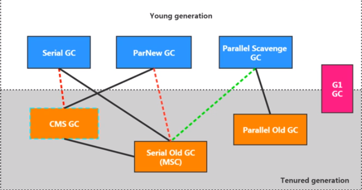
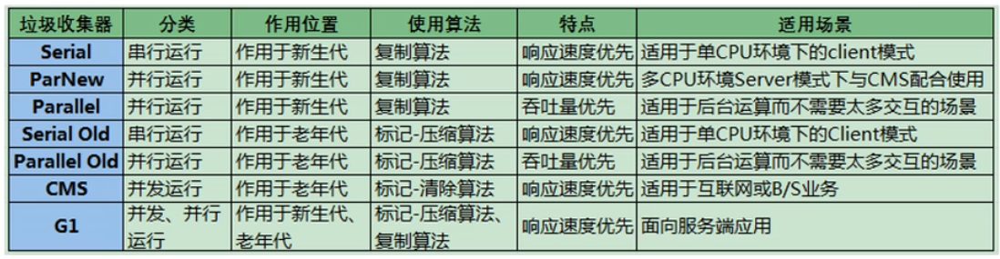

# JVM体系架构
java是跨平台的语言，JVM是跨语言的平台（Kotlin,Scala, Jython, JRuby, JavaScript...)。JVM不关心运行在其内部的程序的编程语言，只关心字节码文件。

特点：

1. 一次编译，到处运行
2. 自动内存管理
3. 自动垃圾回收

运行在OS上，与硬件无直接交互。

## 不同种类的JVM

### Classic VM

第一款商用JVM。在JDK1.4被淘汰。只提供解释器(没有JIT)，执行效率低下。

### Exact VM

准确式内存管理Exact Memory Management。知道内存中某个位置的数据具体是什么类型。具备现代高性能VM的雏形。

### HotSpot VM

在JDK1.3时被设置成默认VM。热点代码探测技术。通过计数器找到最具编译价值代码，在本地缓存起来。通过编译器和解释器协同工作，平衡程序响应时间和最佳执行性能。

### JRockit

专注于服务器端应用，不关注程序启动速度，内部不包含解析器实现，是世界上最快JVM。MissionControl服务套件以最低的开销进行资源分析、管理和监控。

### J9

IBM。市场定位与HotSpot类似。多用途VM。通用性没有JRockit好。

## 基础

#### 代码执行流程

前端编译器(javac)将java文件进行编译成为class字节码。在JVM中，用类加载器进行加载。之后：解释器翻译字节码(解释执行)成机器语言，后端编译器(JIT)编译执行，将热点代码缓存起来。这两者协同工作。解释器响应快，但是JIT在正常运行之后(一开始有暂停时间)速度更快。

### JVM架构模型

**基于栈的指令集架构**

1. 设计和实现更简单，适用于资源受限的系统
2. 避开了寄存器的分配难题
3. 绝大部分指令是零地址指令
4. 可移植性好

**基于寄存器的指令集架构**

1. 典型应用：x86
2. 完全依赖硬件
3. 性能优秀，执行高效
4. 一/二/三地址指令

### 生命周期

**启动**

引导类加载器Bootstrap class loader创建一个初始类，这个类由虚拟机的具体实现指定。

**执行**

程序开始执行到结束。

**退出**

正常结束，程序出现异常或错误，操作系统出现错误，线程调用Runtime类或System类的exit方法。


# 类加载子系统

负责从文件系统或网络中加载class文件，有特定的文件标识。class文件的运行是有执行引擎Execution Engine决定。加载的类信息存放在方法区(还会存放运行时常量池信息)。

判断两个class对象是否是同一个类：类的完整类名相同，且加载它们的ClassLoader实例对象必须相同。

### 结构


方法区和堆是多个线程共享的。

执行引擎只认机器码。

## 类的加载过程
加载loading -> 验证verification -> 准备preparation -> 解析resolution -> 初始化initialization 

### 加载

整体加载过程中的第一个环节。

通过一个类的全限定名获取类的二进制字节流。将其所代表的的静态存储结构转化为方法区的运行时数据结构。在内存中生成一个代表这个类的java.lang.Class对象，作为方法区这个类的数据的访问入口。

### 链接

#### 验证Verify

确保class文件中字节流中包含的信息符合VM要求，保证被加载类的正确性，不会危害VM的安全。

CAFE BABE。

文件格式验证、元数据验证、字节码验证、符号引用验证。

#### 准备Prepare

为类变量分配内存，设置该类变量(静态变量)默认初始值。这里不包含用final修饰的static，因为final在编译的时候就会分配了，准备阶段会显示初始化。

#### 解析Resolve

将常量池内的符号引用转换为直接引用的过程。

### 初始化

执行类构造器方法\<clinit\>()的过程。此方法不需定义，是javac编译器自动收集类中的静态变量的复制动作和静态代码块中的语句合并二来。这个阶段主要是对类变量初始化，是执行类构造器的过程。Class只是对 Klass的封装。

构造器方法中指令按照语句在源文件中出现的顺序执行。

若该类具有父类，JVM会保证父类的clinit先执行。 

## 两种加载器

四者之间的关系是包含关系，不是继承关系。扩展类和系统类算是自定义类。

获取加载器的方式。

```java
// 1获取当前类的加载器
clazz.getClassLoader();
// 2获取当前线程的加载器
Thread.currentThread().getContextClassLoader();
// 3获取系统的加载器
ClassLoader.getSystemClassLoader();
// 4获取调用者的加载器
DriverManager.getCallerClassLoader();
```

### 自定义类User-Defined

所有派生于抽象类ClassLoader的类加载器(不光是程序员自定义的)。默认使用系统类加载器进行加载。

使用场景：隔离加载类，修改类加载的方式，扩展加载源，防止源码泄露。

步骤：

1. 继承抽象类ClassLoader。
2. 加载逻辑写在findClass()方法。
3. 可以选择直接继承URLClassLoader。避免自己重写findClass()和获取字节码流的方法。

#### 扩展类Extension

继承了URLClassLoader。间接继承了ClassLoader。使用getParent会获取到null，因为bootstrap class loader不是java编写的。

#### 应用AppClassLoader/系统类System 

继承了URLClassLoader。间接继承了ClassLoader。使用getParent会获取到扩展类加载器。

### 启动/引导类Bootstrap

用C语言实现，嵌套在JVM内部。Java中的核心类库(e.g., String类)使用引导类加载器进行加载。没有父加载器。

## 双亲委派模式parents delegation

JVM对class文件采用按需加载。

### 工作原理

1. 如果一个类加载器收到了类加载请求，先把请求委托给父类的加载器去执行
2. 如果父类加载器还存在其父类加载器，依次向上委托
3. 如果父类加载器可以完成类加载任务，就成功返回；否则，子加载器再自己尝试加载

### 优点

1. 具有优先级层次的关系，可以避免类的重复加载
2. 安全考虑，可以防止Java核心api被替换

### 沙箱安全机制

对于java核心源代码的保护。自定义的同名类不会被引导类加载器加载(会先加载jdk自带的文件)。


# 运行时数据区和线程

方法区、堆：一个进程一个。随着JVM启动而创建，随着JVM退出而销毁。

程序计数器、本地方法栈、栈：一个线程一个。随着线程启动而创建，随着线程退出而销毁。

当一个java线程准备好执行以后，此时一个OS的本地线程也同时创建。Java线程执行终止后，本地线程也会回收。OS负责所有线程的安排调度到任何一个可用的CPU上，一旦本地线程初始化成功，它就会调用Java线程中的run()方法。

*方法中定义的局部变量是否线程安全？* 如果被多个线程调用，则不安全。比如把stringbuilder传进去别的方法或者进行return。

查看参数：jps查看当前运行中的进程，jinfo -flag 参数 进程id。

### 程序计数器

PC寄存器。用来存储指向下一条指令的地址。唯一一个JVM规范中没有规定任何OutOfMemoryError情况的区域（占用内存极小）。没有GC。

采用javap反编译.class文件。左边是指令地址，右边是对应的操作指令。

为什么需要记录当前线程的执行地址：因为CPU不停切换各个线程，切换回来以后得接着从上一次执行到的地方开始继续执行。

### 栈

由于跨平台的设计，java的指令是根据栈来设计的(不是基于寄存器)。

主管Java程序的运行。保存方法的局部变量、部分结果，并参与方法的调用和返回。没有GC。

一个栈帧，对应着一个java方法。

JVM允许java栈的大小是动态的或者固定不变的。如果是固定大小，有可能抛出StackOverflowError；如果是动态扩展，有可能抛出OutOfMemoryError。使用-Xss设置最大的栈的大小。

#### 局部变量表

定义为一个数字数组，存储方法参数和定义在方法体内的局部变量。线程私有，不存在数据安全问题。所需容量是在编译器确定下来的，在方法运行期间不会更改。在javap反解析看locals。

最基本的存储单元是槽slot。32位类型占用1个slot，64位类型占用2个slot。如果当前栈帧是实例方法，那么该对象引用this将会存放在index为0的slot处。其余局部变量按顺序排列。栈帧中的局部变量表中的slot是可以重用的。如果一个局部变量过了作用域(代码块)，在其作用域之后申明的新的局部变量就很有可能会复用过期局部变量的槽位，从而达到节省资源的目的。

局部变量表中的变量也是重要的垃圾回收根节点，只要被局部变量表中直接或间接引用的，都不会被回收。

#### 操作数栈

保存计算过程的中间结果，也作为变量临时的存储空间。所需容量是在编译器确定下来的，在方法运行期间不会更改。在javap反解析看stack。

底层数据结构是数组，但是不能采用访问索引的方式进行数据访问。

栈顶缓存技术：将栈顶元素缓存在物理cpu的寄存器中，降低对内存的读写次数。

#### 动态链接

每一个栈帧内部都包含一个指向运行时常量池中的该栈帧所属方法的引用，目的是支持动态链接。作用是为了将这些符号引用转换为调用方法的直接引用。

常量池：提供一些符号和常量，便于指令识别。

放在方法区是为了线程共享。

**静态链接**

当一个字节码文件被装载进jvm，如果被调用的目标方法在编译期可知，且运行期不变，这种情况下将调用方法转换为直接引用的过程是静态链接。

**动态链接**

被调用的目标方法在编译期无法被确定。多态的实现。

**早期绑定**

对应静态链接。

**晚期绑定**

对应动态链接。

**方法调用**

Java中任何一个普通的方法其实都具备虚函数的特征，相当于C++中的虚函数(需要使用virtual显示定义)。如果在java中不希望某个方法拥有虚函数的特征，可以使用final进行标记。

普通调用指令：

invokestatic调用静态方法。(非虚方法)

invokespecial调用\<init\>方法、私有和父类方法。(非虚方法)

invokevirtual调用所有虚方法和隐式调用父类final方法(没加super)。

invokeinterface调用接口方法(实际上也是虚方法)。

动态调用指令：

invokedynamic动态解析出需要调用的方法，然后执行。java原本是静态语言(对类型的检查是在编译器)，加入了这个指令可以支持一些动态语言的特征。

**非虚方法**

在编译器就确定了具体调用版本。private/static/final/constructor/父类方法都是非虚方法。其他都是虚方法。

子类对象的多态适用前提：类的继承关系；方法的重写。

**方法重写**

找到操作数栈顶的第一个元素所执行的对象的实际类型，记作C。如果在C中找到与常量中的描述符合简单名称都相符的方法，则进行访问权限校验。如果通过，则返回这个方法的引用。没有权限就是IllegalAccessError异常。否则，按照继承关系依次对其父类进行校验。

为了提高性能，jvm建立了一个虚方法表。在类加载的链接(解析)阶段创建该表。

#### 方法返回地址

存放调用该方法的pc寄存器的值。正常退出。异常退出的话，不会给调用者返回值，返回信息要去异常表中找。

#### 附加信息

其他信息。例如，对程序调试提供支持的信息。

### 本地方法栈

本地方法native method就是一个java调用非java代码的接口。标识符native可以与除了abstract之外的其他java标识符连用。

使用本地方法的原因

1. 与java环境外交互：比如与操作系统或某些硬件交换信息。
2. 与操作系统交互：使用Java语言本身没有提供封装的操作系统的特性。
3. Sun's Java：Sun的解释器使用C实现。

本地方法栈是线程私有，用于管理本地方法的调用。

### 堆

一个JVM实例只存在一个堆内存。在JVM启动的时候，堆空间大小就确定了。

堆可以处于物理上不连续的内存空间。

空间大小可以用-Xms和-Xmx指定(起始和最大内存)。

#### 逃逸分析Escape Analysis

基本行为就是分析对象动态作用域。

当一个对象在方法中被定义后，只在方法内部使用，则认为没有发生逃逸。

代码优化：

- 栈上分配

经过逃逸分析后发现，一个对象并没有逃逸出方法的话，那么可能被优化成栈上分配。

- 同步省略

JVM会自动优化没有必要的锁(锁消除)。

- 标量替换

有的对象可能不需要作为一个连续的内存结构存在也可以被访问到，那么对象的部分可以不存储在内存，而是存储在CPU寄存器中。

#### TLAB

Thread Local Allocation Buffer. 堆是线程共享，任何线程都可以访问其中的共享数据。并发环境下操作共享数据容易存在线程不安全问题。如果加锁，会影响效率。JVM为每个线程分配了一个私有缓存区域，包含在Eden空间内。一旦对象在TLAB空间分配内存失败，JVM会尝试通过加锁机制创建对象。

#### 分代

默认新生代:老年代是1:2比例。默认Eden:Survivor0:Survivor1是8:1:1比例。几乎所有新对象都是在Eden区被创建的。80%的对象都是在新生代就死了。

*分代原因* 

优化GC性能。如果没有分代，所有对象都在一块，GC的时候需要全局扫描。

**新生代**

Eden区： 诞生于此。当这个区快满的时候，会触发垃圾回收Young GC (YGC)。仍然留下的对象将迁入Survivor中的分区。Eden区的内存设置过小，会导致YGC频率过高，影响性能。

Survivor0区/Survivor1区：YGC被动触发回收(Survivor区满了不会触发YGC)。Survivor区满了，可以晋升老年代，但是不会主动触发垃圾回收YGC。Survivor区的内存设置过小，会导致YGC失去意义，因为对象都去老年代了。

这两个survivor区同时只有1个会被使用。

每一次gc会不断移动survivor分区中的对象到另一个分区，且对象增长1岁。15岁的对象（或者超大对象）会被晋升放入老年代。动态对象年龄判断：如果Survivoor区中相同年龄的所有对象的大小的总和大于Survivor区空间的一半，年龄大于等于这个值的对象可以直接进入老年代。

**老年代**

老年代快满的时候，会有full gc。目前，只有CMS GC会有单独收集老年代的行为。

**元空间**

在Java 8之前叫做永久代。元空间的大小，不受堆大小参数的限制。实际上是属于方法区。

*判断对象是否存活*

1. 引用计数法
   缺点：两个对象互相引用，别的对象并不需要这两个对象，这两个对象不会被删除。
2. 可达性分析法

### 方法区

#### 直接内存

元空间需要使用直接内存。是在java堆外的，直接向系统申请的内存空间。来源于NIO，通过存在堆中的DirectByteBuffer操作直接内存。

IO：字节流、字符流，阻塞。NIO：缓冲区，非阻塞。

访问效率比java堆高。分配回收成本较高，不受jvm内存回收管理。

在JVM启动的时候被创建，实际物理内存空间可以是不连续的。用于存储类型信息、常量、静态变量、JIT编译的代码缓存等。

元空间不在JVM设置的内存中，使用本地内存(与永久代的区别之一)。

#### 常量池

数据类型：数量值、字符串、类引用、字段引用、方法引用(字符串常量池和静态变量仍在堆)

JVM为每一个已加载的类型都维护一个常量池，池中数据项像数组项一样，通过索引访问。

运行时常量池已经换成了真实地址，具备动态性。

*从永久代替换成元空间的原因？* 为永久代设置空间大小很难确定；难以调优。

#### 字符串常量池String Table

永久代回收效率很低，在full gc时才出发。这就导致String Table回收效率不高。在开发中有大量字符串被创建，放到堆中，能及时回收。

#### 垃圾回收

JVM规范对方法区的约束很宽松，可以选择不进行垃圾回收和压缩处理。对这个区域的回收效果难以令人满意，尤其是类型的卸载，条件很苛刻。但是有时候回收确实有必要。

主要回收常量池中废弃的常量和不再使用的类型。

*判定一个类型不再被使用的条件：*

1. 该类所有实例且其子类的实例都已经被回收
2. 加载该类的类加载器已经被回收
3. 该类对应的java.lang.Class对象没有在任何地方被引用，无法在任何地方通过反射访问该类的方法


# 对象的实例化内存布局和访问定位

### 对象的实例化

1. new, 变形1：xx的静态方法，变形2：Factory的静态方法
2. Class的newInstance()，反射的方式，只能调用空参的构造器，权限必须是public
3. Constructor的newInstance(xxx)，反射的方式
4. 使用clone()，当前类需要shixianCloneable接口
5. 使用反序列化
6. 第三方库Objenesis

### 创建对象步骤

1. 判断对象对应的类是否加载、链接、初始化
2. 为对象分配内存。如果内存规整，指针碰撞法；如果不规整，JVM需要维护一个列表，空闲列表分配
3. 处理并发安全问题：CAS失败重试，每个线程预先分配TLAB
4. 初始化分配到的空间：所有属性赋默认值
5. 设置对象的对象头
6. 执行init方法进行初始化

### 对象内存布局

#### 对象头

运行时元数据：

哈希值、gc分代年龄、锁状态标志、线程持有的锁、偏向线程id、偏向时间戳

类型指针：

指向类元数据，确定该对象所属类型

#### 实例数据

相同宽度的字段总是被分配在一起，父类中的定义的变量会出现在子类之前，如果compactFields参数为true，子类的窄变量可能插入到父类变量的空隙

#### 对齐填充

### 对象访问方式

#### 句柄访问

到对象实例数据的指针，到对象类型数据的指针。

reference存储稳定句柄地址，对象被移动时只会改变句柄中实例数据指针，reference本身不需要被改变。

从空间占用多(需要开辟句柄池)。访问效率较低。

#### 直接指针

被hostspot采用。


# 执行引擎

### 概述

将字节码指令解释/编译为对应平台上的本地机器指令才可以(翻译器)。

*半编译半解释型语言：* 执行引擎中既可以使用解释器也可以使用编译器。

解释器：当JVM启动时会根据预定义的规范对字节码采用逐行解释的方式执行。

JIT编译器：将源代码直接编译成和本地机器平台相关的机器语言。

### 机器码、指令、汇编

机器码：二进制编码。与cpu紧密相关，不同种类的cpu对应的机器指令也不同。

指令：可读性稍微得到改善，把特定01序列简化成指令(e.g., mov)。

指令集：不同硬件平台格子支持的指令是有差别的。

汇编：用助记符代替机器指令的操作吗，用地址符号或标号代替指令或操作数的地址。必须翻译成机器指令码。

字节码：是一种中间状态的二进制代码，比机器码更抽象，需要直译器转译后才能成为机器码。主要为了实现特定软件运行。

### 解释器

初衷是满足java程序实现跨平台特性。有两套执行器，即古老的字码解释器和现在使用的模板解释器。比较低效。

响应速度快。省去编译的时间，立即执行。

### JIT编译器

随着程序运行时间的推移，根据热点探测功能，将有价值的字节码编译为本地机器指令。

#### 热点探测

热点代码：一个被多次调用的方法，或者方法内部循环次数较多的循环体。

热点探测方法：基于计数器的热点探测。

热度衰减：计数器统计的不是方法被调用的绝对次数，而是相对的执行频率。当超过一定时间限度，如果方法的调用次数仍然不足以让它提交给JIT，那这个方法的调用计数器就被减少一半。这段时间被称为半衰周期。

方法调用计数器：统计方法被调用的次数。默认阈值在client模式下是1500次，在server模式下是10000次。

#### 分类

C1：client compiler。会对字节码进行简单和可靠的优化，耗时短。以达到更快的编译速度。

C2：server compiler。64位只有这种选择。C2进行耗时较长的优化，以及基金优化。


# String Table

String实现了Serializable接口和Comparable接口。在JDK8及以前定义了final char[] value用于存储字符串数据。JDK9改为byte[]。节省了一些空间。

String的不可变性。字符串常量池中不存储相同的字符串。

String的String Pool是一个固定大小的Hashtable。在JDK6中StringTable是固定的，就是1009的长度。如果常量池中字符串过多，就会导致效率下降很快（hash冲突严重，导致链表很长）。在JDK7以后，默认值是60013。

Java有8种基本数据类型再加上String都有常量池。类似于java系统提供的缓存。String类型的常量池比较特殊。使用方法有直接使用双引号生命的，或者调用intern()方法。

常量与常量的拼接结果在常量池，原理是编译期优化。只要其中有一个变量(被final修饰的String应该被当成常量)，结果就在堆中。变量拼接的原理是StringBuilder。如果拼接的结果调用intern()方法，则主动将常量池中还没有的字符串对象放入池中，并返回此对象地址。

intern(): 判断字符串常量池中是否存在该值，如果存在，则返回常量池中的地址，否则需要加载一份并返回此对象地址。

```java
String s1 = "a"+"b"+"c";
String s2 = "abc";
System.out.println(s1 == s2); // true

// 拼接符号前后出现了变量，相当于在堆空间中new String()
String s1 = "javaEE";
String s2 = "hadoop";
String s3 = "javaEEhadoop";
String s4 = "javaEE" + "hadoop";
String s5 = s1 + "hadoop";
String s6 = "javaEE" + s2;
String s7 = s1 + s2;
// s5, s6, s7互不相同
```

### intern()的使用

如果不是用双引号声明的String对象，可以使用intern()，从字符串常量池中查询当前字符串是否存在，如果存在则返回引用。在jdk1.6中，如果串池没有这个字符串对象，会把此对象复制一份，放入池中，返回池中对象地址。从jdk1.7开始，如果没有，会把对象的引用地址复制一份，放入池中，并返回池中的引用地址。

对于程序中大量存在的字符串(重复字符串)，使用intern()可以节省空间。

*如何保证变量s指向的是字符串常量池中的数据？*

1. String s = "abc";
2. String s = new String("abc").intern();调用intern方法

*new String("ab")会创建几个对象？*

会创建两个。堆中有一个String对象，常量池有一个"ab"。

*new String("a") + new String("b")会创建几个对象？*

会创建6个。第一个是StringBuilder，堆有两个String对象，常量池中有"a", "b"。StringBuilder的toString()方法也创建了一个对象new String("ab")。字符串常量池中是没有"ab"。

```java
String s1 = new String("1"); //指向堆中String对象的地址
s1.intern(); //字符串常量池中已经存在"1"
String s2 = "1";
System.out.println(s1 == s2);  //jdk6:F, jdk7/8:F

String s3 = new String("1") + new String("1"); //指向堆中String对象的地址
s3.intern(); //字符串常量池中原先不存在"11"，现在生成
//jdk6创建了一个新对象”11"，也就有了新地址；jdk7记录了在堆中"11"的地址
String s4 = "11"; //使用上一行代码在常量池中生成的"11"
System.out.println(s3 == s4); //jdk6:F, jdk7/8:T
```


# 垃圾回收

### 概述

垃圾是指在运行程序中没有任何指针指向的对象。

自动内存管理，降低内存泄露和内存溢出的风险。程序员可以更专心地专注业务开发。

## 相关概念

### 对象的finalization机制

允许开发人员提供对象被销毁之前的自定义处理逻辑。子类可以重写这个方法，用于在对象被回收时候进行资源释放。一个对象的finalize()只能被调用一次。

永远不要主动调用某个对象的finalize()方法，应该交给垃圾回收机制调用。理由有三：

1. 在finalize()时可能会导致对象复活
2. finalize()执行时间是没有保障的，完全由gc线程决定，极端情况下，如果不发生gc，则finalize()将没有执行机会
3. 糟糕的实现会严重影响gc性能

对象三种可能的状态：可触及的，可复活的，不可触及的

判定一个对象a是否应该被回收，要经历两次过程：

1. 如果对象a到gc roots没有引用链，进行第一次标记。
2. 判断a是否有必要执行finalize()方法。如果该类没有重写finalize()或者已经被jvm调用过，则a被判定为不可触及。如果重写过该方法且还未被执行，那么a会被插入到F-Queue队列中，有jvm自动创建的、低优先级的Finalizer线程触发其finalize()。gc会对队列中的对象进行二次标记。如果a在finalize()中与引用链上任意对象建立了联系，那么第二次标记时，a会被移出即将回收集合。

### 查看GC Roots

MAT是memory analyzer的简称，基于eclipse开发，用于java堆内存分析。

JProfiler是基于idea开发。

### System.gc()的理解

默认情况下，显示触发FGC。然而System.gc()调用附带一个免责声明，无法保证对垃圾收集器的调用。 使用System.runFInalization()会强制调用使用引用对象的finalization()方法。

### 内存溢出和内存泄露

OOM指没有空闲内存，并且垃圾收集器也无法提供更多内存。原因包括堆内存设置不够，或者代码中创建了大量大对象，并且长时间不能被回收。

内存泄漏是指只有对象不会再被程序用到了，但是gc有不能回收他们的情况。宽泛的讲，对象的生命周期过长(没有必要的长)，也可以算内存泄露。

举例：

1. 单例模式

   单例的生命周期和应用程序一样长。如果持有对外部对象的引用的话，那么这个外部对象是不能被回收的，导致内存泄露。

2. 未关闭资源

   数据库连接，网络连接和io连接。

### Stop the World

在gc事件发生过程中，产生应用程序的停顿。

### 并发和并行

并发：CPU把一个时间段划分成几个片段，在这几个片段之间来回切换。让用户感觉到是多个应用程序同时进行。多个任务相互抢占资源。在GC指的是用户线程和垃圾收集线程同时执行。

并行：不同cpu执行不同进程。不互相抢占资源。在GC指的是多条垃圾手机线程同时执行，用户线程处于等待状态。

### 安全点和安全区域

安全点Safe Point：程序在运行的时候并不是在任何时间点上都能停顿下来开始gc。只有在特定的点才行。如果太少，可能导致gc等待的时间太长。如果太频繁，可能导致性能问题。可以选择执行时间较长的指令作为安全点，比如方法调用、循环跳转和异常跳转。

抢先式中断：首先中断所有线程，如果还有线程不在安全点，就恢复线程，让线程跑到安全点。

主动式中断：设置一个中断标志，各个线程运行到安全点的时候主动轮询这个标志，如果标志为真，则将自己进行中断挂起。

安全区域：线程处于sleep状态或者blocked转态，无法响应jvm的中断请求，到安全点去中断挂起。安全区域是指在一段代码片段中，对象的引用关系不会发生变化，在这个区域中的任何位置开始gc都是安全的。

### 引用

4种引用强度依次减弱。除了强引用，都可以在java.lang.ref包中找到。

#### 强引用

最传统的引用定义。new一个对象。只要强引用存在，垃圾收集器永远不能回收掉被引用的对象。

#### 软引用

在系统将要发生内存溢出之前，将会把这些对象列入回收范围之中进行第二次回收。如果回收后仍然没有足够内存，才会报OOM。

高速缓存有用到。

```java
Object obj = new Object();
SoftReference<Object> sf = new SoftReference(obj);
obj = null;
```

#### 弱引用

对象只能生存到下一次垃圾收集之前。无论内存空间是否足够，都会被回收。

*开发中使用WeakHashMap?*

Entry<K, V> extends WeakReference

#### 虚引用

一个对象是否有虚引用的存在，完全不会对其生存时间构成影响。唯一目的就是能在这个对象被收集器回收时收到一个系统通知(对象回收跟踪)。不能单独使用，无法通过虚引用来获取被引用的对象。

#### 终结器引用

实现对象的finalize()方法。无需手动编码，其内部配合引用队列使用。

## 标记阶段

### 引用计数算法

对每个对象保存一个引用计数器属性，用于记录对象被引用的情况。

优点：实现简单，垃圾对象便于辨别；判定效率高，回收没有延迟性

缺点：增加了存储空间的开销；每次赋值都需要更新，增加时间开销；无法处理循环引用的情况

python如何解决循环引用：手动解除；使用弱引用weakref

### 可达性分析算法

也叫根搜索算法和追踪性垃圾收集。以跟对象集合(GC Roots)为起始点，从上而下搜索被该集合所连接的目标是否可达。搜索经过的路径被称为引用链。不可达的被标记为垃圾。

GC Roots:

1. 栈中引用的对象
2. 本地方法栈内引用的对象
3. 方法区中类静态属性的引用的对象
4. 方法区中常量引用的对象
5. 被同步锁持有的对象
6. jvm内部的引用

如果要使用可达性分析算法，分析工作必须在一个能保障一致性的快照中进行。这也是导致GC进行时必须stop the world的一个重要原因。

## 清除阶段

在成功区分出内存中存活对象和死亡对象后，gc接下来的任务就是执行垃圾回收。

### 标记-清除 Mark-Sweep

标记时Collector从引用根节点开始遍历，标记所有被引用的对象。一般是在对象的header中记录为可达对象。清除时Collector对堆内存从头到尾进行线性遍历，如果发现某个对象在header中没有标记为可达对象，则将其回收。这里的清除并不是真的置空，而是把需要清除的对象地址保存在空闲的地址列表中。下次有新对象需要加载，判断垃圾的位置空间是否足够。

优点：

1. 易于理解

缺点：

1. 效率不高  

2. 在进行gc时，需要停止整个应用程序
3. 会产生许多碎片空间

### 复制 Copying

将活着的内存空间分为两块，每次只使用其中一块，在垃圾回收时将正在使用的内存中的存活对象复制到未被使用的内存块中。

高效性建立在存活对象少，垃圾对象多。在新生代经常发生。

优点：

1. 运行高效
2. 没有碎片

缺点：

1. 缩小了一半空间
2. 需要维护region之间对象引用关系

### 标记-压缩 Mark-Compact

第一阶段和标记-清除算法一样，标记出所有被引用的对象。第二阶段将存活的对象压缩到内存的一段，按顺序排放，清理边界外所有空间。

优点：

1. 没有碎片，只需要记录内存起始地址(指针碰撞)
2. 消除了复制算法中内存减半的高额代价

缺点：

1. 效率低
2. 有可能需要调整引用的地址

## 复合算法思路

### 分代收集算法

不同对象的生命周期是不一样的。可以采取不同的收集方式，提高回收效率。

年轻代的特点就是对象生命周期短，存活率低，回收频繁。复制算法在这种情况是比较合适的。老年代区域较大，对象生命周期长，存活率高。标记-整理和标记-清除的混合实现比较适合。

### 增量收集算法

如果一次性将所有垃圾进行处理，需要造成系统长时间的停顿。不如让垃圾收集线程和应用程序线程交替执行。每次只收集一小片区域的内存空间，允许垃圾收集线程以分阶段的方式完成标记、清理和复制工作。本质仍然是传统的标记-清除和复制算法。

缺点：

1. 线程切换和上下文转换的消耗，会使得垃圾回收的总体成本上升

### 分区算法

为了更好控制gc产生的停顿时间，将一块大的内存区域分割成多个小块。每一个小区间独立使用，独立回收。

## 垃圾回收器

使用`-XX:+PrintCommandLineFlags`查看默认垃圾回收器。

### 分类

#### 工作模式

并发式垃圾回收：与应用程序线程交替工作，尽可能减少停顿时间。

独占式垃圾回收：一旦运行，需要STW。

#### 碎片处理方式

压缩式垃圾回收：消除碎片。再分配对象空间，使用指针碰撞。

非压缩式垃圾回收：不进行消除碎片。再分配对象空间，使用空闲列表。

#### 工作的内存区间

年轻代

老年代

### 性能指标

**吞吐量** throughput

运行用户代码的时间占总运行时间的比例。补数是垃圾收集开销。吞吐量优先意味着总暂停时间尽可能短。

**暂停时间** pause time

执行垃圾收集时，程序的工作线程被暂停的时间。暂停时间优先意味着让单次STW的时间尽可能短。

**收集频率**

相对于应用程序的执行，gc发生的频率。

**内存占用**

java堆区所占的内存大小。

**快速**

一个对象从诞生到被回收所经历的时间。

### 常见垃圾收集器

新生代：Serial, ParNew, Parallel Scavenge

老年代：Serial Old GC, Parallel Old GC, CMS GC

整堆：G1

组合关系




两个收集器间有连线，表明它们可以搭配使用：Serial/Serial old、Serial/CMS、ParNew/Serial old、ParNew/CMS、Parallel Scavenge/Serial 0ld、Parallel Scavenge/Parallel 01d、G1；
其中Serial o1d作为CMs出现"Concurrent Mode Failure"失败的后备预案。
（红色虚线）由于维护和兼容性测试的成本，在JDK 8时将Serial+CMS、ParNew+Serial old这两个组合声明为废弃（JEP173），并在JDK9中完全取消了这些组合的支持（JEP214），即：移除。
（绿色虚线）JDK14中：弃用Parallel Scavenge和Serialold GC组合（JEP366）
（青色虚线）JDK14中：删除CMS垃圾回收器（JEP363）

#### Serial GC

串行回收。最基本最悠久的垃圾回收器。在Client模式下是默认的新生代垃圾收集器。

采用复制算法。除了年轻代，还提供了用于老年代的Serial Old收集器，采用标记-压缩算法。Serial Old在Server模式下，可以与新生代Parallel Scavenge配合使用，也可以作为老年代CMS收集器的后备垃圾收集方案。

只使用一个cpu线程去完成垃圾收集工作。需要STW。

优点：

1. 简单高效，没有线程交互开销

缺点：

1. 等待时间久

#### ParNew GC

并行回收。相当于Serial GC的多线程版本。在Server模式下是默认的新生代垃圾收集器。

采用复制算法。可以与CMS收集器配合使用。

#### Parallel Scavenge GC

吞吐量优先。新生代垃圾收集器。采用复制算法。和ParNew GC的区别是：目标是达到一个可控制的吞吐量，有自适应调节策略。

高吞吐量则可以高效率地利用cpu时间。适合在后天运算而不需要太多交互的任务，比如执行批量处理、订单处理、工资支付、科学计算。

提供了用于执行老年代垃圾收集的Parallel Old收集器，用来代替老年代的Serial Old收集器。

在java8中作为默认垃圾收集器。

#### CMS (Concurrent Mark Sweep)

低延迟。第一次实现了让垃圾收集线程和用户线程同时工作。基于标记-清除实现的。对于碎片问题，使用基于标记-整理的Serial Old回收器作为补偿措施。

工作原理分为4个阶段。

初始标记：STW。标记GC Roots能直接关联到的对象。速度非常快。

并发标记：从GC Roots的直接关联对象开始遍历整个对象图的过程。耗时较长，但是不需要暂停用户线程。

重新标记：STW。修正并发标记期间，因为用户程序继续运作而导致的标记产生变动的那一部分。时间不会太长。

并发清除：清理判断已经死亡的对象，释放内存。

由于在垃圾收集阶段用户线程没有中断，在回收过程中，应该确保应用程序用户线程有足够的内存可用。要是CMS运行期间预留的内存无法满足程序需要，就会出现Concurrent Mode Failre失败，jvm会临时启用Serial Old收集器重新进行老年代的垃圾收集。

*不能使用mark compace的原因？*

并发清除的时候，用户线程仍然在执行，使用compact整理内存会修改用户线程使用的内存。

优点：

1. 并发收集，低延迟

缺点：

1. 内存碎片，导致老年代无法分配大对象，可能提前触发FGC。
2. 对cpu资源非常敏感。并发阶段，占用了一部分线程，导致应用程序变慢，吞吐量低。
3. 无法处理浮动垃圾。在并发标记阶段如果产生新的垃圾对象，CMS无法对这些垃圾进行标记。

#### G1

区域化分代式。在延迟可控的情况下获得尽可能高的吞吐量。

有计划地避免在整个堆中进行全区域的垃圾收集。G1跟踪各个区域里面的垃圾堆积的价值大小（所获得的的空间大小以及回收所需时间），在后头维护一个优先列表，每次根据允许的收集时间，优先回收价值最大的区域。

优点：

1. 既可以并行也可以并发
2. 同时兼顾年轻代和老年代，不要求空间连续
3. 空间整合，将内存划分为不同区域，区域之间是复制算法，但整体上实际可看作是标记-压缩算法。有利于程序长时间运行。
4. 可预测的停顿时间

缺点：

1. 占用额外的内存空间来存放记忆集

应用场景：

面向服务端应用，针对具有大内存、多处理器的机器。在下面情况，应该使用G1替换CMS：超过50%的java对被活动数据占用，对象分配频率或年代提升频率变化大，gc停顿时间过长。

**分区Region**

将java堆划分成2048个大小相同的独立区域，每个区域的大小根据堆空间的实际大小而定。所有的region大小相同，而且在jvm生命周期内不会被改变。新生代和老年代不再是物理隔离的，只是逻辑上的连续。大对象放到humongous区（适合处理短期存在的大对象）。

回收过程包括三个环节。G1的初衷就是避免FGC的出现。如果三个环节不能正常工作，仍然会触发FGC。原因大概有两个：evacuation的时候没有足够的to-space来存放晋升对象；并发处理过程完成之前空间耗尽。

年轻代GC：

并行的独占式收集器。扫描GC Roots，更新记忆集，处理记忆集，复制对象，处理引用。

老年代并发标记过程Concurrent Marking：

堆内存达到阈值(默认45%)开始。初始标记，跟区域扫描(扫描Survivor区直接可达的老年代区域对象)，并发标记(计算区域的对象活性)，再次标记(采用了比CMS更快的初始快照算法)，独占清理，并发清理。

混合回收：

整个年轻代和一部分老年代都有回收。

**记忆集 Remembered set**

一个Region不是孤立的，其中的对象可能被其他任意Region中对象引用。判断对象存活时，需要扫描整堆才能保证准确。回收新生代的同时需要扫描老年代，极大降低YGC的效率。

为了解决这个问题，jvm使用记忆集来避免全局扫描。每一个region都有对应的记忆集。每次reference类型数据写操作时，都会产生一个write barrier暂时中断操作。检查将要写入的引用指向的对象是否和该reference类型数据在不同的region。如果不同，通过card table把相关引用信息记录到记忆集。



#### Epsilon GC

no-op garbage collector. 内存分配完之后不需要执行垃圾回收程序就结束了。

#### Shenandoah GC

第一款不由Oracle公司团队领导开发的HotSpot垃圾收集器。实现低延迟的需求。团队宣称暂停时间和堆大小无关。

#### ZGC

与Shenandoah目标高度相似。在尽可能对吞吐量影响不大的前提下，实现在任意堆内存下大小下都可以把垃圾收集的停顿时间限制在10毫秒以内。可并发的标记-压缩算法。


# Reference

- [宋红康JVM教程](https://www.bilibili.com/video/BV1PJ411n7xZ)

