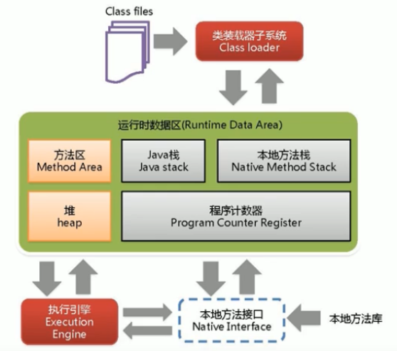

# JVM体系架构
java是跨平台的语言，JVM是跨语言的平台（Kotlin,Scala, Jython, JRuby, JavaScript...)。JVM不关心运行在其内部的程序的编程语言，只关心字节码文件。

特点：

1. 一次编译，到处运行
2. 自动内存管理
3. 自动垃圾回收

运行在OS上，与硬件无直接交互。

## 不同种类的JVM

### Classic VM

第一款商用JVM。在JDK1.4被淘汰。只提供解释器(没有JIT)，执行效率低下。

### Exact VM

准确式内存管理Exact Memory Management。知道内存中某个位置的数据具体是什么类型。具备现代高性能VM的雏形。

### HotSpot VM

在JDK1.3时被设置成默认VM。热点代码探测技术。通过计数器找到最具编译价值代码，在本地缓存起来。通过编译器和解释器协同工作，平衡程序响应时间和最佳执行性能。

### JRockit

专注于服务器端应用，不关注程序启动速度，内部不包含解析器实现，是世界上最快JVM。MissionControl服务套件以最低的开销进行资源分析、管理和监控。

### J9

IBM。市场定位与HotSpot类似。多用途VM。通用性没有JRockit好。

## 基础

#### 代码执行流程

前端编译器(javac)将java文件进行编译成为class字节码。在JVM中，用类加载器进行加载。之后：解释器翻译字节码(解释执行)成机器语言，后端编译器(JIT)编译执行，将热点代码缓存起来。这两者协同工作。解释器响应快，但是JIT在正常运行之后(一开始有暂停时间)速度更快。

### JVM架构模型

**基于栈的指令集架构**

1. 设计和实现更简单，适用于资源受限的系统
2. 避开了寄存器的分配难题
3. 绝大部分指令是零地址指令
4. 可移植性好

**基于寄存器的指令集架构**

1. 典型应用：x86
2. 完全依赖硬件
3. 性能优秀，执行高效
4. 一/二/三地址指令

### 生命周期

**启动**

引导类加载器Bootstrap class loader创建一个初始类，这个类由虚拟机的具体实现指定。

**执行**

程序开始执行到结束。

**退出**

正常结束，程序出现异常或错误，操作系统出现错误，线程调用Runtime类或System类的exit方法。


# 类加载子系统

负责从文件系统或网络中加载class文件，有特定的文件标识。class文件的运行是有执行引擎Execution Engine决定。加载的类信息存放在方法区(还会存放运行时常量池信息)。

判断两个class对象是否是同一个类：类的完整类名相同，且加载它们的ClassLoader实例对象必须相同。

### 结构



方法区和堆是多个线程共享的。

执行引擎只认机器码。

## 类的加载过程
加载loading -> 验证verification -> 准备preparation -> 解析resolution -> 初始化initialization 

### 加载

整体加载过程中的第一个环节。

通过一个类的全限定名获取类的二进制字节流。将其所代表的的静态存储结构转化为方法区的运行时数据结构。在内存中生成一个代表这个类的java.lang.Class对象，作为方法区这个类的数据的访问入口。

### 链接

#### 验证Verify

确保class文件中字节流中包含的信息符合VM要求，保证被加载类的正确性，不会危害VM的安全。

CAFE BABE。

文件格式验证、元数据验证、字节码验证、符号引用验证。

#### 准备Prepare

为类变量分配内存，设置该类变量(静态变量)默认初始值。这里不包含用final修饰的static，因为final在编译的时候就会分配了，准备阶段会显示初始化。

#### 解析Resolve

将常量池内的符号引用转换为直接引用的过程。

### 初始化

执行类构造器方法\<clinit\>()的过程。此方法不需定义，是javac编译器自动收集类中的静态变量的复制动作和静态代码块中的语句合并二来。这个阶段主要是对类变量初始化，是执行类构造器的过程。Class只是对 Klass的封装。

构造器方法中指令按照语句在源文件中出现的顺序执行。

若该类具有父类，JVM会保证父类的clinit先执行。 

## 两种加载器

四者之间的关系是包含关系，不是继承关系。扩展类和系统类算是自定义类。

获取加载器的方式。

```java
// 1获取当前类的加载器
clazz.getClassLoader();
// 2获取当前线程的加载器
Thread.currentThread().getContextClassLoader();
// 3获取系统的加载器
ClassLoader.getSystemClassLoader();
// 4获取调用者的加载器
DriverManager.getCallerClassLoader();
```

### 自定义类User-Defined

所有派生于抽象类ClassLoader的类加载器(不光是程序员自定义的)。默认使用系统类加载器进行加载。

使用场景：隔离加载类，修改类加载的方式，扩展加载源，防止源码泄露。

步骤：

1. 继承抽象类ClassLoader。
2. 加载逻辑写在findClass()方法。
3. 可以选择直接继承URLClassLoader。避免自己重写findClass()和获取字节码流的方法。

#### 扩展类Extension

继承了URLClassLoader。间接继承了ClassLoader。使用getParent会获取到null，因为bootstrap class loader不是java编写的。

#### 应用AppClassLoader/系统类System 

继承了URLClassLoader。间接继承了ClassLoader。使用getParent会获取到扩展类加载器。

### 启动/引导类Bootstrap

用C语言实现，嵌套在JVM内部。Java中的核心类库(e.g., String类)使用引导类加载器进行加载。没有父加载器。

## 双亲委派模式parents delegation

JVM对class文件采用按需加载。

### 工作原理

1. 如果一个类加载器收到了类加载请求，先把请求委托给父类的加载器去执行
2. 如果父类加载器还存在其父类加载器，依次向上委托
3. 如果父类加载器可以完成类加载任务，就成功返回；否则，子加载器再自己尝试加载

### 优点

1. 具有优先级层次的关系，可以避免类的重复加载
2. 安全考虑，可以防止Java核心api被替换

### 沙箱安全机制

对于java核心源代码的保护。自定义的同名类不会被引导类加载器加载(会先加载jdk自带的文件)。


# 运行时数据区和线程

方法区、堆：一个进程一个。随着JVM启动而创建，随着JVM退出而销毁。

程序计数器、本地方法栈、栈：一个线程一个。随着线程启动而创建，随着线程退出而销毁。

当一个java线程准备好执行以后，此时一个OS的本地线程也同时创建。Java线程执行终止后，本地线程也会回收。OS负责所有线程的安排调度到任何一个可用的CPU上，一旦本地线程初始化成功，它就会调用Java线程中的run()方法。

*方法中定义的局部变量是否线程安全？* 如果被多个线程调用，则不安全。比如把stringbuilder传进去别的方法或者进行return。

### 程序计数器

PC寄存器。用来存储指向下一条指令的地址。唯一一个JVM规范中没有规定任何OutOfMemoryError情况的区域（占用内存极小）。没有GC。

采用javap反编译.class文件。左边是指令地址，右边是对应的操作指令。

为什么需要记录当前线程的执行地址：因为CPU不停切换各个线程，切换回来以后得接着从上一次执行到的地方开始继续执行。

### 栈

由于跨平台的设计，java的指令是根据栈来设计的(不是基于寄存器)。

主管Java程序的运行。保存方法的局部变量、部分结果，并参与方法的调用和返回。没有GC。

一个栈帧，对应着一个java方法。

JVM允许java栈的大小是动态的或者固定不变的。如果是固定大小，有可能抛出StackOverflowError；如果是动态扩展，有可能抛出OutOfMemoryError。使用-Xss设置最大的栈的大小。

#### 局部变量表

定义为一个数字数组，存储方法参数和定义在方法体内的局部变量。线程私有，不存在数据安全问题。所需容量是在编译器确定下来的，在方法运行期间不会更改。在javap反解析看locals。

最基本的存储单元是槽slot。32位类型占用1个slot，64位类型占用2个slot。如果当前栈帧是实例方法，那么该对象引用this将会存放在index为0的slot处。其余局部变量按顺序排列。栈帧中的局部变量表中的slot是可以重用的。如果一个局部变量过了作用域(代码块)，在其作用域之后申明的新的局部变量就很有可能会复用过期局部变量的槽位，从而达到节省资源的目的。

局部变量表中的变量也是重要的垃圾回收根节点，只要被局部变量表中直接或间接引用的，都不会被回收。

#### 操作数栈

保存计算过程的中间结果，也作为变量临时的存储空间。所需容量是在编译器确定下来的，在方法运行期间不会更改。在javap反解析看stack。

底层数据结构是数组，但是不能采用访问索引的方式进行数据访问。

栈顶缓存技术：将栈顶元素缓存在物理cpu的寄存器中，降低对内存的读写次数。

#### 动态链接

每一个栈帧内部都包含一个指向运行时常量池中的该栈帧所属方法的引用，目的是支持动态链接。作用是为了将这些符号引用转换为调用方法的直接引用。

常量池：提供一些符号和常量，便于指令识别。

放在方法区是为了线程共享。

**静态链接**

当一个字节码文件被装载进jvm，如果被调用的目标方法在编译期可知，且运行期不变，这种情况下将调用方法转换为直接引用的过程是静态链接。

**动态链接**

被调用的目标方法在编译期无法被确定。多态的实现。

**早期绑定**

对应静态链接。

**晚期绑定**

对应动态链接。

**方法调用**

Java中任何一个普通的方法其实都具备虚函数的特征，相当于C++中的虚函数(需要使用virtual显示定义)。如果在java中不希望某个方法拥有虚函数的特征，可以使用final进行标记。

普通调用指令：

invokestatic调用静态方法。(非虚方法)

invokespecial调用\<init\>方法、私有和父类方法。(非虚方法)

invokevirtual调用所有虚方法和隐式调用父类final方法(没加super)。

invokeinterface调用接口方法(实际上也是虚方法)。

动态调用指令：

invokedynamic动态解析出需要调用的方法，然后执行。java原本是静态语言(对类型的检查是在编译器)，加入了这个指令可以支持一些动态语言的特征。

**非虚方法**

在编译器就确定了具体调用版本。private/static/final/constructor/父类方法都是非虚方法。其他都是虚方法。

子类对象的多态适用前提：类的继承关系；方法的重写。

**方法重写**

找到操作数栈顶的第一个元素所执行的对象的实际类型，记作C。如果在C中找到与常量中的描述符合简单名称都相符的方法，则进行访问权限校验。如果通过，则返回这个方法的引用。没有权限就是IllegalAccessError异常。否则，按照继承关系依次对其父类进行校验。

为了提高性能，jvm建立了一个虚方法表。在类加载的链接(解析)阶段创建该表。

#### 方法返回地址

存放调用该方法的pc寄存器的值。正常退出。异常退出的话，不会给调用者返回值，返回信息要去异常表中找。

#### 附加信息

其他信息。例如，对程序调试提供支持的信息。

### 本地方法栈

本地方法native method就是一个java调用非java代码的接口。标识符native可以与除了abstract之外的其他java标识符连用。

使用本地方法的原因

1. 与java环境外交互：比如与操作系统或某些硬件交换信息。
2. 与操作系统交互：使用Java语言本身没有提供封装的操作系统的特性。
3. Sun's Java：Sun的解释器使用C实现。

本地方法栈是线程私有，用于管理本地方法的调用。

### 堆

一个JVM实例只存在一个堆内存。在JVM启动的时候，堆空间大小就确定了。

堆可以处于物理上不连续的内存空间。

空间大小可以用-Xms和-Xmx指定(起始和最大内存)。

#### TLAB

Thread Local Allocation Buffer. 堆是线程共享，任何线程都可以访问其中的共享数据。并发环境下操作共享数据容易存在线程不安全问题。如果加锁，会影响效率。JVM为每个线程分配了一个私有缓存区域，包含在Eden空间内。一旦对象在TLAB空间分配内存失败，JVM会尝试通过加锁机制创建对象。

#### 分代

默认新生代:老年代是1:2比例。默认Eden:Survivor0:Survivor1是8:1:1比例。几乎所有新对象都是在Eden区被创建的。80%的对象都是在新生代就死了。

*分代原因* 

优化GC性能。如果没有分代，所有对象都在一块，GC的时候需要全局扫描。

**新生代**

Eden区： 诞生于此。当这个区快满的时候，会触发垃圾回收Young GC (YGC)。仍然留下的对象将迁入Survivor中的分区。

Survivor0区/Survivor1区：YGC被动触发回收(Survivor区满了不会触发YGC)。Survivor区满了，可以晋升老年代，但是不会主动触发垃圾回收YGC。

这两个survivor区同时只有1个会被使用。

每一次gc会不断移动survivor分区中的对象到另一个分区，且对象增长1岁。15岁的对象（或者超大对象）会被晋升放入老年代。动态对象年龄判断：如果Survivoor区中相同年龄的所有对象的大小的总和大于Survivor区空间的一半，年龄大于等于这个值的对象可以直接进入老年代。

**老年代**

老年代快满的时候，会有full gc。目前，只有CMS GC会有单独收集老年代的行为。

**元空间**

在Java 8之前叫做永久代。元空间的大小，不受堆大小参数的限制。

*判断对象是否存活*

1. 引用计数法
   缺点：两个对象互相引用，别的对象并不需要这两个对象，这两个对象不会被删除。
2. 可达性分析法


# 垃圾回收
## 标记-清除
缺点：1.效率不高  2. 会产生许多碎片空间
## 复制
缺点：缩小了一半空间。
## 标记-整理
首先标记出所有需要回收的对象，然后将存活的对象移动到空间的一端，然后清理掉边界以外的对象。


# Reference
- [宋红康JVM教程](https://www.bilibili.com/video/BV1PJ411n7xZ)

